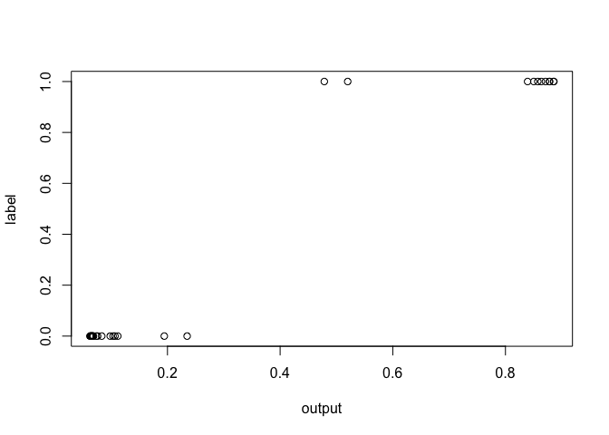
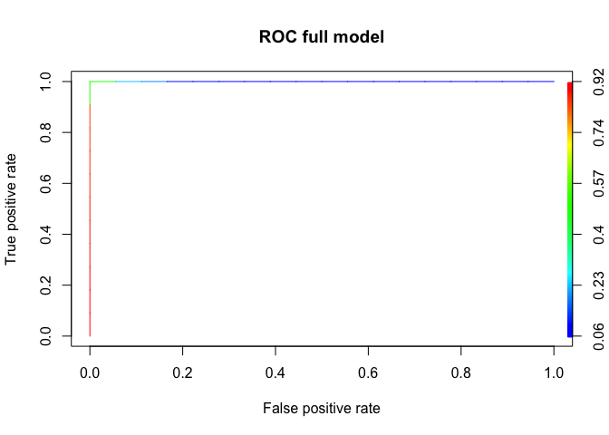

dermacentor
================
Jessica Martin, Ilya Fischhoff
1/23/2020

\#\#\#\#\#install packages

    ## Loaded gbm 2.1.5

    ## Loading required package: raster

    ## Loading required package: sp

    ## Loading required package: lattice

    ## Loading required package: ggplot2

    ## Loading required package: gplots

    ## 
    ## Attaching package: 'gplots'

    ## The following object is masked from 'package:stats':
    ## 
    ##     lowess

\#\#\#read in data and rearrange columns

``` r
tick2<-read.csv("Dermacentor database_v2_01-10-20_4R.csv", header = T)

#remove variables with all NAs
tick <- tick2[, !apply(is.na(tick2),2,all)]

#rearrange columns so that GIDEON (the response variable) is last
tick<-tick[c(1:91,93:101,92)]
```

#### remove columns with near zero variance Global

### this reduces the number of variables from 101 to 92

``` r
nzv <- nearZeroVar(tick,saveMetrics=TRUE, freqCut = 80/20)#changed from default 95/5 because otherwise ran into checksum error when doing bootstrap AUC
nzv <- row.names(nzv[which(nzv$nzv==TRUE),])
dropnzv<-names(tick[ , which(names(tick) %in% nzv)])
tick<-tick[ , -which(names(tick) %in% nzv)]
dim(tick)
```

    ## [1] 41 88

### select traits above a coverage threshold

## Ilya - Barbara’s orignal comment here said to “update to inlcude the residuals columns”

## I’m not sure that I did this step right (I’m unclear on what the residuals columns are for)

## Does this step make sense to you?

``` r
index<-c(2:dim(tick)[2]) #comment from Jess: index excludes columns for species.name, does not include residuals (?)

traits<-names(tick)[index]
output<-c() # trait coverage

for(i in 1:length(traits)){
  output[i]<-length(tick[which(is.na(tick[,index[i]])==F),index[i]])/length(tick[,index[i]])
}
coverage<-data.frame(cbind(traits,output),stringsAsFactors = FALSE)
colnames(coverage)<-c("Predictor","Coverage")

# set coverage threshold
#JM: changed threshold from 0.01 to 0.1
traits<-coverage[which(coverage$Coverage > 0.1),]  
```

\#\#run GBM

``` r
shrinkage = 0.0001
n.trees = 80000
interaction.depth = 3
n.minobsinnode = 2
cv.folds = 2

#Start the clock
ptm<-proc.time()

set.seed(777)
intrain<-createDataPartition(y=tick$GIDEON,
                             # groups=3,
                             p=0.7,
                             list=FALSE)
train<-tick[intrain,]
test<-tick[-intrain,]


# column 94 (GIDEON) contains the outcomes that the model is trying to predict
y_col = which(names(tick)=="GIDEON")
model<-as.formula(paste(colnames(tick)[y_col], "~",
                        paste(traits$Predictor,collapse = "+"), #traits
                        collapse="+"))
save(model, file = "model.Rdata")
tickgbm <- gbm(model,
               data=train, 
               distribution="bernoulli", 
               n.trees=n.trees, 
               shrinkage=shrinkage,
               interaction.depth=interaction.depth,
               bag.fraction=0.50,
               train.fraction=1,
               n.minobsinnode=n.minobsinnode,#too few data for 3
               cv.folds=cv.folds,#too few data for cv.folds = 5
               class.stratify.cv = TRUE,
               keep.data=TRUE,
               verbose=TRUE,
               n.cores=1)
```

    ## Iter   TrainDeviance   ValidDeviance   StepSize   Improve
    ##      1        1.3273             nan     0.0001    0.0001
    ##      2        1.3271             nan     0.0001    0.0001
    ##      3        1.3270             nan     0.0001   -0.0000
    ##      4        1.3268             nan     0.0001    0.0001
    ##      5        1.3266             nan     0.0001    0.0000
    ##      6        1.3264             nan     0.0001    0.0001
    ##      7        1.3262             nan     0.0001    0.0001
    ##      8        1.3261             nan     0.0001    0.0001
    ##      9        1.3260             nan     0.0001    0.0000
    ##     10        1.3258             nan     0.0001    0.0001
    ##     20        1.3240             nan     0.0001    0.0001
    ##     40        1.3207             nan     0.0001    0.0001
    ##     60        1.3174             nan     0.0001    0.0000
    ##     80        1.3142             nan     0.0001    0.0000
    ##    100        1.3110             nan     0.0001    0.0001
    ##    120        1.3077             nan     0.0001    0.0000
    ##    140        1.3045             nan     0.0001    0.0001
    ##    160        1.3014             nan     0.0001    0.0001
    ##    180        1.2982             nan     0.0001    0.0000
    ##    200        1.2951             nan     0.0001    0.0001
    ##    220        1.2918             nan     0.0001    0.0001
    ##    240        1.2884             nan     0.0001    0.0001
    ##    260        1.2850             nan     0.0001    0.0001
    ##    280        1.2819             nan     0.0001    0.0000
    ##    300        1.2787             nan     0.0001    0.0001
    ##    320        1.2755             nan     0.0001    0.0000
    ##    340        1.2723             nan     0.0001    0.0001
    ##    360        1.2693             nan     0.0001    0.0000
    ##    380        1.2659             nan     0.0001    0.0001
    ##    400        1.2628             nan     0.0001    0.0001
    ##    420        1.2597             nan     0.0001    0.0001
    ##    440        1.2565             nan     0.0001    0.0001
    ##    460        1.2533             nan     0.0001    0.0001
    ##    480        1.2502             nan     0.0001    0.0001
    ##    500        1.2470             nan     0.0001    0.0000
    ##    520        1.2442             nan     0.0001    0.0000
    ##    540        1.2410             nan     0.0001    0.0001
    ##    560        1.2380             nan     0.0001    0.0001
    ##    580        1.2351             nan     0.0001    0.0001
    ##    600        1.2320             nan     0.0001    0.0001
    ##    620        1.2291             nan     0.0001    0.0001
    ##    640        1.2261             nan     0.0001    0.0001
    ##    660        1.2234             nan     0.0001    0.0000
    ##    680        1.2205             nan     0.0001   -0.0000
    ##    700        1.2176             nan     0.0001    0.0001
    ##    720        1.2147             nan     0.0001    0.0001
    ##    740        1.2116             nan     0.0001    0.0000
    ##    760        1.2086             nan     0.0001    0.0001
    ##    780        1.2057             nan     0.0001    0.0001
    ##    800        1.2028             nan     0.0001    0.0001
    ##    820        1.1999             nan     0.0001    0.0000
    ##    840        1.1970             nan     0.0001    0.0001
    ##    860        1.1941             nan     0.0001    0.0001
    ##    880        1.1912             nan     0.0001    0.0001
    ##    900        1.1885             nan     0.0001    0.0001
    ##    920        1.1855             nan     0.0001    0.0001
    ##    940        1.1827             nan     0.0001    0.0001
    ##    960        1.1798             nan     0.0001    0.0001
    ##    980        1.1769             nan     0.0001   -0.0000
    ##   1000        1.1739             nan     0.0001    0.0001
    ##   1020        1.1710             nan     0.0001    0.0001
    ##   1040        1.1682             nan     0.0001    0.0000
    ##   1060        1.1654             nan     0.0001    0.0000
    ##   1080        1.1627             nan     0.0001    0.0000
    ##   1100        1.1600             nan     0.0001    0.0001
    ##   1120        1.1573             nan     0.0001    0.0001
    ##   1140        1.1546             nan     0.0001    0.0001
    ##   1160        1.1520             nan     0.0001    0.0000
    ##   1180        1.1492             nan     0.0001    0.0001
    ##   1200        1.1464             nan     0.0001    0.0001
    ##   1220        1.1439             nan     0.0001    0.0000
    ##   1240        1.1411             nan     0.0001    0.0000
    ##   1260        1.1382             nan     0.0001    0.0001
    ##   1280        1.1353             nan     0.0001    0.0001
    ##   1300        1.1327             nan     0.0001    0.0001
    ##   1320        1.1300             nan     0.0001    0.0000
    ##   1340        1.1273             nan     0.0001    0.0001
    ##   1360        1.1247             nan     0.0001    0.0001
    ##   1380        1.1220             nan     0.0001    0.0000
    ##   1400        1.1195             nan     0.0001    0.0001
    ##   1420        1.1168             nan     0.0001    0.0001
    ##   1440        1.1143             nan     0.0001    0.0000
    ##   1460        1.1117             nan     0.0001    0.0001
    ##   1480        1.1091             nan     0.0001    0.0000
    ##   1500        1.1065             nan     0.0001    0.0001
    ##   1520        1.1039             nan     0.0001    0.0001
    ##   1540        1.1013             nan     0.0001    0.0001
    ##   1560        1.0988             nan     0.0001    0.0001
    ##   1580        1.0963             nan     0.0001    0.0000
    ##   1600        1.0938             nan     0.0001    0.0000
    ##   1620        1.0915             nan     0.0001    0.0001
    ##   1640        1.0891             nan     0.0001    0.0000
    ##   1660        1.0865             nan     0.0001    0.0001
    ##   1680        1.0840             nan     0.0001    0.0001
    ##   1700        1.0817             nan     0.0001    0.0001
    ##   1720        1.0793             nan     0.0001    0.0001
    ##   1740        1.0768             nan     0.0001    0.0001
    ##   1760        1.0746             nan     0.0001    0.0001
    ##   1780        1.0721             nan     0.0001    0.0000
    ##   1800        1.0697             nan     0.0001    0.0001
    ##   1820        1.0674             nan     0.0001    0.0001
    ##   1840        1.0649             nan     0.0001    0.0001
    ##   1860        1.0624             nan     0.0001    0.0000
    ##   1880        1.0600             nan     0.0001    0.0000
    ##   1900        1.0574             nan     0.0001    0.0001
    ##   1920        1.0551             nan     0.0001    0.0001
    ##   1940        1.0528             nan     0.0001    0.0000
    ##   1960        1.0506             nan     0.0001    0.0001
    ##   1980        1.0482             nan     0.0001    0.0001
    ##   2000        1.0459             nan     0.0001    0.0000
    ##   2020        1.0436             nan     0.0001    0.0000
    ##   2040        1.0415             nan     0.0001    0.0001
    ##   2060        1.0393             nan     0.0001    0.0000
    ##   2080        1.0371             nan     0.0001    0.0000
    ##   2100        1.0348             nan     0.0001    0.0001
    ##   2120        1.0325             nan     0.0001    0.0000
    ##   2140        1.0299             nan     0.0001    0.0001
    ##   2160        1.0276             nan     0.0001    0.0000
    ##   2180        1.0254             nan     0.0001    0.0001
    ##   2200        1.0231             nan     0.0001    0.0000
    ##   2220        1.0207             nan     0.0001    0.0000
    ##   2240        1.0183             nan     0.0001    0.0000
    ##   2260        1.0162             nan     0.0001    0.0000
    ##   2280        1.0138             nan     0.0001    0.0001
    ##   2300        1.0116             nan     0.0001    0.0000
    ##   2320        1.0093             nan     0.0001    0.0000
    ##   2340        1.0072             nan     0.0001    0.0001
    ##   2360        1.0047             nan     0.0001    0.0001
    ##   2380        1.0026             nan     0.0001    0.0001
    ##   2400        1.0002             nan     0.0001    0.0000
    ##   2420        0.9979             nan     0.0001    0.0001
    ##   2440        0.9955             nan     0.0001    0.0000
    ##   2460        0.9932             nan     0.0001    0.0001
    ##   2480        0.9908             nan     0.0001    0.0001
    ##   2500        0.9887             nan     0.0001    0.0000
    ##   2520        0.9866             nan     0.0001    0.0000
    ##   2540        0.9842             nan     0.0001    0.0001
    ##   2560        0.9820             nan     0.0001    0.0001
    ##   2580        0.9798             nan     0.0001    0.0000
    ##   2600        0.9776             nan     0.0001    0.0001
    ##   2620        0.9755             nan     0.0001    0.0001
    ##   2640        0.9734             nan     0.0001    0.0000
    ##   2660        0.9713             nan     0.0001    0.0000
    ##   2680        0.9691             nan     0.0001    0.0001
    ##   2700        0.9670             nan     0.0001    0.0000
    ##   2720        0.9649             nan     0.0001    0.0000
    ##   2740        0.9627             nan     0.0001    0.0000
    ##   2760        0.9606             nan     0.0001    0.0000
    ##   2780        0.9585             nan     0.0001    0.0000
    ##   2800        0.9565             nan     0.0001    0.0000
    ##   2820        0.9543             nan     0.0001   -0.0000
    ##   2840        0.9521             nan     0.0001    0.0001
    ##   2860        0.9500             nan     0.0001    0.0001
    ##   2880        0.9480             nan     0.0001    0.0001
    ##   2900        0.9459             nan     0.0001    0.0000
    ##   2920        0.9439             nan     0.0001    0.0001
    ##   2940        0.9417             nan     0.0001    0.0000
    ##   2960        0.9395             nan     0.0001    0.0001
    ##   2980        0.9376             nan     0.0001    0.0000
    ##   3000        0.9356             nan     0.0001    0.0000
    ##   3020        0.9337             nan     0.0001    0.0000
    ##   3040        0.9316             nan     0.0001    0.0001
    ##   3060        0.9295             nan     0.0001    0.0001
    ##   3080        0.9276             nan     0.0001    0.0000
    ##   3100        0.9255             nan     0.0001    0.0000
    ##   3120        0.9234             nan     0.0001    0.0000
    ##   3140        0.9214             nan     0.0001    0.0001
    ##   3160        0.9194             nan     0.0001    0.0001
    ##   3180        0.9174             nan     0.0001    0.0000
    ##   3200        0.9155             nan     0.0001   -0.0000
    ##   3220        0.9137             nan     0.0001    0.0000
    ##   3240        0.9117             nan     0.0001    0.0000
    ##   3260        0.9097             nan     0.0001    0.0001
    ##   3280        0.9079             nan     0.0001    0.0000
    ##   3300        0.9059             nan     0.0001    0.0001
    ##   3320        0.9038             nan     0.0001    0.0001
    ##   3340        0.9019             nan     0.0001    0.0000
    ##   3360        0.8999             nan     0.0001    0.0001
    ##   3380        0.8980             nan     0.0001    0.0000
    ##   3400        0.8961             nan     0.0001    0.0000
    ##   3420        0.8943             nan     0.0001    0.0000
    ##   3440        0.8925             nan     0.0001    0.0000
    ##   3460        0.8908             nan     0.0001   -0.0000
    ##   3480        0.8889             nan     0.0001    0.0000
    ##   3500        0.8871             nan     0.0001    0.0000
    ##   3520        0.8853             nan     0.0001    0.0000
    ##   3540        0.8834             nan     0.0001    0.0000
    ##   3560        0.8815             nan     0.0001    0.0000
    ##   3580        0.8796             nan     0.0001    0.0001
    ##   3600        0.8778             nan     0.0001    0.0000
    ##   3620        0.8760             nan     0.0001    0.0001
    ##   3640        0.8743             nan     0.0001    0.0000
    ##   3660        0.8726             nan     0.0001    0.0000
    ##   3680        0.8711             nan     0.0001    0.0000
    ##   3700        0.8692             nan     0.0001    0.0000
    ##   3720        0.8674             nan     0.0001    0.0000
    ##   3740        0.8656             nan     0.0001    0.0000
    ##   3760        0.8639             nan     0.0001    0.0000
    ##   3780        0.8620             nan     0.0001    0.0000
    ##   3800        0.8601             nan     0.0001    0.0001
    ##   3820        0.8584             nan     0.0001    0.0000
    ##   3840        0.8566             nan     0.0001    0.0000
    ##   3860        0.8546             nan     0.0001    0.0000
    ##   3880        0.8528             nan     0.0001    0.0000
    ##   3900        0.8510             nan     0.0001    0.0000
    ##   3920        0.8492             nan     0.0001    0.0001
    ##   3940        0.8475             nan     0.0001    0.0000
    ##   3960        0.8458             nan     0.0001    0.0000
    ##   3980        0.8440             nan     0.0001    0.0000
    ##   4000        0.8423             nan     0.0001    0.0001
    ##   4020        0.8406             nan     0.0001    0.0000
    ##   4040        0.8389             nan     0.0001    0.0001
    ##   4060        0.8370             nan     0.0001    0.0000
    ##   4080        0.8353             nan     0.0001    0.0001
    ##   4100        0.8335             nan     0.0001    0.0001
    ##   4120        0.8319             nan     0.0001    0.0001
    ##   4140        0.8302             nan     0.0001    0.0000
    ##   4160        0.8284             nan     0.0001    0.0001
    ##   4180        0.8267             nan     0.0001    0.0001
    ##   4200        0.8250             nan     0.0001    0.0000
    ##   4220        0.8233             nan     0.0001    0.0000
    ##   4240        0.8215             nan     0.0001    0.0000
    ##   4260        0.8197             nan     0.0001    0.0001
    ##   4280        0.8180             nan     0.0001    0.0000
    ##   4300        0.8162             nan     0.0001    0.0000
    ##   4320        0.8145             nan     0.0001    0.0000
    ##   4340        0.8127             nan     0.0001    0.0000
    ##   4360        0.8111             nan     0.0001    0.0001
    ##   4380        0.8093             nan     0.0001    0.0000
    ##   4400        0.8076             nan     0.0001    0.0001
    ##   4420        0.8057             nan     0.0001    0.0000
    ##   4440        0.8041             nan     0.0001    0.0000
    ##   4460        0.8028             nan     0.0001    0.0001
    ##   4480        0.8013             nan     0.0001    0.0000
    ##   4500        0.7996             nan     0.0001    0.0000
    ##   4520        0.7978             nan     0.0001    0.0000
    ##   4540        0.7963             nan     0.0001    0.0000
    ##   4560        0.7946             nan     0.0001    0.0000
    ##   4580        0.7930             nan     0.0001    0.0000
    ##   4600        0.7913             nan     0.0001    0.0000
    ##   4620        0.7898             nan     0.0001    0.0000
    ##   4640        0.7882             nan     0.0001    0.0000
    ##   4660        0.7866             nan     0.0001    0.0000
    ##   4680        0.7851             nan     0.0001    0.0000
    ##   4700        0.7832             nan     0.0001    0.0000
    ##   4720        0.7817             nan     0.0001    0.0000
    ##   4740        0.7802             nan     0.0001    0.0000
    ##   4760        0.7786             nan     0.0001    0.0000
    ##   4780        0.7770             nan     0.0001    0.0000
    ##   4800        0.7755             nan     0.0001    0.0000
    ##   4820        0.7737             nan     0.0001    0.0000
    ##   4840        0.7721             nan     0.0001    0.0000
    ##   4860        0.7705             nan     0.0001    0.0000
    ##   4880        0.7689             nan     0.0001    0.0000
    ##   4900        0.7674             nan     0.0001    0.0000
    ##   4920        0.7660             nan     0.0001    0.0000
    ##   4940        0.7645             nan     0.0001    0.0000
    ##   4960        0.7631             nan     0.0001    0.0000
    ##   4980        0.7615             nan     0.0001    0.0000
    ##   5000        0.7600             nan     0.0001    0.0001
    ##   5020        0.7585             nan     0.0001    0.0000
    ##   5040        0.7569             nan     0.0001    0.0000
    ##   5060        0.7553             nan     0.0001    0.0000
    ##   5080        0.7537             nan     0.0001    0.0001
    ##   5100        0.7522             nan     0.0001    0.0000
    ##   5120        0.7507             nan     0.0001    0.0000
    ##   5140        0.7492             nan     0.0001    0.0000
    ##   5160        0.7478             nan     0.0001    0.0000
    ##   5180        0.7463             nan     0.0001    0.0000
    ##   5200        0.7447             nan     0.0001    0.0000
    ##   5220        0.7432             nan     0.0001    0.0000
    ##   5240        0.7417             nan     0.0001    0.0000
    ##   5260        0.7402             nan     0.0001    0.0000
    ##   5280        0.7386             nan     0.0001    0.0000
    ##   5300        0.7371             nan     0.0001    0.0000
    ##   5320        0.7357             nan     0.0001    0.0000
    ##   5340        0.7342             nan     0.0001    0.0000
    ##   5360        0.7326             nan     0.0001    0.0000
    ##   5380        0.7312             nan     0.0001    0.0000
    ##   5400        0.7298             nan     0.0001    0.0000
    ##   5420        0.7284             nan     0.0001    0.0000
    ##   5440        0.7268             nan     0.0001    0.0000
    ##   5460        0.7254             nan     0.0001    0.0000
    ##   5480        0.7240             nan     0.0001    0.0000
    ##   5500        0.7225             nan     0.0001    0.0000
    ##   5520        0.7211             nan     0.0001    0.0000
    ##   5540        0.7196             nan     0.0001    0.0000
    ##   5560        0.7180             nan     0.0001    0.0000
    ##   5580        0.7165             nan     0.0001    0.0000
    ##   5600        0.7152             nan     0.0001   -0.0000
    ##   5620        0.7137             nan     0.0001    0.0000
    ##   5640        0.7123             nan     0.0001    0.0000
    ##   5660        0.7110             nan     0.0001    0.0000
    ##   5680        0.7096             nan     0.0001    0.0000
    ##   5700        0.7082             nan     0.0001    0.0000
    ##   5720        0.7068             nan     0.0001    0.0000
    ##   5740        0.7054             nan     0.0001    0.0000
    ##   5760        0.7041             nan     0.0001   -0.0000
    ##   5780        0.7028             nan     0.0001    0.0000
    ##   5800        0.7014             nan     0.0001    0.0000
    ##   5820        0.7000             nan     0.0001    0.0000
    ##   5840        0.6987             nan     0.0001    0.0000
    ##   5860        0.6974             nan     0.0001    0.0000
    ##   5880        0.6961             nan     0.0001    0.0000
    ##   5900        0.6947             nan     0.0001   -0.0000
    ##   5920        0.6933             nan     0.0001    0.0000
    ##   5940        0.6919             nan     0.0001    0.0000
    ##   5960        0.6906             nan     0.0001    0.0000
    ##   5980        0.6892             nan     0.0001    0.0000
    ##   6000        0.6879             nan     0.0001    0.0000
    ##   6020        0.6866             nan     0.0001    0.0000
    ##   6040        0.6852             nan     0.0001    0.0000
    ##   6060        0.6838             nan     0.0001    0.0000
    ##   6080        0.6825             nan     0.0001   -0.0000
    ##   6100        0.6812             nan     0.0001    0.0000
    ##   6120        0.6799             nan     0.0001    0.0000
    ##   6140        0.6786             nan     0.0001    0.0000
    ##   6160        0.6773             nan     0.0001    0.0000
    ##   6180        0.6762             nan     0.0001    0.0000
    ##   6200        0.6749             nan     0.0001    0.0000
    ##   6220        0.6737             nan     0.0001    0.0000
    ##   6240        0.6725             nan     0.0001    0.0000
    ##   6260        0.6712             nan     0.0001    0.0000
    ##   6280        0.6699             nan     0.0001    0.0000
    ##   6300        0.6686             nan     0.0001    0.0000
    ##   6320        0.6671             nan     0.0001    0.0000
    ##   6340        0.6658             nan     0.0001    0.0000
    ##   6360        0.6645             nan     0.0001    0.0000
    ##   6380        0.6631             nan     0.0001    0.0000
    ##   6400        0.6618             nan     0.0001    0.0000
    ##   6420        0.6604             nan     0.0001    0.0000
    ##   6440        0.6591             nan     0.0001    0.0000
    ##   6460        0.6578             nan     0.0001    0.0000
    ##   6480        0.6565             nan     0.0001    0.0000
    ##   6500        0.6553             nan     0.0001    0.0000
    ##   6520        0.6540             nan     0.0001    0.0000
    ##   6540        0.6527             nan     0.0001    0.0000
    ##   6560        0.6515             nan     0.0001    0.0000
    ##   6580        0.6502             nan     0.0001    0.0000
    ##   6600        0.6489             nan     0.0001    0.0000
    ##   6620        0.6475             nan     0.0001    0.0000
    ##   6640        0.6464             nan     0.0001    0.0000
    ##   6660        0.6452             nan     0.0001    0.0000
    ##   6680        0.6438             nan     0.0001    0.0000
    ##   6700        0.6426             nan     0.0001    0.0000
    ##   6720        0.6414             nan     0.0001    0.0000
    ##   6740        0.6403             nan     0.0001    0.0000
    ##   6760        0.6391             nan     0.0001    0.0000
    ##   6780        0.6380             nan     0.0001    0.0000
    ##   6800        0.6366             nan     0.0001    0.0000
    ##   6820        0.6354             nan     0.0001   -0.0000
    ##   6840        0.6342             nan     0.0001    0.0000
    ##   6860        0.6330             nan     0.0001    0.0000
    ##   6880        0.6317             nan     0.0001    0.0000
    ##   6900        0.6305             nan     0.0001    0.0000
    ##   6920        0.6292             nan     0.0001    0.0000
    ##   6940        0.6280             nan     0.0001    0.0000
    ##   6960        0.6269             nan     0.0001    0.0000
    ##   6980        0.6257             nan     0.0001    0.0000
    ##   7000        0.6245             nan     0.0001    0.0000
    ##   7020        0.6234             nan     0.0001    0.0000
    ##   7040        0.6222             nan     0.0001    0.0000
    ##   7060        0.6209             nan     0.0001    0.0000
    ##   7080        0.6197             nan     0.0001    0.0000
    ##   7100        0.6186             nan     0.0001   -0.0000
    ##   7120        0.6174             nan     0.0001    0.0000
    ##   7140        0.6163             nan     0.0001    0.0000
    ##   7160        0.6151             nan     0.0001    0.0000
    ##   7180        0.6140             nan     0.0001    0.0000
    ##   7200        0.6129             nan     0.0001    0.0000
    ##   7220        0.6117             nan     0.0001    0.0000
    ##   7240        0.6106             nan     0.0001    0.0000
    ##   7260        0.6094             nan     0.0001    0.0000
    ##   7280        0.6082             nan     0.0001    0.0000
    ##   7300        0.6071             nan     0.0001    0.0000
    ##   7320        0.6060             nan     0.0001    0.0000
    ##   7340        0.6049             nan     0.0001    0.0000
    ##   7360        0.6037             nan     0.0001    0.0000
    ##   7380        0.6026             nan     0.0001    0.0000
    ##   7400        0.6016             nan     0.0001    0.0000
    ##   7420        0.6004             nan     0.0001    0.0000
    ##   7440        0.5993             nan     0.0001    0.0000
    ##   7460        0.5983             nan     0.0001    0.0000
    ##   7480        0.5972             nan     0.0001    0.0000
    ##   7500        0.5960             nan     0.0001    0.0000
    ##   7520        0.5948             nan     0.0001    0.0000
    ##   7540        0.5935             nan     0.0001    0.0000
    ##   7560        0.5925             nan     0.0001    0.0000
    ##   7580        0.5913             nan     0.0001   -0.0000
    ##   7600        0.5901             nan     0.0001    0.0000
    ##   7620        0.5890             nan     0.0001    0.0000
    ##   7640        0.5877             nan     0.0001    0.0000
    ##   7660        0.5867             nan     0.0001    0.0000
    ##   7680        0.5856             nan     0.0001    0.0000
    ##   7700        0.5845             nan     0.0001    0.0000
    ##   7720        0.5834             nan     0.0001    0.0000
    ##   7740        0.5824             nan     0.0001    0.0000
    ##   7760        0.5812             nan     0.0001    0.0000
    ##   7780        0.5801             nan     0.0001    0.0000
    ##   7800        0.5790             nan     0.0001    0.0000
    ##   7820        0.5780             nan     0.0001    0.0000
    ##   7840        0.5769             nan     0.0001    0.0000
    ##   7860        0.5758             nan     0.0001    0.0000
    ##   7880        0.5749             nan     0.0001    0.0000
    ##   7900        0.5737             nan     0.0001    0.0000
    ##   7920        0.5727             nan     0.0001    0.0000
    ##   7940        0.5715             nan     0.0001    0.0000
    ##   7960        0.5704             nan     0.0001    0.0000
    ##   7980        0.5693             nan     0.0001    0.0000
    ##   8000        0.5682             nan     0.0001    0.0000
    ##   8020        0.5672             nan     0.0001    0.0000
    ##   8040        0.5661             nan     0.0001    0.0000
    ##   8060        0.5651             nan     0.0001    0.0000
    ##   8080        0.5641             nan     0.0001    0.0000
    ##   8100        0.5630             nan     0.0001    0.0000
    ##   8120        0.5620             nan     0.0001    0.0000
    ##   8140        0.5610             nan     0.0001    0.0000
    ##   8160        0.5600             nan     0.0001    0.0000
    ##   8180        0.5589             nan     0.0001    0.0000
    ##   8200        0.5580             nan     0.0001    0.0000
    ##   8220        0.5570             nan     0.0001    0.0000
    ##   8240        0.5560             nan     0.0001    0.0000
    ##   8260        0.5551             nan     0.0001    0.0000
    ##   8280        0.5541             nan     0.0001    0.0000
    ##   8300        0.5532             nan     0.0001    0.0000
    ##   8320        0.5521             nan     0.0001    0.0000
    ##   8340        0.5511             nan     0.0001    0.0000
    ##   8360        0.5500             nan     0.0001    0.0000
    ##   8380        0.5489             nan     0.0001    0.0000
    ##   8400        0.5479             nan     0.0001    0.0000
    ##   8420        0.5470             nan     0.0001    0.0000
    ##   8440        0.5460             nan     0.0001    0.0000
    ##   8460        0.5450             nan     0.0001    0.0000
    ##   8480        0.5440             nan     0.0001    0.0000
    ##   8500        0.5430             nan     0.0001    0.0000
    ##   8520        0.5421             nan     0.0001    0.0000
    ##   8540        0.5411             nan     0.0001    0.0000
    ##   8560        0.5401             nan     0.0001    0.0000
    ##   8580        0.5391             nan     0.0001    0.0000
    ##   8600        0.5381             nan     0.0001    0.0000
    ##   8620        0.5370             nan     0.0001    0.0000
    ##   8640        0.5360             nan     0.0001    0.0000
    ##   8660        0.5350             nan     0.0001    0.0000
    ##   8680        0.5341             nan     0.0001    0.0000
    ##   8700        0.5331             nan     0.0001    0.0000
    ##   8720        0.5321             nan     0.0001   -0.0000
    ##   8740        0.5310             nan     0.0001    0.0000
    ##   8760        0.5301             nan     0.0001    0.0000
    ##   8780        0.5291             nan     0.0001    0.0000
    ##   8800        0.5281             nan     0.0001    0.0000
    ##   8820        0.5270             nan     0.0001    0.0000
    ##   8840        0.5261             nan     0.0001    0.0000
    ##   8860        0.5252             nan     0.0001    0.0000
    ##   8880        0.5242             nan     0.0001    0.0000
    ##   8900        0.5233             nan     0.0001    0.0000
    ##   8920        0.5223             nan     0.0001    0.0000
    ##   8940        0.5213             nan     0.0001    0.0000
    ##   8960        0.5203             nan     0.0001    0.0000
    ##   8980        0.5193             nan     0.0001    0.0000
    ##   9000        0.5184             nan     0.0001    0.0000
    ##   9020        0.5174             nan     0.0001    0.0000
    ##   9040        0.5164             nan     0.0001    0.0000
    ##   9060        0.5154             nan     0.0001    0.0000
    ##   9080        0.5145             nan     0.0001    0.0000
    ##   9100        0.5137             nan     0.0001    0.0000
    ##   9120        0.5128             nan     0.0001    0.0000
    ##   9140        0.5119             nan     0.0001    0.0000
    ##   9160        0.5109             nan     0.0001    0.0000
    ##   9180        0.5100             nan     0.0001    0.0000
    ##   9200        0.5091             nan     0.0001    0.0000
    ##   9220        0.5082             nan     0.0001    0.0000
    ##   9240        0.5072             nan     0.0001    0.0000
    ##   9260        0.5064             nan     0.0001    0.0000
    ##   9280        0.5053             nan     0.0001    0.0000
    ##   9300        0.5043             nan     0.0001    0.0000
    ##   9320        0.5033             nan     0.0001    0.0000
    ##   9340        0.5024             nan     0.0001    0.0000
    ##   9360        0.5016             nan     0.0001    0.0000
    ##   9380        0.5006             nan     0.0001    0.0000
    ##   9400        0.4997             nan     0.0001    0.0000
    ##   9420        0.4989             nan     0.0001    0.0000
    ##   9440        0.4980             nan     0.0001    0.0000
    ##   9460        0.4971             nan     0.0001    0.0000
    ##   9480        0.4962             nan     0.0001    0.0000
    ##   9500        0.4953             nan     0.0001    0.0000
    ##   9520        0.4944             nan     0.0001    0.0000
    ##   9540        0.4934             nan     0.0001    0.0000
    ##   9560        0.4926             nan     0.0001    0.0000
    ##   9580        0.4916             nan     0.0001    0.0000
    ##   9600        0.4908             nan     0.0001    0.0000
    ##   9620        0.4899             nan     0.0001    0.0000
    ##   9640        0.4890             nan     0.0001    0.0000
    ##   9660        0.4882             nan     0.0001    0.0000
    ##   9680        0.4874             nan     0.0001    0.0000
    ##   9700        0.4865             nan     0.0001    0.0000
    ##   9720        0.4856             nan     0.0001    0.0000
    ##   9740        0.4848             nan     0.0001    0.0000
    ##   9760        0.4840             nan     0.0001    0.0000
    ##   9780        0.4830             nan     0.0001    0.0000
    ##   9800        0.4821             nan     0.0001    0.0000
    ##   9820        0.4813             nan     0.0001    0.0000
    ##   9840        0.4804             nan     0.0001    0.0000
    ##   9860        0.4796             nan     0.0001    0.0000
    ##   9880        0.4787             nan     0.0001    0.0000
    ##   9900        0.4779             nan     0.0001    0.0000
    ##   9920        0.4770             nan     0.0001    0.0000
    ##   9940        0.4762             nan     0.0001    0.0000
    ##   9960        0.4754             nan     0.0001    0.0000
    ##   9980        0.4745             nan     0.0001    0.0000
    ##  10000        0.4736             nan     0.0001    0.0000
    ##  10020        0.4728             nan     0.0001    0.0000
    ##  10040        0.4718             nan     0.0001    0.0000
    ##  10060        0.4710             nan     0.0001    0.0000
    ##  10080        0.4702             nan     0.0001    0.0000
    ##  10100        0.4694             nan     0.0001    0.0000
    ##  10120        0.4685             nan     0.0001    0.0000
    ##  10140        0.4677             nan     0.0001    0.0000
    ##  10160        0.4669             nan     0.0001    0.0000
    ##  10180        0.4660             nan     0.0001    0.0000
    ##  10200        0.4651             nan     0.0001    0.0000
    ##  10220        0.4643             nan     0.0001    0.0000
    ##  10240        0.4635             nan     0.0001    0.0000
    ##  10260        0.4627             nan     0.0001    0.0000
    ##  10280        0.4618             nan     0.0001    0.0000
    ##  10300        0.4610             nan     0.0001    0.0000
    ##  10320        0.4602             nan     0.0001    0.0000
    ##  10340        0.4595             nan     0.0001    0.0000
    ##  10360        0.4588             nan     0.0001    0.0000
    ##  10380        0.4579             nan     0.0001   -0.0000
    ##  10400        0.4571             nan     0.0001    0.0000
    ##  10420        0.4563             nan     0.0001    0.0000
    ##  10440        0.4554             nan     0.0001    0.0000
    ##  10460        0.4546             nan     0.0001    0.0000
    ##  10480        0.4539             nan     0.0001    0.0000
    ##  10500        0.4531             nan     0.0001   -0.0000
    ##  10520        0.4523             nan     0.0001    0.0000
    ##  10540        0.4516             nan     0.0001    0.0000
    ##  10560        0.4506             nan     0.0001    0.0000
    ##  10580        0.4498             nan     0.0001    0.0000
    ##  10600        0.4491             nan     0.0001    0.0000
    ##  10620        0.4483             nan     0.0001    0.0000
    ##  10640        0.4475             nan     0.0001    0.0000
    ##  10660        0.4467             nan     0.0001    0.0000
    ##  10680        0.4458             nan     0.0001    0.0000
    ##  10700        0.4451             nan     0.0001    0.0000
    ##  10720        0.4443             nan     0.0001    0.0000
    ##  10740        0.4435             nan     0.0001    0.0000
    ##  10760        0.4428             nan     0.0001    0.0000
    ##  10780        0.4421             nan     0.0001    0.0000
    ##  10800        0.4413             nan     0.0001    0.0000
    ##  10820        0.4406             nan     0.0001    0.0000
    ##  10840        0.4399             nan     0.0001    0.0000
    ##  10860        0.4391             nan     0.0001    0.0000
    ##  10880        0.4383             nan     0.0001    0.0000
    ##  10900        0.4375             nan     0.0001    0.0000
    ##  10920        0.4367             nan     0.0001    0.0000
    ##  10940        0.4359             nan     0.0001    0.0000
    ##  10960        0.4351             nan     0.0001    0.0000
    ##  10980        0.4343             nan     0.0001    0.0000
    ##  11000        0.4334             nan     0.0001    0.0000
    ##  11020        0.4327             nan     0.0001    0.0000
    ##  11040        0.4319             nan     0.0001    0.0000
    ##  11060        0.4312             nan     0.0001    0.0000
    ##  11080        0.4305             nan     0.0001    0.0000
    ##  11100        0.4298             nan     0.0001    0.0000
    ##  11120        0.4290             nan     0.0001    0.0000
    ##  11140        0.4283             nan     0.0001    0.0000
    ##  11160        0.4276             nan     0.0001    0.0000
    ##  11180        0.4268             nan     0.0001    0.0000
    ##  11200        0.4262             nan     0.0001    0.0000
    ##  11220        0.4254             nan     0.0001    0.0000
    ##  11240        0.4247             nan     0.0001    0.0000
    ##  11260        0.4240             nan     0.0001   -0.0000
    ##  11280        0.4232             nan     0.0001    0.0000
    ##  11300        0.4224             nan     0.0001    0.0000
    ##  11320        0.4217             nan     0.0001    0.0000
    ##  11340        0.4209             nan     0.0001    0.0000
    ##  11360        0.4202             nan     0.0001    0.0000
    ##  11380        0.4195             nan     0.0001   -0.0000
    ##  11400        0.4186             nan     0.0001    0.0000
    ##  11420        0.4179             nan     0.0001    0.0000
    ##  11440        0.4171             nan     0.0001    0.0000
    ##  11460        0.4164             nan     0.0001    0.0000
    ##  11480        0.4157             nan     0.0001    0.0000
    ##  11500        0.4150             nan     0.0001    0.0000
    ##  11520        0.4142             nan     0.0001    0.0000
    ##  11540        0.4135             nan     0.0001    0.0000
    ##  11560        0.4128             nan     0.0001   -0.0000
    ##  11580        0.4120             nan     0.0001    0.0000
    ##  11600        0.4114             nan     0.0001    0.0000
    ##  11620        0.4107             nan     0.0001    0.0000
    ##  11640        0.4101             nan     0.0001    0.0000
    ##  11660        0.4094             nan     0.0001    0.0000
    ##  11680        0.4087             nan     0.0001    0.0000
    ##  11700        0.4080             nan     0.0001    0.0000
    ##  11720        0.4073             nan     0.0001    0.0000
    ##  11740        0.4066             nan     0.0001    0.0000
    ##  11760        0.4059             nan     0.0001    0.0000
    ##  11780        0.4053             nan     0.0001    0.0000
    ##  11800        0.4046             nan     0.0001    0.0000
    ##  11820        0.4038             nan     0.0001    0.0000
    ##  11840        0.4031             nan     0.0001    0.0000
    ##  11860        0.4025             nan     0.0001    0.0000
    ##  11880        0.4019             nan     0.0001    0.0000
    ##  11900        0.4013             nan     0.0001    0.0000
    ##  11920        0.4006             nan     0.0001    0.0000
    ##  11940        0.3998             nan     0.0001    0.0000
    ##  11960        0.3991             nan     0.0001    0.0000
    ##  11980        0.3986             nan     0.0001    0.0000
    ##  12000        0.3978             nan     0.0001    0.0000
    ##  12020        0.3972             nan     0.0001    0.0000
    ##  12040        0.3964             nan     0.0001    0.0000
    ##  12060        0.3959             nan     0.0001    0.0000
    ##  12080        0.3951             nan     0.0001    0.0000
    ##  12100        0.3945             nan     0.0001   -0.0000
    ##  12120        0.3937             nan     0.0001    0.0000
    ##  12140        0.3931             nan     0.0001    0.0000
    ##  12160        0.3923             nan     0.0001    0.0000
    ##  12180        0.3917             nan     0.0001    0.0000
    ##  12200        0.3910             nan     0.0001    0.0000
    ##  12220        0.3903             nan     0.0001    0.0000
    ##  12240        0.3897             nan     0.0001    0.0000
    ##  12260        0.3891             nan     0.0001    0.0000
    ##  12280        0.3884             nan     0.0001    0.0000
    ##  12300        0.3878             nan     0.0001    0.0000
    ##  12320        0.3872             nan     0.0001    0.0000
    ##  12340        0.3864             nan     0.0001    0.0000
    ##  12360        0.3858             nan     0.0001    0.0000
    ##  12380        0.3851             nan     0.0001    0.0000
    ##  12400        0.3845             nan     0.0001    0.0000
    ##  12420        0.3839             nan     0.0001    0.0000
    ##  12440        0.3833             nan     0.0001    0.0000
    ##  12460        0.3827             nan     0.0001    0.0000
    ##  12480        0.3820             nan     0.0001    0.0000
    ##  12500        0.3814             nan     0.0001    0.0000
    ##  12520        0.3808             nan     0.0001    0.0000
    ##  12540        0.3801             nan     0.0001    0.0000
    ##  12560        0.3795             nan     0.0001    0.0000
    ##  12580        0.3789             nan     0.0001    0.0000
    ##  12600        0.3783             nan     0.0001    0.0000
    ##  12620        0.3776             nan     0.0001    0.0000
    ##  12640        0.3770             nan     0.0001    0.0000
    ##  12660        0.3764             nan     0.0001    0.0000
    ##  12680        0.3758             nan     0.0001    0.0000
    ##  12700        0.3751             nan     0.0001    0.0000
    ##  12720        0.3745             nan     0.0001    0.0000
    ##  12740        0.3739             nan     0.0001    0.0000
    ##  12760        0.3733             nan     0.0001   -0.0000
    ##  12780        0.3726             nan     0.0001    0.0000
    ##  12800        0.3719             nan     0.0001    0.0000
    ##  12820        0.3713             nan     0.0001    0.0000
    ##  12840        0.3706             nan     0.0001    0.0000
    ##  12860        0.3698             nan     0.0001    0.0000
    ##  12880        0.3692             nan     0.0001    0.0000
    ##  12900        0.3686             nan     0.0001    0.0000
    ##  12920        0.3680             nan     0.0001    0.0000
    ##  12940        0.3673             nan     0.0001    0.0000
    ##  12960        0.3667             nan     0.0001    0.0000
    ##  12980        0.3661             nan     0.0001    0.0000
    ##  13000        0.3654             nan     0.0001    0.0000
    ##  13020        0.3648             nan     0.0001    0.0000
    ##  13040        0.3642             nan     0.0001    0.0000
    ##  13060        0.3636             nan     0.0001    0.0000
    ##  13080        0.3630             nan     0.0001    0.0000
    ##  13100        0.3623             nan     0.0001    0.0000
    ##  13120        0.3617             nan     0.0001    0.0000
    ##  13140        0.3611             nan     0.0001   -0.0000
    ##  13160        0.3605             nan     0.0001   -0.0000
    ##  13180        0.3600             nan     0.0001    0.0000
    ##  13200        0.3594             nan     0.0001    0.0000
    ##  13220        0.3588             nan     0.0001    0.0000
    ##  13240        0.3582             nan     0.0001    0.0000
    ##  13260        0.3577             nan     0.0001    0.0000
    ##  13280        0.3571             nan     0.0001    0.0000
    ##  13300        0.3566             nan     0.0001    0.0000
    ##  13320        0.3559             nan     0.0001    0.0000
    ##  13340        0.3554             nan     0.0001    0.0000
    ##  13360        0.3548             nan     0.0001    0.0000
    ##  13380        0.3542             nan     0.0001    0.0000
    ##  13400        0.3536             nan     0.0001    0.0000
    ##  13420        0.3530             nan     0.0001    0.0000
    ##  13440        0.3524             nan     0.0001    0.0000
    ##  13460        0.3518             nan     0.0001   -0.0000
    ##  13480        0.3513             nan     0.0001    0.0000
    ##  13500        0.3507             nan     0.0001    0.0000
    ##  13520        0.3501             nan     0.0001    0.0000
    ##  13540        0.3496             nan     0.0001    0.0000
    ##  13560        0.3490             nan     0.0001    0.0000
    ##  13580        0.3485             nan     0.0001    0.0000
    ##  13600        0.3478             nan     0.0001    0.0000
    ##  13620        0.3472             nan     0.0001    0.0000
    ##  13640        0.3466             nan     0.0001    0.0000
    ##  13660        0.3460             nan     0.0001    0.0000
    ##  13680        0.3453             nan     0.0001    0.0000
    ##  13700        0.3448             nan     0.0001    0.0000
    ##  13720        0.3442             nan     0.0001    0.0000
    ##  13740        0.3436             nan     0.0001    0.0000
    ##  13760        0.3430             nan     0.0001    0.0000
    ##  13780        0.3424             nan     0.0001    0.0000
    ##  13800        0.3418             nan     0.0001    0.0000
    ##  13820        0.3412             nan     0.0001    0.0000
    ##  13840        0.3407             nan     0.0001    0.0000
    ##  13860        0.3402             nan     0.0001    0.0000
    ##  13880        0.3396             nan     0.0001    0.0000
    ##  13900        0.3391             nan     0.0001    0.0000
    ##  13920        0.3385             nan     0.0001    0.0000
    ##  13940        0.3380             nan     0.0001    0.0000
    ##  13960        0.3374             nan     0.0001    0.0000
    ##  13980        0.3368             nan     0.0001    0.0000
    ##  14000        0.3363             nan     0.0001    0.0000
    ##  14020        0.3357             nan     0.0001    0.0000
    ##  14040        0.3352             nan     0.0001    0.0000
    ##  14060        0.3347             nan     0.0001    0.0000
    ##  14080        0.3342             nan     0.0001    0.0000
    ##  14100        0.3337             nan     0.0001    0.0000
    ##  14120        0.3331             nan     0.0001    0.0000
    ##  14140        0.3326             nan     0.0001    0.0000
    ##  14160        0.3321             nan     0.0001    0.0000
    ##  14180        0.3315             nan     0.0001    0.0000
    ##  14200        0.3309             nan     0.0001    0.0000
    ##  14220        0.3303             nan     0.0001   -0.0000
    ##  14240        0.3298             nan     0.0001    0.0000
    ##  14260        0.3293             nan     0.0001    0.0000
    ##  14280        0.3288             nan     0.0001    0.0000
    ##  14300        0.3282             nan     0.0001    0.0000
    ##  14320        0.3277             nan     0.0001    0.0000
    ##  14340        0.3271             nan     0.0001    0.0000
    ##  14360        0.3267             nan     0.0001    0.0000
    ##  14380        0.3261             nan     0.0001    0.0000
    ##  14400        0.3255             nan     0.0001    0.0000
    ##  14420        0.3250             nan     0.0001    0.0000
    ##  14440        0.3245             nan     0.0001    0.0000
    ##  14460        0.3240             nan     0.0001    0.0000
    ##  14480        0.3235             nan     0.0001   -0.0000
    ##  14500        0.3230             nan     0.0001    0.0000
    ##  14520        0.3224             nan     0.0001    0.0000
    ##  14540        0.3218             nan     0.0001    0.0000
    ##  14560        0.3213             nan     0.0001    0.0000
    ##  14580        0.3208             nan     0.0001    0.0000
    ##  14600        0.3203             nan     0.0001    0.0000
    ##  14620        0.3197             nan     0.0001    0.0000
    ##  14640        0.3191             nan     0.0001   -0.0000
    ##  14660        0.3185             nan     0.0001    0.0000
    ##  14680        0.3180             nan     0.0001    0.0000
    ##  14700        0.3175             nan     0.0001    0.0000
    ##  14720        0.3170             nan     0.0001    0.0000
    ##  14740        0.3165             nan     0.0001    0.0000
    ##  14760        0.3160             nan     0.0001    0.0000
    ##  14780        0.3155             nan     0.0001    0.0000
    ##  14800        0.3149             nan     0.0001    0.0000
    ##  14820        0.3144             nan     0.0001    0.0000
    ##  14840        0.3139             nan     0.0001    0.0000
    ##  14860        0.3134             nan     0.0001    0.0000
    ##  14880        0.3129             nan     0.0001    0.0000
    ##  14900        0.3125             nan     0.0001    0.0000
    ##  14920        0.3120             nan     0.0001    0.0000
    ##  14940        0.3115             nan     0.0001    0.0000
    ##  14960        0.3110             nan     0.0001    0.0000
    ##  14980        0.3105             nan     0.0001    0.0000
    ##  15000        0.3100             nan     0.0001   -0.0000
    ##  15020        0.3095             nan     0.0001    0.0000
    ##  15040        0.3090             nan     0.0001    0.0000
    ##  15060        0.3085             nan     0.0001   -0.0000
    ##  15080        0.3080             nan     0.0001    0.0000
    ##  15100        0.3075             nan     0.0001    0.0000
    ##  15120        0.3071             nan     0.0001    0.0000
    ##  15140        0.3066             nan     0.0001    0.0000
    ##  15160        0.3061             nan     0.0001    0.0000
    ##  15180        0.3056             nan     0.0001    0.0000
    ##  15200        0.3051             nan     0.0001    0.0000
    ##  15220        0.3046             nan     0.0001    0.0000
    ##  15240        0.3042             nan     0.0001    0.0000
    ##  15260        0.3037             nan     0.0001    0.0000
    ##  15280        0.3032             nan     0.0001    0.0000
    ##  15300        0.3027             nan     0.0001    0.0000
    ##  15320        0.3023             nan     0.0001    0.0000
    ##  15340        0.3018             nan     0.0001    0.0000
    ##  15360        0.3013             nan     0.0001   -0.0000
    ##  15380        0.3009             nan     0.0001    0.0000
    ##  15400        0.3004             nan     0.0001    0.0000
    ##  15420        0.2999             nan     0.0001    0.0000
    ##  15440        0.2994             nan     0.0001    0.0000
    ##  15460        0.2990             nan     0.0001    0.0000
    ##  15480        0.2985             nan     0.0001    0.0000
    ##  15500        0.2980             nan     0.0001    0.0000
    ##  15520        0.2975             nan     0.0001    0.0000
    ##  15540        0.2970             nan     0.0001    0.0000
    ##  15560        0.2965             nan     0.0001   -0.0000
    ##  15580        0.2960             nan     0.0001    0.0000
    ##  15600        0.2955             nan     0.0001    0.0000
    ##  15620        0.2951             nan     0.0001    0.0000
    ##  15640        0.2946             nan     0.0001    0.0000
    ##  15660        0.2942             nan     0.0001    0.0000
    ##  15680        0.2938             nan     0.0001   -0.0000
    ##  15700        0.2933             nan     0.0001    0.0000
    ##  15720        0.2928             nan     0.0001    0.0000
    ##  15740        0.2924             nan     0.0001    0.0000
    ##  15760        0.2919             nan     0.0001    0.0000
    ##  15780        0.2913             nan     0.0001    0.0000
    ##  15800        0.2909             nan     0.0001    0.0000
    ##  15820        0.2904             nan     0.0001    0.0000
    ##  15840        0.2899             nan     0.0001    0.0000
    ##  15860        0.2895             nan     0.0001   -0.0000
    ##  15880        0.2890             nan     0.0001    0.0000
    ##  15900        0.2886             nan     0.0001    0.0000
    ##  15920        0.2882             nan     0.0001   -0.0000
    ##  15940        0.2878             nan     0.0001    0.0000
    ##  15960        0.2873             nan     0.0001    0.0000
    ##  15980        0.2868             nan     0.0001    0.0000
    ##  16000        0.2864             nan     0.0001    0.0000
    ##  16020        0.2859             nan     0.0001    0.0000
    ##  16040        0.2854             nan     0.0001    0.0000
    ##  16060        0.2850             nan     0.0001    0.0000
    ##  16080        0.2845             nan     0.0001    0.0000
    ##  16100        0.2841             nan     0.0001    0.0000
    ##  16120        0.2836             nan     0.0001    0.0000
    ##  16140        0.2832             nan     0.0001    0.0000
    ##  16160        0.2827             nan     0.0001    0.0000
    ##  16180        0.2822             nan     0.0001    0.0000
    ##  16200        0.2818             nan     0.0001    0.0000
    ##  16220        0.2815             nan     0.0001   -0.0000
    ##  16240        0.2810             nan     0.0001   -0.0000
    ##  16260        0.2805             nan     0.0001    0.0000
    ##  16280        0.2800             nan     0.0001    0.0000
    ##  16300        0.2796             nan     0.0001    0.0000
    ##  16320        0.2792             nan     0.0001    0.0000
    ##  16340        0.2787             nan     0.0001    0.0000
    ##  16360        0.2783             nan     0.0001    0.0000
    ##  16380        0.2778             nan     0.0001    0.0000
    ##  16400        0.2774             nan     0.0001    0.0000
    ##  16420        0.2769             nan     0.0001   -0.0000
    ##  16440        0.2765             nan     0.0001    0.0000
    ##  16460        0.2760             nan     0.0001    0.0000
    ##  16480        0.2756             nan     0.0001    0.0000
    ##  16500        0.2752             nan     0.0001    0.0000
    ##  16520        0.2748             nan     0.0001    0.0000
    ##  16540        0.2744             nan     0.0001    0.0000
    ##  16560        0.2739             nan     0.0001   -0.0000
    ##  16580        0.2736             nan     0.0001    0.0000
    ##  16600        0.2732             nan     0.0001    0.0000
    ##  16620        0.2727             nan     0.0001    0.0000
    ##  16640        0.2723             nan     0.0001   -0.0000
    ##  16660        0.2718             nan     0.0001    0.0000
    ##  16680        0.2714             nan     0.0001    0.0000
    ##  16700        0.2710             nan     0.0001   -0.0000
    ##  16720        0.2706             nan     0.0001    0.0000
    ##  16740        0.2701             nan     0.0001    0.0000
    ##  16760        0.2697             nan     0.0001    0.0000
    ##  16780        0.2692             nan     0.0001    0.0000
    ##  16800        0.2688             nan     0.0001    0.0000
    ##  16820        0.2684             nan     0.0001    0.0000
    ##  16840        0.2680             nan     0.0001    0.0000
    ##  16860        0.2676             nan     0.0001    0.0000
    ##  16880        0.2671             nan     0.0001    0.0000
    ##  16900        0.2667             nan     0.0001    0.0000
    ##  16920        0.2663             nan     0.0001   -0.0000
    ##  16940        0.2659             nan     0.0001   -0.0000
    ##  16960        0.2655             nan     0.0001    0.0000
    ##  16980        0.2650             nan     0.0001   -0.0000
    ##  17000        0.2647             nan     0.0001    0.0000
    ##  17020        0.2643             nan     0.0001    0.0000
    ##  17040        0.2639             nan     0.0001    0.0000
    ##  17060        0.2635             nan     0.0001    0.0000
    ##  17080        0.2630             nan     0.0001    0.0000
    ##  17100        0.2626             nan     0.0001    0.0000
    ##  17120        0.2622             nan     0.0001    0.0000
    ##  17140        0.2617             nan     0.0001   -0.0000
    ##  17160        0.2613             nan     0.0001    0.0000
    ##  17180        0.2610             nan     0.0001    0.0000
    ##  17200        0.2606             nan     0.0001    0.0000
    ##  17220        0.2602             nan     0.0001    0.0000
    ##  17240        0.2598             nan     0.0001    0.0000
    ##  17260        0.2594             nan     0.0001    0.0000
    ##  17280        0.2590             nan     0.0001   -0.0000
    ##  17300        0.2586             nan     0.0001    0.0000
    ##  17320        0.2582             nan     0.0001    0.0000
    ##  17340        0.2579             nan     0.0001   -0.0000
    ##  17360        0.2575             nan     0.0001    0.0000
    ##  17380        0.2571             nan     0.0001   -0.0000
    ##  17400        0.2568             nan     0.0001   -0.0000
    ##  17420        0.2564             nan     0.0001    0.0000
    ##  17440        0.2559             nan     0.0001    0.0000
    ##  17460        0.2555             nan     0.0001    0.0000
    ##  17480        0.2551             nan     0.0001    0.0000
    ##  17500        0.2547             nan     0.0001   -0.0000
    ##  17520        0.2544             nan     0.0001    0.0000
    ##  17540        0.2540             nan     0.0001    0.0000
    ##  17560        0.2536             nan     0.0001    0.0000
    ##  17580        0.2532             nan     0.0001    0.0000
    ##  17600        0.2527             nan     0.0001    0.0000
    ##  17620        0.2524             nan     0.0001    0.0000
    ##  17640        0.2520             nan     0.0001    0.0000
    ##  17660        0.2515             nan     0.0001    0.0000
    ##  17680        0.2512             nan     0.0001    0.0000
    ##  17700        0.2508             nan     0.0001   -0.0000
    ##  17720        0.2504             nan     0.0001    0.0000
    ##  17740        0.2501             nan     0.0001    0.0000
    ##  17760        0.2497             nan     0.0001    0.0000
    ##  17780        0.2493             nan     0.0001    0.0000
    ##  17800        0.2489             nan     0.0001    0.0000
    ##  17820        0.2485             nan     0.0001   -0.0000
    ##  17840        0.2481             nan     0.0001    0.0000
    ##  17860        0.2477             nan     0.0001   -0.0000
    ##  17880        0.2474             nan     0.0001   -0.0000
    ##  17900        0.2471             nan     0.0001    0.0000
    ##  17920        0.2467             nan     0.0001    0.0000
    ##  17940        0.2464             nan     0.0001   -0.0000
    ##  17960        0.2460             nan     0.0001    0.0000
    ##  17980        0.2456             nan     0.0001    0.0000
    ##  18000        0.2452             nan     0.0001   -0.0000
    ##  18020        0.2449             nan     0.0001   -0.0000
    ##  18040        0.2445             nan     0.0001    0.0000
    ##  18060        0.2442             nan     0.0001    0.0000
    ##  18080        0.2438             nan     0.0001    0.0000
    ##  18100        0.2434             nan     0.0001    0.0000
    ##  18120        0.2430             nan     0.0001   -0.0000
    ##  18140        0.2427             nan     0.0001    0.0000
    ##  18160        0.2423             nan     0.0001    0.0000
    ##  18180        0.2419             nan     0.0001    0.0000
    ##  18200        0.2415             nan     0.0001    0.0000
    ##  18220        0.2412             nan     0.0001    0.0000
    ##  18240        0.2408             nan     0.0001    0.0000
    ##  18260        0.2404             nan     0.0001   -0.0000
    ##  18280        0.2401             nan     0.0001    0.0000
    ##  18300        0.2397             nan     0.0001    0.0000
    ##  18320        0.2394             nan     0.0001    0.0000
    ##  18340        0.2391             nan     0.0001    0.0000
    ##  18360        0.2388             nan     0.0001    0.0000
    ##  18380        0.2384             nan     0.0001    0.0000
    ##  18400        0.2380             nan     0.0001    0.0000
    ##  18420        0.2377             nan     0.0001   -0.0000
    ##  18440        0.2373             nan     0.0001    0.0000
    ##  18460        0.2370             nan     0.0001    0.0000
    ##  18480        0.2366             nan     0.0001   -0.0000
    ##  18500        0.2362             nan     0.0001   -0.0000
    ##  18520        0.2359             nan     0.0001    0.0000
    ##  18540        0.2355             nan     0.0001   -0.0000
    ##  18560        0.2352             nan     0.0001    0.0000
    ##  18580        0.2348             nan     0.0001   -0.0000
    ##  18600        0.2345             nan     0.0001    0.0000
    ##  18620        0.2342             nan     0.0001   -0.0000
    ##  18640        0.2338             nan     0.0001   -0.0000
    ##  18660        0.2334             nan     0.0001    0.0000
    ##  18680        0.2331             nan     0.0001    0.0000
    ##  18700        0.2328             nan     0.0001    0.0000
    ##  18720        0.2324             nan     0.0001   -0.0000
    ##  18740        0.2321             nan     0.0001   -0.0000
    ##  18760        0.2318             nan     0.0001   -0.0000
    ##  18780        0.2314             nan     0.0001   -0.0000
    ##  18800        0.2311             nan     0.0001   -0.0000
    ##  18820        0.2307             nan     0.0001    0.0000
    ##  18840        0.2304             nan     0.0001   -0.0000
    ##  18860        0.2301             nan     0.0001    0.0000
    ##  18880        0.2298             nan     0.0001   -0.0000
    ##  18900        0.2294             nan     0.0001    0.0000
    ##  18920        0.2291             nan     0.0001    0.0000
    ##  18940        0.2287             nan     0.0001    0.0000
    ##  18960        0.2284             nan     0.0001    0.0000
    ##  18980        0.2280             nan     0.0001    0.0000
    ##  19000        0.2278             nan     0.0001   -0.0000
    ##  19020        0.2275             nan     0.0001   -0.0000
    ##  19040        0.2271             nan     0.0001    0.0000
    ##  19060        0.2267             nan     0.0001    0.0000
    ##  19080        0.2264             nan     0.0001    0.0000
    ##  19100        0.2261             nan     0.0001    0.0000
    ##  19120        0.2258             nan     0.0001   -0.0000
    ##  19140        0.2254             nan     0.0001    0.0000
    ##  19160        0.2251             nan     0.0001    0.0000
    ##  19180        0.2247             nan     0.0001   -0.0000
    ##  19200        0.2243             nan     0.0001    0.0000
    ##  19220        0.2240             nan     0.0001   -0.0000
    ##  19240        0.2237             nan     0.0001    0.0000
    ##  19260        0.2233             nan     0.0001    0.0000
    ##  19280        0.2230             nan     0.0001    0.0000
    ##  19300        0.2228             nan     0.0001    0.0000
    ##  19320        0.2225             nan     0.0001    0.0000
    ##  19340        0.2222             nan     0.0001    0.0000
    ##  19360        0.2219             nan     0.0001    0.0000
    ##  19380        0.2215             nan     0.0001    0.0000
    ##  19400        0.2212             nan     0.0001    0.0000
    ##  19420        0.2209             nan     0.0001    0.0000
    ##  19440        0.2206             nan     0.0001    0.0000
    ##  19460        0.2203             nan     0.0001    0.0000
    ##  19480        0.2200             nan     0.0001    0.0000
    ##  19500        0.2197             nan     0.0001    0.0000
    ##  19520        0.2193             nan     0.0001    0.0000
    ##  19540        0.2191             nan     0.0001   -0.0000
    ##  19560        0.2188             nan     0.0001    0.0000
    ##  19580        0.2184             nan     0.0001    0.0000
    ##  19600        0.2182             nan     0.0001    0.0000
    ##  19620        0.2179             nan     0.0001   -0.0000
    ##  19640        0.2175             nan     0.0001   -0.0000
    ##  19660        0.2172             nan     0.0001    0.0000
    ##  19680        0.2168             nan     0.0001    0.0000
    ##  19700        0.2165             nan     0.0001    0.0000
    ##  19720        0.2162             nan     0.0001    0.0000
    ##  19740        0.2159             nan     0.0001    0.0000
    ##  19760        0.2156             nan     0.0001   -0.0000
    ##  19780        0.2154             nan     0.0001   -0.0000
    ##  19800        0.2150             nan     0.0001    0.0000
    ##  19820        0.2147             nan     0.0001    0.0000
    ##  19840        0.2144             nan     0.0001    0.0000
    ##  19860        0.2140             nan     0.0001    0.0000
    ##  19880        0.2137             nan     0.0001   -0.0000
    ##  19900        0.2134             nan     0.0001   -0.0000
    ##  19920        0.2132             nan     0.0001    0.0000
    ##  19940        0.2129             nan     0.0001    0.0000
    ##  19960        0.2126             nan     0.0001    0.0000
    ##  19980        0.2123             nan     0.0001    0.0000
    ##  20000        0.2120             nan     0.0001    0.0000
    ##  20020        0.2117             nan     0.0001    0.0000
    ##  20040        0.2114             nan     0.0001    0.0000
    ##  20060        0.2110             nan     0.0001    0.0000
    ##  20080        0.2108             nan     0.0001    0.0000
    ##  20100        0.2105             nan     0.0001    0.0000
    ##  20120        0.2102             nan     0.0001    0.0000
    ##  20140        0.2099             nan     0.0001    0.0000
    ##  20160        0.2096             nan     0.0001    0.0000
    ##  20180        0.2093             nan     0.0001    0.0000
    ##  20200        0.2090             nan     0.0001    0.0000
    ##  20220        0.2087             nan     0.0001   -0.0000
    ##  20240        0.2084             nan     0.0001    0.0000
    ##  20260        0.2081             nan     0.0001    0.0000
    ##  20280        0.2078             nan     0.0001    0.0000
    ##  20300        0.2076             nan     0.0001    0.0000
    ##  20320        0.2073             nan     0.0001    0.0000
    ##  20340        0.2069             nan     0.0001    0.0000
    ##  20360        0.2067             nan     0.0001    0.0000
    ##  20380        0.2063             nan     0.0001    0.0000
    ##  20400        0.2060             nan     0.0001    0.0000
    ##  20420        0.2057             nan     0.0001    0.0000
    ##  20440        0.2054             nan     0.0001    0.0000
    ##  20460        0.2052             nan     0.0001    0.0000
    ##  20480        0.2050             nan     0.0001    0.0000
    ##  20500        0.2047             nan     0.0001   -0.0000
    ##  20520        0.2045             nan     0.0001    0.0000
    ##  20540        0.2041             nan     0.0001    0.0000
    ##  20560        0.2038             nan     0.0001    0.0000
    ##  20580        0.2035             nan     0.0001    0.0000
    ##  20600        0.2032             nan     0.0001    0.0000
    ##  20620        0.2030             nan     0.0001    0.0000
    ##  20640        0.2027             nan     0.0001   -0.0000
    ##  20660        0.2024             nan     0.0001    0.0000
    ##  20680        0.2022             nan     0.0001    0.0000
    ##  20700        0.2019             nan     0.0001    0.0000
    ##  20720        0.2016             nan     0.0001   -0.0000
    ##  20740        0.2013             nan     0.0001    0.0000
    ##  20760        0.2010             nan     0.0001    0.0000
    ##  20780        0.2007             nan     0.0001   -0.0000
    ##  20800        0.2005             nan     0.0001   -0.0000
    ##  20820        0.2002             nan     0.0001    0.0000
    ##  20840        0.1999             nan     0.0001    0.0000
    ##  20860        0.1997             nan     0.0001    0.0000
    ##  20880        0.1995             nan     0.0001   -0.0000
    ##  20900        0.1992             nan     0.0001   -0.0000
    ##  20920        0.1989             nan     0.0001    0.0000
    ##  20940        0.1986             nan     0.0001    0.0000
    ##  20960        0.1983             nan     0.0001    0.0000
    ##  20980        0.1981             nan     0.0001    0.0000
    ##  21000        0.1978             nan     0.0001    0.0000
    ##  21020        0.1975             nan     0.0001    0.0000
    ##  21040        0.1972             nan     0.0001   -0.0000
    ##  21060        0.1969             nan     0.0001   -0.0000
    ##  21080        0.1967             nan     0.0001   -0.0000
    ##  21100        0.1964             nan     0.0001    0.0000
    ##  21120        0.1961             nan     0.0001    0.0000
    ##  21140        0.1958             nan     0.0001    0.0000
    ##  21160        0.1955             nan     0.0001    0.0000
    ##  21180        0.1952             nan     0.0001   -0.0000
    ##  21200        0.1950             nan     0.0001    0.0000
    ##  21220        0.1947             nan     0.0001    0.0000
    ##  21240        0.1945             nan     0.0001   -0.0000
    ##  21260        0.1942             nan     0.0001    0.0000
    ##  21280        0.1939             nan     0.0001    0.0000
    ##  21300        0.1936             nan     0.0001    0.0000
    ##  21320        0.1934             nan     0.0001    0.0000
    ##  21340        0.1931             nan     0.0001   -0.0000
    ##  21360        0.1929             nan     0.0001    0.0000
    ##  21380        0.1927             nan     0.0001    0.0000
    ##  21400        0.1924             nan     0.0001    0.0000
    ##  21420        0.1921             nan     0.0001    0.0000
    ##  21440        0.1918             nan     0.0001    0.0000
    ##  21460        0.1916             nan     0.0001   -0.0000
    ##  21480        0.1914             nan     0.0001   -0.0000
    ##  21500        0.1911             nan     0.0001    0.0000
    ##  21520        0.1909             nan     0.0001    0.0000
    ##  21540        0.1907             nan     0.0001    0.0000
    ##  21560        0.1904             nan     0.0001   -0.0000
    ##  21580        0.1902             nan     0.0001    0.0000
    ##  21600        0.1899             nan     0.0001    0.0000
    ##  21620        0.1896             nan     0.0001    0.0000
    ##  21640        0.1893             nan     0.0001    0.0000
    ##  21660        0.1890             nan     0.0001   -0.0000
    ##  21680        0.1888             nan     0.0001   -0.0000
    ##  21700        0.1885             nan     0.0001    0.0000
    ##  21720        0.1882             nan     0.0001   -0.0000
    ##  21740        0.1879             nan     0.0001    0.0000
    ##  21760        0.1877             nan     0.0001    0.0000
    ##  21780        0.1874             nan     0.0001    0.0000
    ##  21800        0.1872             nan     0.0001    0.0000
    ##  21820        0.1869             nan     0.0001   -0.0000
    ##  21840        0.1868             nan     0.0001    0.0000
    ##  21860        0.1865             nan     0.0001    0.0000
    ##  21880        0.1863             nan     0.0001   -0.0000
    ##  21900        0.1861             nan     0.0001   -0.0000
    ##  21920        0.1858             nan     0.0001   -0.0000
    ##  21940        0.1856             nan     0.0001    0.0000
    ##  21960        0.1853             nan     0.0001    0.0000
    ##  21980        0.1851             nan     0.0001    0.0000
    ##  22000        0.1848             nan     0.0001   -0.0000
    ##  22020        0.1846             nan     0.0001    0.0000
    ##  22040        0.1844             nan     0.0001   -0.0000
    ##  22060        0.1842             nan     0.0001    0.0000
    ##  22080        0.1839             nan     0.0001   -0.0000
    ##  22100        0.1836             nan     0.0001   -0.0000
    ##  22120        0.1834             nan     0.0001    0.0000
    ##  22140        0.1831             nan     0.0001    0.0000
    ##  22160        0.1829             nan     0.0001    0.0000
    ##  22180        0.1826             nan     0.0001   -0.0000
    ##  22200        0.1824             nan     0.0001    0.0000
    ##  22220        0.1821             nan     0.0001    0.0000
    ##  22240        0.1819             nan     0.0001   -0.0000
    ##  22260        0.1816             nan     0.0001   -0.0000
    ##  22280        0.1814             nan     0.0001    0.0000
    ##  22300        0.1811             nan     0.0001    0.0000
    ##  22320        0.1809             nan     0.0001    0.0000
    ##  22340        0.1806             nan     0.0001    0.0000
    ##  22360        0.1804             nan     0.0001   -0.0000
    ##  22380        0.1801             nan     0.0001   -0.0000
    ##  22400        0.1799             nan     0.0001    0.0000
    ##  22420        0.1796             nan     0.0001    0.0000
    ##  22440        0.1794             nan     0.0001    0.0000
    ##  22460        0.1792             nan     0.0001   -0.0000
    ##  22480        0.1789             nan     0.0001    0.0000
    ##  22500        0.1787             nan     0.0001    0.0000
    ##  22520        0.1784             nan     0.0001    0.0000
    ##  22540        0.1782             nan     0.0001   -0.0000
    ##  22560        0.1780             nan     0.0001   -0.0000
    ##  22580        0.1778             nan     0.0001    0.0000
    ##  22600        0.1775             nan     0.0001    0.0000
    ##  22620        0.1773             nan     0.0001    0.0000
    ##  22640        0.1770             nan     0.0001    0.0000
    ##  22660        0.1768             nan     0.0001    0.0000
    ##  22680        0.1765             nan     0.0001   -0.0000
    ##  22700        0.1762             nan     0.0001    0.0000
    ##  22720        0.1760             nan     0.0001   -0.0000
    ##  22740        0.1758             nan     0.0001    0.0000
    ##  22760        0.1755             nan     0.0001   -0.0000
    ##  22780        0.1753             nan     0.0001   -0.0000
    ##  22800        0.1750             nan     0.0001    0.0000
    ##  22820        0.1748             nan     0.0001    0.0000
    ##  22840        0.1746             nan     0.0001    0.0000
    ##  22860        0.1744             nan     0.0001    0.0000
    ##  22880        0.1741             nan     0.0001    0.0000
    ##  22900        0.1739             nan     0.0001   -0.0000
    ##  22920        0.1737             nan     0.0001    0.0000
    ##  22940        0.1735             nan     0.0001    0.0000
    ##  22960        0.1733             nan     0.0001   -0.0000
    ##  22980        0.1731             nan     0.0001    0.0000
    ##  23000        0.1728             nan     0.0001    0.0000
    ##  23020        0.1726             nan     0.0001    0.0000
    ##  23040        0.1724             nan     0.0001   -0.0000
    ##  23060        0.1721             nan     0.0001    0.0000
    ##  23080        0.1719             nan     0.0001    0.0000
    ##  23100        0.1717             nan     0.0001    0.0000
    ##  23120        0.1716             nan     0.0001   -0.0000
    ##  23140        0.1713             nan     0.0001    0.0000
    ##  23160        0.1712             nan     0.0001    0.0000
    ##  23180        0.1709             nan     0.0001    0.0000
    ##  23200        0.1707             nan     0.0001    0.0000
    ##  23220        0.1705             nan     0.0001   -0.0000
    ##  23240        0.1703             nan     0.0001   -0.0000
    ##  23260        0.1701             nan     0.0001   -0.0000
    ##  23280        0.1699             nan     0.0001    0.0000
    ##  23300        0.1697             nan     0.0001   -0.0000
    ##  23320        0.1695             nan     0.0001    0.0000
    ##  23340        0.1692             nan     0.0001   -0.0000
    ##  23360        0.1690             nan     0.0001    0.0000
    ##  23380        0.1689             nan     0.0001    0.0000
    ##  23400        0.1687             nan     0.0001    0.0000
    ##  23420        0.1685             nan     0.0001   -0.0000
    ##  23440        0.1683             nan     0.0001   -0.0000
    ##  23460        0.1681             nan     0.0001   -0.0000
    ##  23480        0.1679             nan     0.0001   -0.0000
    ##  23500        0.1677             nan     0.0001    0.0000
    ##  23520        0.1675             nan     0.0001    0.0000
    ##  23540        0.1673             nan     0.0001   -0.0000
    ##  23560        0.1671             nan     0.0001    0.0000
    ##  23580        0.1669             nan     0.0001   -0.0000
    ##  23600        0.1667             nan     0.0001    0.0000
    ##  23620        0.1665             nan     0.0001    0.0000
    ##  23640        0.1663             nan     0.0001   -0.0000
    ##  23660        0.1661             nan     0.0001    0.0000
    ##  23680        0.1659             nan     0.0001    0.0000
    ##  23700        0.1657             nan     0.0001    0.0000
    ##  23720        0.1655             nan     0.0001    0.0000
    ##  23740        0.1652             nan     0.0001   -0.0000
    ##  23760        0.1650             nan     0.0001   -0.0000
    ##  23780        0.1648             nan     0.0001    0.0000
    ##  23800        0.1647             nan     0.0001    0.0000
    ##  23820        0.1645             nan     0.0001    0.0000
    ##  23840        0.1643             nan     0.0001    0.0000
    ##  23860        0.1641             nan     0.0001   -0.0000
    ##  23880        0.1638             nan     0.0001    0.0000
    ##  23900        0.1636             nan     0.0001   -0.0000
    ##  23920        0.1634             nan     0.0001    0.0000
    ##  23940        0.1632             nan     0.0001    0.0000
    ##  23960        0.1631             nan     0.0001    0.0000
    ##  23980        0.1630             nan     0.0001   -0.0000
    ##  24000        0.1627             nan     0.0001    0.0000
    ##  24020        0.1626             nan     0.0001    0.0000
    ##  24040        0.1624             nan     0.0001    0.0000
    ##  24060        0.1622             nan     0.0001    0.0000
    ##  24080        0.1620             nan     0.0001    0.0000
    ##  24100        0.1618             nan     0.0001   -0.0000
    ##  24120        0.1617             nan     0.0001   -0.0000
    ##  24140        0.1615             nan     0.0001   -0.0000
    ##  24160        0.1613             nan     0.0001    0.0000
    ##  24180        0.1612             nan     0.0001   -0.0000
    ##  24200        0.1610             nan     0.0001   -0.0000
    ##  24220        0.1609             nan     0.0001    0.0000
    ##  24240        0.1607             nan     0.0001    0.0000
    ##  24260        0.1605             nan     0.0001    0.0000
    ##  24280        0.1603             nan     0.0001    0.0000
    ##  24300        0.1601             nan     0.0001   -0.0000
    ##  24320        0.1599             nan     0.0001   -0.0000
    ##  24340        0.1597             nan     0.0001    0.0000
    ##  24360        0.1595             nan     0.0001    0.0000
    ##  24380        0.1593             nan     0.0001   -0.0000
    ##  24400        0.1591             nan     0.0001   -0.0000
    ##  24420        0.1590             nan     0.0001   -0.0000
    ##  24440        0.1588             nan     0.0001    0.0000
    ##  24460        0.1586             nan     0.0001    0.0000
    ##  24480        0.1584             nan     0.0001    0.0000
    ##  24500        0.1583             nan     0.0001    0.0000
    ##  24520        0.1580             nan     0.0001   -0.0000
    ##  24540        0.1578             nan     0.0001    0.0000
    ##  24560        0.1577             nan     0.0001    0.0000
    ##  24580        0.1575             nan     0.0001   -0.0000
    ##  24600        0.1573             nan     0.0001    0.0000
    ##  24620        0.1571             nan     0.0001   -0.0000
    ##  24640        0.1570             nan     0.0001    0.0000
    ##  24660        0.1568             nan     0.0001    0.0000
    ##  24680        0.1566             nan     0.0001    0.0000
    ##  24700        0.1564             nan     0.0001   -0.0000
    ##  24720        0.1563             nan     0.0001    0.0000
    ##  24740        0.1561             nan     0.0001    0.0000
    ##  24760        0.1559             nan     0.0001   -0.0000
    ##  24780        0.1557             nan     0.0001   -0.0000
    ##  24800        0.1556             nan     0.0001    0.0000
    ##  24820        0.1554             nan     0.0001   -0.0000
    ##  24840        0.1552             nan     0.0001    0.0000
    ##  24860        0.1551             nan     0.0001    0.0000
    ##  24880        0.1549             nan     0.0001   -0.0000
    ##  24900        0.1548             nan     0.0001    0.0000
    ##  24920        0.1546             nan     0.0001    0.0000
    ##  24940        0.1544             nan     0.0001   -0.0000
    ##  24960        0.1542             nan     0.0001    0.0000
    ##  24980        0.1541             nan     0.0001    0.0000
    ##  25000        0.1539             nan     0.0001   -0.0000
    ##  25020        0.1537             nan     0.0001   -0.0000
    ##  25040        0.1536             nan     0.0001    0.0000
    ##  25060        0.1534             nan     0.0001   -0.0000
    ##  25080        0.1532             nan     0.0001    0.0000
    ##  25100        0.1530             nan     0.0001   -0.0000
    ##  25120        0.1528             nan     0.0001    0.0000
    ##  25140        0.1527             nan     0.0001   -0.0000
    ##  25160        0.1525             nan     0.0001   -0.0000
    ##  25180        0.1523             nan     0.0001    0.0000
    ##  25200        0.1522             nan     0.0001   -0.0000
    ##  25220        0.1521             nan     0.0001    0.0000
    ##  25240        0.1519             nan     0.0001   -0.0000
    ##  25260        0.1518             nan     0.0001   -0.0000
    ##  25280        0.1516             nan     0.0001    0.0000
    ##  25300        0.1515             nan     0.0001    0.0000
    ##  25320        0.1513             nan     0.0001    0.0000
    ##  25340        0.1512             nan     0.0001    0.0000
    ##  25360        0.1510             nan     0.0001   -0.0000
    ##  25380        0.1509             nan     0.0001    0.0000
    ##  25400        0.1507             nan     0.0001    0.0000
    ##  25420        0.1506             nan     0.0001    0.0000
    ##  25440        0.1504             nan     0.0001    0.0000
    ##  25460        0.1502             nan     0.0001   -0.0000
    ##  25480        0.1500             nan     0.0001   -0.0000
    ##  25500        0.1498             nan     0.0001    0.0000
    ##  25520        0.1497             nan     0.0001    0.0000
    ##  25540        0.1496             nan     0.0001   -0.0000
    ##  25560        0.1494             nan     0.0001    0.0000
    ##  25580        0.1492             nan     0.0001    0.0000
    ##  25600        0.1491             nan     0.0001    0.0000
    ##  25620        0.1489             nan     0.0001   -0.0000
    ##  25640        0.1487             nan     0.0001   -0.0000
    ##  25660        0.1486             nan     0.0001   -0.0000
    ##  25680        0.1484             nan     0.0001    0.0000
    ##  25700        0.1482             nan     0.0001   -0.0000
    ##  25720        0.1481             nan     0.0001    0.0000
    ##  25740        0.1479             nan     0.0001    0.0000
    ##  25760        0.1477             nan     0.0001   -0.0000
    ##  25780        0.1476             nan     0.0001   -0.0000
    ##  25800        0.1474             nan     0.0001   -0.0000
    ##  25820        0.1473             nan     0.0001   -0.0000
    ##  25840        0.1472             nan     0.0001    0.0000
    ##  25860        0.1470             nan     0.0001    0.0000
    ##  25880        0.1469             nan     0.0001   -0.0000
    ##  25900        0.1467             nan     0.0001    0.0000
    ##  25920        0.1465             nan     0.0001    0.0000
    ##  25940        0.1464             nan     0.0001   -0.0000
    ##  25960        0.1462             nan     0.0001    0.0000
    ##  25980        0.1460             nan     0.0001   -0.0000
    ##  26000        0.1458             nan     0.0001   -0.0000
    ##  26020        0.1457             nan     0.0001   -0.0000
    ##  26040        0.1455             nan     0.0001   -0.0000
    ##  26060        0.1454             nan     0.0001   -0.0000
    ##  26080        0.1453             nan     0.0001   -0.0000
    ##  26100        0.1451             nan     0.0001   -0.0000
    ##  26120        0.1450             nan     0.0001    0.0000
    ##  26140        0.1449             nan     0.0001   -0.0000
    ##  26160        0.1447             nan     0.0001   -0.0000
    ##  26180        0.1445             nan     0.0001   -0.0000
    ##  26200        0.1444             nan     0.0001   -0.0000
    ##  26220        0.1442             nan     0.0001   -0.0000
    ##  26240        0.1441             nan     0.0001   -0.0000
    ##  26260        0.1439             nan     0.0001    0.0000
    ##  26280        0.1438             nan     0.0001    0.0000
    ##  26300        0.1437             nan     0.0001    0.0000
    ##  26320        0.1435             nan     0.0001    0.0000
    ##  26340        0.1433             nan     0.0001   -0.0000
    ##  26360        0.1432             nan     0.0001   -0.0000
    ##  26380        0.1430             nan     0.0001   -0.0000
    ##  26400        0.1428             nan     0.0001    0.0000
    ##  26420        0.1427             nan     0.0001    0.0000
    ##  26440        0.1425             nan     0.0001   -0.0000
    ##  26460        0.1424             nan     0.0001   -0.0000
    ##  26480        0.1423             nan     0.0001    0.0000
    ##  26500        0.1422             nan     0.0001    0.0000
    ##  26520        0.1420             nan     0.0001   -0.0000
    ##  26540        0.1419             nan     0.0001   -0.0000
    ##  26560        0.1417             nan     0.0001    0.0000
    ##  26580        0.1416             nan     0.0001   -0.0000
    ##  26600        0.1415             nan     0.0001    0.0000
    ##  26620        0.1413             nan     0.0001    0.0000
    ##  26640        0.1412             nan     0.0001   -0.0000
    ##  26660        0.1411             nan     0.0001    0.0000
    ##  26680        0.1409             nan     0.0001   -0.0000
    ##  26700        0.1408             nan     0.0001    0.0000
    ##  26720        0.1406             nan     0.0001    0.0000
    ##  26740        0.1404             nan     0.0001    0.0000
    ##  26760        0.1403             nan     0.0001    0.0000
    ##  26780        0.1402             nan     0.0001   -0.0000
    ##  26800        0.1400             nan     0.0001   -0.0000
    ##  26820        0.1399             nan     0.0001    0.0000
    ##  26840        0.1398             nan     0.0001   -0.0000
    ##  26860        0.1396             nan     0.0001   -0.0000
    ##  26880        0.1395             nan     0.0001   -0.0000
    ##  26900        0.1394             nan     0.0001   -0.0000
    ##  26920        0.1393             nan     0.0001   -0.0000
    ##  26940        0.1391             nan     0.0001   -0.0000
    ##  26960        0.1389             nan     0.0001    0.0000
    ##  26980        0.1387             nan     0.0001    0.0000
    ##  27000        0.1385             nan     0.0001    0.0000
    ##  27020        0.1383             nan     0.0001    0.0000
    ##  27040        0.1382             nan     0.0001    0.0000
    ##  27060        0.1381             nan     0.0001    0.0000
    ##  27080        0.1379             nan     0.0001    0.0000
    ##  27100        0.1378             nan     0.0001   -0.0000
    ##  27120        0.1376             nan     0.0001   -0.0000
    ##  27140        0.1375             nan     0.0001    0.0000
    ##  27160        0.1373             nan     0.0001    0.0000
    ##  27180        0.1372             nan     0.0001    0.0000
    ##  27200        0.1371             nan     0.0001    0.0000
    ##  27220        0.1370             nan     0.0001   -0.0000
    ##  27240        0.1368             nan     0.0001   -0.0000
    ##  27260        0.1367             nan     0.0001    0.0000
    ##  27280        0.1366             nan     0.0001   -0.0000
    ##  27300        0.1364             nan     0.0001    0.0000
    ##  27320        0.1363             nan     0.0001   -0.0000
    ##  27340        0.1361             nan     0.0001    0.0000
    ##  27360        0.1360             nan     0.0001    0.0000
    ##  27380        0.1359             nan     0.0001    0.0000
    ##  27400        0.1358             nan     0.0001   -0.0000
    ##  27420        0.1357             nan     0.0001    0.0000
    ##  27440        0.1355             nan     0.0001   -0.0000
    ##  27460        0.1354             nan     0.0001    0.0000
    ##  27480        0.1353             nan     0.0001   -0.0000
    ##  27500        0.1352             nan     0.0001   -0.0000
    ##  27520        0.1351             nan     0.0001   -0.0000
    ##  27540        0.1350             nan     0.0001   -0.0000
    ##  27560        0.1349             nan     0.0001   -0.0000
    ##  27580        0.1347             nan     0.0001   -0.0000
    ##  27600        0.1346             nan     0.0001   -0.0000
    ##  27620        0.1345             nan     0.0001    0.0000
    ##  27640        0.1344             nan     0.0001    0.0000
    ##  27660        0.1342             nan     0.0001   -0.0000
    ##  27680        0.1341             nan     0.0001    0.0000
    ##  27700        0.1340             nan     0.0001   -0.0000
    ##  27720        0.1338             nan     0.0001   -0.0000
    ##  27740        0.1337             nan     0.0001    0.0000
    ##  27760        0.1336             nan     0.0001   -0.0000
    ##  27780        0.1334             nan     0.0001   -0.0000
    ##  27800        0.1333             nan     0.0001   -0.0000
    ##  27820        0.1333             nan     0.0001   -0.0000
    ##  27840        0.1332             nan     0.0001   -0.0000
    ##  27860        0.1330             nan     0.0001    0.0000
    ##  27880        0.1328             nan     0.0001   -0.0000
    ##  27900        0.1327             nan     0.0001    0.0000
    ##  27920        0.1325             nan     0.0001    0.0000
    ##  27940        0.1324             nan     0.0001    0.0000
    ##  27960        0.1323             nan     0.0001    0.0000
    ##  27980        0.1322             nan     0.0001   -0.0000
    ##  28000        0.1321             nan     0.0001    0.0000
    ##  28020        0.1320             nan     0.0001    0.0000
    ##  28040        0.1318             nan     0.0001    0.0000
    ##  28060        0.1317             nan     0.0001    0.0000
    ##  28080        0.1316             nan     0.0001   -0.0000
    ##  28100        0.1314             nan     0.0001    0.0000
    ##  28120        0.1313             nan     0.0001   -0.0000
    ##  28140        0.1312             nan     0.0001    0.0000
    ##  28160        0.1311             nan     0.0001    0.0000
    ##  28180        0.1309             nan     0.0001   -0.0000
    ##  28200        0.1307             nan     0.0001   -0.0000
    ##  28220        0.1306             nan     0.0001    0.0000
    ##  28240        0.1305             nan     0.0001    0.0000
    ##  28260        0.1304             nan     0.0001    0.0000
    ##  28280        0.1302             nan     0.0001    0.0000
    ##  28300        0.1301             nan     0.0001    0.0000
    ##  28320        0.1300             nan     0.0001   -0.0000
    ##  28340        0.1299             nan     0.0001    0.0000
    ##  28360        0.1298             nan     0.0001    0.0000
    ##  28380        0.1296             nan     0.0001    0.0000
    ##  28400        0.1295             nan     0.0001    0.0000
    ##  28420        0.1294             nan     0.0001    0.0000
    ##  28440        0.1293             nan     0.0001    0.0000
    ##  28460        0.1292             nan     0.0001    0.0000
    ##  28480        0.1291             nan     0.0001    0.0000
    ##  28500        0.1289             nan     0.0001   -0.0000
    ##  28520        0.1288             nan     0.0001    0.0000
    ##  28540        0.1287             nan     0.0001   -0.0000
    ##  28560        0.1285             nan     0.0001   -0.0000
    ##  28580        0.1284             nan     0.0001   -0.0000
    ##  28600        0.1283             nan     0.0001   -0.0000
    ##  28620        0.1282             nan     0.0001    0.0000
    ##  28640        0.1281             nan     0.0001   -0.0000
    ##  28660        0.1280             nan     0.0001   -0.0000
    ##  28680        0.1279             nan     0.0001    0.0000
    ##  28700        0.1278             nan     0.0001    0.0000
    ##  28720        0.1276             nan     0.0001   -0.0000
    ##  28740        0.1275             nan     0.0001   -0.0000
    ##  28760        0.1273             nan     0.0001   -0.0000
    ##  28780        0.1272             nan     0.0001   -0.0000
    ##  28800        0.1271             nan     0.0001   -0.0000
    ##  28820        0.1270             nan     0.0001   -0.0000
    ##  28840        0.1268             nan     0.0001   -0.0000
    ##  28860        0.1268             nan     0.0001   -0.0000
    ##  28880        0.1267             nan     0.0001    0.0000
    ##  28900        0.1265             nan     0.0001   -0.0000
    ##  28920        0.1263             nan     0.0001    0.0000
    ##  28940        0.1262             nan     0.0001   -0.0000
    ##  28960        0.1261             nan     0.0001    0.0000
    ##  28980        0.1260             nan     0.0001   -0.0000
    ##  29000        0.1259             nan     0.0001   -0.0000
    ##  29020        0.1258             nan     0.0001    0.0000
    ##  29040        0.1257             nan     0.0001   -0.0000
    ##  29060        0.1255             nan     0.0001    0.0000
    ##  29080        0.1254             nan     0.0001   -0.0000
    ##  29100        0.1253             nan     0.0001    0.0000
    ##  29120        0.1252             nan     0.0001    0.0000
    ##  29140        0.1251             nan     0.0001   -0.0000
    ##  29160        0.1250             nan     0.0001   -0.0000
    ##  29180        0.1248             nan     0.0001   -0.0000
    ##  29200        0.1247             nan     0.0001    0.0000
    ##  29220        0.1246             nan     0.0001   -0.0000
    ##  29240        0.1245             nan     0.0001    0.0000
    ##  29260        0.1244             nan     0.0001    0.0000
    ##  29280        0.1243             nan     0.0001   -0.0000
    ##  29300        0.1242             nan     0.0001    0.0000
    ##  29320        0.1241             nan     0.0001   -0.0000
    ##  29340        0.1240             nan     0.0001    0.0000
    ##  29360        0.1239             nan     0.0001   -0.0000
    ##  29380        0.1238             nan     0.0001    0.0000
    ##  29400        0.1237             nan     0.0001   -0.0000
    ##  29420        0.1236             nan     0.0001   -0.0000
    ##  29440        0.1235             nan     0.0001    0.0000
    ##  29460        0.1234             nan     0.0001    0.0000
    ##  29480        0.1233             nan     0.0001   -0.0000
    ##  29500        0.1231             nan     0.0001   -0.0000
    ##  29520        0.1231             nan     0.0001   -0.0000
    ##  29540        0.1229             nan     0.0001    0.0000
    ##  29560        0.1228             nan     0.0001    0.0000
    ##  29580        0.1227             nan     0.0001    0.0000
    ##  29600        0.1226             nan     0.0001   -0.0000
    ##  29620        0.1225             nan     0.0001    0.0000
    ##  29640        0.1224             nan     0.0001    0.0000
    ##  29660        0.1223             nan     0.0001    0.0000
    ##  29680        0.1222             nan     0.0001    0.0000
    ##  29700        0.1220             nan     0.0001    0.0000
    ##  29720        0.1219             nan     0.0001   -0.0000
    ##  29740        0.1218             nan     0.0001   -0.0000
    ##  29760        0.1217             nan     0.0001   -0.0000
    ##  29780        0.1216             nan     0.0001   -0.0000
    ##  29800        0.1215             nan     0.0001   -0.0000
    ##  29820        0.1214             nan     0.0001    0.0000
    ##  29840        0.1212             nan     0.0001    0.0000
    ##  29860        0.1211             nan     0.0001    0.0000
    ##  29880        0.1210             nan     0.0001   -0.0000
    ##  29900        0.1209             nan     0.0001    0.0000
    ##  29920        0.1208             nan     0.0001    0.0000
    ##  29940        0.1207             nan     0.0001   -0.0000
    ##  29960        0.1206             nan     0.0001   -0.0000
    ##  29980        0.1205             nan     0.0001    0.0000
    ##  30000        0.1204             nan     0.0001   -0.0000
    ##  30020        0.1204             nan     0.0001    0.0000
    ##  30040        0.1203             nan     0.0001    0.0000
    ##  30060        0.1201             nan     0.0001    0.0000
    ##  30080        0.1200             nan     0.0001    0.0000
    ##  30100        0.1199             nan     0.0001   -0.0000
    ##  30120        0.1198             nan     0.0001   -0.0000
    ##  30140        0.1197             nan     0.0001    0.0000
    ##  30160        0.1196             nan     0.0001   -0.0000
    ##  30180        0.1195             nan     0.0001    0.0000
    ##  30200        0.1194             nan     0.0001   -0.0000
    ##  30220        0.1193             nan     0.0001   -0.0000
    ##  30240        0.1192             nan     0.0001    0.0000
    ##  30260        0.1191             nan     0.0001    0.0000
    ##  30280        0.1190             nan     0.0001    0.0000
    ##  30300        0.1189             nan     0.0001   -0.0000
    ##  30320        0.1188             nan     0.0001    0.0000
    ##  30340        0.1187             nan     0.0001    0.0000
    ##  30360        0.1186             nan     0.0001    0.0000
    ##  30380        0.1185             nan     0.0001    0.0000
    ##  30400        0.1184             nan     0.0001    0.0000
    ##  30420        0.1183             nan     0.0001    0.0000
    ##  30440        0.1182             nan     0.0001   -0.0000
    ##  30460        0.1181             nan     0.0001   -0.0000
    ##  30480        0.1181             nan     0.0001   -0.0000
    ##  30500        0.1180             nan     0.0001   -0.0000
    ##  30520        0.1179             nan     0.0001    0.0000
    ##  30540        0.1178             nan     0.0001    0.0000
    ##  30560        0.1176             nan     0.0001    0.0000
    ##  30580        0.1175             nan     0.0001   -0.0000
    ##  30600        0.1174             nan     0.0001   -0.0000
    ##  30620        0.1173             nan     0.0001    0.0000
    ##  30640        0.1172             nan     0.0001   -0.0000
    ##  30660        0.1171             nan     0.0001    0.0000
    ##  30680        0.1169             nan     0.0001   -0.0000
    ##  30700        0.1168             nan     0.0001    0.0000
    ##  30720        0.1167             nan     0.0001   -0.0000
    ##  30740        0.1166             nan     0.0001    0.0000
    ##  30760        0.1165             nan     0.0001    0.0000
    ##  30780        0.1164             nan     0.0001   -0.0000
    ##  30800        0.1163             nan     0.0001   -0.0000
    ##  30820        0.1162             nan     0.0001   -0.0000
    ##  30840        0.1160             nan     0.0001    0.0000
    ##  30860        0.1159             nan     0.0001   -0.0000
    ##  30880        0.1158             nan     0.0001   -0.0000
    ##  30900        0.1157             nan     0.0001    0.0000
    ##  30920        0.1156             nan     0.0001    0.0000
    ##  30940        0.1155             nan     0.0001   -0.0000
    ##  30960        0.1154             nan     0.0001   -0.0000
    ##  30980        0.1154             nan     0.0001    0.0000
    ##  31000        0.1152             nan     0.0001    0.0000
    ##  31020        0.1151             nan     0.0001   -0.0000
    ##  31040        0.1151             nan     0.0001   -0.0000
    ##  31060        0.1149             nan     0.0001    0.0000
    ##  31080        0.1148             nan     0.0001   -0.0000
    ##  31100        0.1147             nan     0.0001   -0.0000
    ##  31120        0.1146             nan     0.0001   -0.0000
    ##  31140        0.1145             nan     0.0001   -0.0000
    ##  31160        0.1145             nan     0.0001   -0.0000
    ##  31180        0.1144             nan     0.0001   -0.0000
    ##  31200        0.1143             nan     0.0001    0.0000
    ##  31220        0.1142             nan     0.0001   -0.0000
    ##  31240        0.1141             nan     0.0001    0.0000
    ##  31260        0.1140             nan     0.0001   -0.0000
    ##  31280        0.1139             nan     0.0001    0.0000
    ##  31300        0.1138             nan     0.0001   -0.0000
    ##  31320        0.1137             nan     0.0001   -0.0000
    ##  31340        0.1136             nan     0.0001   -0.0000
    ##  31360        0.1135             nan     0.0001    0.0000
    ##  31380        0.1134             nan     0.0001   -0.0000
    ##  31400        0.1133             nan     0.0001   -0.0000
    ##  31420        0.1132             nan     0.0001   -0.0000
    ##  31440        0.1131             nan     0.0001   -0.0000
    ##  31460        0.1130             nan     0.0001   -0.0000
    ##  31480        0.1129             nan     0.0001   -0.0000
    ##  31500        0.1128             nan     0.0001    0.0000
    ##  31520        0.1127             nan     0.0001   -0.0000
    ##  31540        0.1126             nan     0.0001    0.0000
    ##  31560        0.1125             nan     0.0001    0.0000
    ##  31580        0.1124             nan     0.0001    0.0000
    ##  31600        0.1123             nan     0.0001   -0.0000
    ##  31620        0.1122             nan     0.0001    0.0000
    ##  31640        0.1121             nan     0.0001    0.0000
    ##  31660        0.1120             nan     0.0001   -0.0000
    ##  31680        0.1120             nan     0.0001   -0.0000
    ##  31700        0.1119             nan     0.0001   -0.0000
    ##  31720        0.1118             nan     0.0001   -0.0000
    ##  31740        0.1117             nan     0.0001    0.0000
    ##  31760        0.1116             nan     0.0001   -0.0000
    ##  31780        0.1115             nan     0.0001   -0.0000
    ##  31800        0.1114             nan     0.0001   -0.0000
    ##  31820        0.1113             nan     0.0001    0.0000
    ##  31840        0.1112             nan     0.0001    0.0000
    ##  31860        0.1111             nan     0.0001    0.0000
    ##  31880        0.1111             nan     0.0001   -0.0000
    ##  31900        0.1110             nan     0.0001    0.0000
    ##  31920        0.1109             nan     0.0001    0.0000
    ##  31940        0.1108             nan     0.0001   -0.0000
    ##  31960        0.1107             nan     0.0001    0.0000
    ##  31980        0.1106             nan     0.0001    0.0000
    ##  32000        0.1105             nan     0.0001   -0.0000
    ##  32020        0.1104             nan     0.0001   -0.0000
    ##  32040        0.1103             nan     0.0001    0.0000
    ##  32060        0.1102             nan     0.0001    0.0000
    ##  32080        0.1102             nan     0.0001   -0.0000
    ##  32100        0.1101             nan     0.0001   -0.0000
    ##  32120        0.1100             nan     0.0001   -0.0000
    ##  32140        0.1099             nan     0.0001   -0.0000
    ##  32160        0.1098             nan     0.0001    0.0000
    ##  32180        0.1098             nan     0.0001   -0.0000
    ##  32200        0.1097             nan     0.0001    0.0000
    ##  32220        0.1096             nan     0.0001    0.0000
    ##  32240        0.1095             nan     0.0001    0.0000
    ##  32260        0.1094             nan     0.0001    0.0000
    ##  32280        0.1093             nan     0.0001   -0.0000
    ##  32300        0.1092             nan     0.0001   -0.0000
    ##  32320        0.1092             nan     0.0001   -0.0000
    ##  32340        0.1091             nan     0.0001    0.0000
    ##  32360        0.1090             nan     0.0001   -0.0000
    ##  32380        0.1089             nan     0.0001   -0.0000
    ##  32400        0.1089             nan     0.0001    0.0000
    ##  32420        0.1088             nan     0.0001   -0.0000
    ##  32440        0.1087             nan     0.0001   -0.0000
    ##  32460        0.1086             nan     0.0001   -0.0000
    ##  32480        0.1085             nan     0.0001   -0.0000
    ##  32500        0.1084             nan     0.0001   -0.0000
    ##  32520        0.1083             nan     0.0001   -0.0000
    ##  32540        0.1082             nan     0.0001    0.0000
    ##  32560        0.1082             nan     0.0001   -0.0000
    ##  32580        0.1081             nan     0.0001    0.0000
    ##  32600        0.1080             nan     0.0001   -0.0000
    ##  32620        0.1079             nan     0.0001   -0.0000
    ##  32640        0.1079             nan     0.0001   -0.0000
    ##  32660        0.1078             nan     0.0001   -0.0000
    ##  32680        0.1077             nan     0.0001   -0.0000
    ##  32700        0.1076             nan     0.0001    0.0000
    ##  32720        0.1076             nan     0.0001   -0.0000
    ##  32740        0.1075             nan     0.0001   -0.0000
    ##  32760        0.1074             nan     0.0001    0.0000
    ##  32780        0.1073             nan     0.0001    0.0000
    ##  32800        0.1072             nan     0.0001    0.0000
    ##  32820        0.1071             nan     0.0001    0.0000
    ##  32840        0.1071             nan     0.0001   -0.0000
    ##  32860        0.1070             nan     0.0001    0.0000
    ##  32880        0.1069             nan     0.0001    0.0000
    ##  32900        0.1068             nan     0.0001   -0.0000
    ##  32920        0.1067             nan     0.0001    0.0000
    ##  32940        0.1066             nan     0.0001   -0.0000
    ##  32960        0.1066             nan     0.0001   -0.0000
    ##  32980        0.1065             nan     0.0001   -0.0000
    ##  33000        0.1064             nan     0.0001   -0.0000
    ##  33020        0.1064             nan     0.0001   -0.0000
    ##  33040        0.1063             nan     0.0001    0.0000
    ##  33060        0.1062             nan     0.0001   -0.0000
    ##  33080        0.1061             nan     0.0001    0.0000
    ##  33100        0.1061             nan     0.0001   -0.0000
    ##  33120        0.1060             nan     0.0001   -0.0000
    ##  33140        0.1059             nan     0.0001    0.0000
    ##  33160        0.1058             nan     0.0001    0.0000
    ##  33180        0.1057             nan     0.0001   -0.0000
    ##  33200        0.1057             nan     0.0001   -0.0000
    ##  33220        0.1056             nan     0.0001    0.0000
    ##  33240        0.1056             nan     0.0001   -0.0000
    ##  33260        0.1055             nan     0.0001   -0.0000
    ##  33280        0.1054             nan     0.0001    0.0000
    ##  33300        0.1053             nan     0.0001   -0.0000
    ##  33320        0.1052             nan     0.0001    0.0000
    ##  33340        0.1052             nan     0.0001   -0.0000
    ##  33360        0.1050             nan     0.0001    0.0000
    ##  33380        0.1050             nan     0.0001    0.0000
    ##  33400        0.1049             nan     0.0001    0.0000
    ##  33420        0.1048             nan     0.0001   -0.0000
    ##  33440        0.1048             nan     0.0001    0.0000
    ##  33460        0.1047             nan     0.0001    0.0000
    ##  33480        0.1046             nan     0.0001   -0.0000
    ##  33500        0.1045             nan     0.0001   -0.0000
    ##  33520        0.1045             nan     0.0001   -0.0000
    ##  33540        0.1044             nan     0.0001   -0.0000
    ##  33560        0.1043             nan     0.0001    0.0000
    ##  33580        0.1042             nan     0.0001    0.0000
    ##  33600        0.1042             nan     0.0001   -0.0000
    ##  33620        0.1041             nan     0.0001   -0.0000
    ##  33640        0.1041             nan     0.0001   -0.0000
    ##  33660        0.1039             nan     0.0001   -0.0000
    ##  33680        0.1039             nan     0.0001   -0.0000
    ##  33700        0.1038             nan     0.0001    0.0000
    ##  33720        0.1037             nan     0.0001    0.0000
    ##  33740        0.1036             nan     0.0001    0.0000
    ##  33760        0.1036             nan     0.0001   -0.0000
    ##  33780        0.1035             nan     0.0001   -0.0000
    ##  33800        0.1034             nan     0.0001    0.0000
    ##  33820        0.1034             nan     0.0001    0.0000
    ##  33840        0.1033             nan     0.0001    0.0000
    ##  33860        0.1032             nan     0.0001   -0.0000
    ##  33880        0.1031             nan     0.0001   -0.0000
    ##  33900        0.1030             nan     0.0001   -0.0000
    ##  33920        0.1030             nan     0.0001   -0.0000
    ##  33940        0.1029             nan     0.0001   -0.0000
    ##  33960        0.1028             nan     0.0001   -0.0000
    ##  33980        0.1028             nan     0.0001    0.0000
    ##  34000        0.1027             nan     0.0001   -0.0000
    ##  34020        0.1026             nan     0.0001    0.0000
    ##  34040        0.1025             nan     0.0001    0.0000
    ##  34060        0.1025             nan     0.0001   -0.0000
    ##  34080        0.1024             nan     0.0001   -0.0000
    ##  34100        0.1023             nan     0.0001   -0.0000
    ##  34120        0.1022             nan     0.0001   -0.0000
    ##  34140        0.1022             nan     0.0001   -0.0000
    ##  34160        0.1021             nan     0.0001   -0.0000
    ##  34180        0.1020             nan     0.0001   -0.0000
    ##  34200        0.1020             nan     0.0001   -0.0000
    ##  34220        0.1019             nan     0.0001   -0.0000
    ##  34240        0.1018             nan     0.0001    0.0000
    ##  34260        0.1018             nan     0.0001   -0.0000
    ##  34280        0.1017             nan     0.0001   -0.0000
    ##  34300        0.1016             nan     0.0001   -0.0000
    ##  34320        0.1016             nan     0.0001   -0.0000
    ##  34340        0.1015             nan     0.0001   -0.0000
    ##  34360        0.1014             nan     0.0001   -0.0000
    ##  34380        0.1013             nan     0.0001   -0.0000
    ##  34400        0.1012             nan     0.0001    0.0000
    ##  34420        0.1012             nan     0.0001   -0.0000
    ##  34440        0.1011             nan     0.0001    0.0000
    ##  34460        0.1011             nan     0.0001   -0.0000
    ##  34480        0.1010             nan     0.0001   -0.0000
    ##  34500        0.1009             nan     0.0001   -0.0000
    ##  34520        0.1009             nan     0.0001   -0.0000
    ##  34540        0.1008             nan     0.0001   -0.0000
    ##  34560        0.1007             nan     0.0001    0.0000
    ##  34580        0.1007             nan     0.0001    0.0000
    ##  34600        0.1006             nan     0.0001   -0.0000
    ##  34620        0.1005             nan     0.0001   -0.0000
    ##  34640        0.1004             nan     0.0001    0.0000
    ##  34660        0.1003             nan     0.0001    0.0000
    ##  34680        0.1003             nan     0.0001   -0.0000
    ##  34700        0.1002             nan     0.0001    0.0000
    ##  34720        0.1001             nan     0.0001   -0.0000
    ##  34740        0.1000             nan     0.0001   -0.0000
    ##  34760        0.1000             nan     0.0001   -0.0000
    ##  34780        0.0999             nan     0.0001    0.0000
    ##  34800        0.0998             nan     0.0001   -0.0000
    ##  34820        0.0998             nan     0.0001   -0.0000
    ##  34840        0.0997             nan     0.0001   -0.0000
    ##  34860        0.0996             nan     0.0001   -0.0000
    ##  34880        0.0996             nan     0.0001   -0.0000
    ##  34900        0.0995             nan     0.0001    0.0000
    ##  34920        0.0994             nan     0.0001    0.0000
    ##  34940        0.0994             nan     0.0001   -0.0000
    ##  34960        0.0992             nan     0.0001    0.0000
    ##  34980        0.0992             nan     0.0001   -0.0000
    ##  35000        0.0991             nan     0.0001   -0.0000
    ##  35020        0.0991             nan     0.0001   -0.0000
    ##  35040        0.0990             nan     0.0001    0.0000
    ##  35060        0.0989             nan     0.0001   -0.0000
    ##  35080        0.0989             nan     0.0001   -0.0000
    ##  35100        0.0988             nan     0.0001   -0.0000
    ##  35120        0.0988             nan     0.0001    0.0000
    ##  35140        0.0987             nan     0.0001   -0.0000
    ##  35160        0.0986             nan     0.0001   -0.0000
    ##  35180        0.0986             nan     0.0001    0.0000
    ##  35200        0.0985             nan     0.0001    0.0000
    ##  35220        0.0984             nan     0.0001    0.0000
    ##  35240        0.0983             nan     0.0001    0.0000
    ##  35260        0.0983             nan     0.0001   -0.0000
    ##  35280        0.0982             nan     0.0001   -0.0000
    ##  35300        0.0982             nan     0.0001   -0.0000
    ##  35320        0.0981             nan     0.0001   -0.0000
    ##  35340        0.0981             nan     0.0001   -0.0000
    ##  35360        0.0980             nan     0.0001    0.0000
    ##  35380        0.0980             nan     0.0001   -0.0000
    ##  35400        0.0979             nan     0.0001   -0.0000
    ##  35420        0.0979             nan     0.0001   -0.0000
    ##  35440        0.0978             nan     0.0001   -0.0000
    ##  35460        0.0978             nan     0.0001   -0.0000
    ##  35480        0.0977             nan     0.0001    0.0000
    ##  35500        0.0976             nan     0.0001    0.0000
    ##  35520        0.0975             nan     0.0001   -0.0000
    ##  35540        0.0975             nan     0.0001   -0.0000
    ##  35560        0.0973             nan     0.0001    0.0000
    ##  35580        0.0973             nan     0.0001   -0.0000
    ##  35600        0.0972             nan     0.0001   -0.0000
    ##  35620        0.0972             nan     0.0001    0.0000
    ##  35640        0.0971             nan     0.0001    0.0000
    ##  35660        0.0971             nan     0.0001   -0.0000
    ##  35680        0.0970             nan     0.0001   -0.0000
    ##  35700        0.0970             nan     0.0001   -0.0000
    ##  35720        0.0969             nan     0.0001   -0.0000
    ##  35740        0.0968             nan     0.0001    0.0000
    ##  35760        0.0968             nan     0.0001   -0.0000
    ##  35780        0.0967             nan     0.0001   -0.0000
    ##  35800        0.0966             nan     0.0001   -0.0000
    ##  35820        0.0966             nan     0.0001   -0.0000
    ##  35840        0.0965             nan     0.0001    0.0000
    ##  35860        0.0964             nan     0.0001    0.0000
    ##  35880        0.0964             nan     0.0001   -0.0000
    ##  35900        0.0963             nan     0.0001    0.0000
    ##  35920        0.0963             nan     0.0001    0.0000
    ##  35940        0.0962             nan     0.0001    0.0000
    ##  35960        0.0961             nan     0.0001   -0.0000
    ##  35980        0.0961             nan     0.0001   -0.0000
    ##  36000        0.0960             nan     0.0001   -0.0000
    ##  36020        0.0960             nan     0.0001    0.0000
    ##  36040        0.0959             nan     0.0001   -0.0000
    ##  36060        0.0958             nan     0.0001   -0.0000
    ##  36080        0.0957             nan     0.0001   -0.0000
    ##  36100        0.0957             nan     0.0001   -0.0000
    ##  36120        0.0956             nan     0.0001   -0.0000
    ##  36140        0.0956             nan     0.0001   -0.0000
    ##  36160        0.0955             nan     0.0001   -0.0000
    ##  36180        0.0954             nan     0.0001   -0.0000
    ##  36200        0.0954             nan     0.0001    0.0000
    ##  36220        0.0953             nan     0.0001    0.0000
    ##  36240        0.0952             nan     0.0001   -0.0000
    ##  36260        0.0952             nan     0.0001    0.0000
    ##  36280        0.0951             nan     0.0001   -0.0000
    ##  36300        0.0951             nan     0.0001   -0.0000
    ##  36320        0.0950             nan     0.0001   -0.0000
    ##  36340        0.0950             nan     0.0001   -0.0000
    ##  36360        0.0949             nan     0.0001   -0.0000
    ##  36380        0.0948             nan     0.0001    0.0000
    ##  36400        0.0948             nan     0.0001   -0.0000
    ##  36420        0.0947             nan     0.0001   -0.0000
    ##  36440        0.0946             nan     0.0001    0.0000
    ##  36460        0.0945             nan     0.0001    0.0000
    ##  36480        0.0944             nan     0.0001    0.0000
    ##  36500        0.0944             nan     0.0001   -0.0000
    ##  36520        0.0943             nan     0.0001    0.0000
    ##  36540        0.0942             nan     0.0001   -0.0000
    ##  36560        0.0942             nan     0.0001    0.0000
    ##  36580        0.0941             nan     0.0001   -0.0000
    ##  36600        0.0941             nan     0.0001    0.0000
    ##  36620        0.0940             nan     0.0001    0.0000
    ##  36640        0.0939             nan     0.0001    0.0000
    ##  36660        0.0938             nan     0.0001   -0.0000
    ##  36680        0.0938             nan     0.0001   -0.0000
    ##  36700        0.0937             nan     0.0001   -0.0000
    ##  36720        0.0936             nan     0.0001   -0.0000
    ##  36740        0.0936             nan     0.0001   -0.0000
    ##  36760        0.0935             nan     0.0001   -0.0000
    ##  36780        0.0934             nan     0.0001   -0.0000
    ##  36800        0.0934             nan     0.0001    0.0000
    ##  36820        0.0934             nan     0.0001    0.0000
    ##  36840        0.0933             nan     0.0001   -0.0000
    ##  36860        0.0933             nan     0.0001   -0.0000
    ##  36880        0.0932             nan     0.0001   -0.0000
    ##  36900        0.0931             nan     0.0001    0.0000
    ##  36920        0.0931             nan     0.0001   -0.0000
    ##  36940        0.0930             nan     0.0001   -0.0000
    ##  36960        0.0929             nan     0.0001   -0.0000
    ##  36980        0.0929             nan     0.0001   -0.0000
    ##  37000        0.0928             nan     0.0001    0.0000
    ##  37020        0.0928             nan     0.0001   -0.0000
    ##  37040        0.0927             nan     0.0001    0.0000
    ##  37060        0.0927             nan     0.0001   -0.0000
    ##  37080        0.0926             nan     0.0001   -0.0000
    ##  37100        0.0925             nan     0.0001    0.0000
    ##  37120        0.0925             nan     0.0001   -0.0000
    ##  37140        0.0924             nan     0.0001   -0.0000
    ##  37160        0.0923             nan     0.0001   -0.0000
    ##  37180        0.0923             nan     0.0001    0.0000
    ##  37200        0.0922             nan     0.0001   -0.0000
    ##  37220        0.0921             nan     0.0001   -0.0000
    ##  37240        0.0921             nan     0.0001   -0.0000
    ##  37260        0.0920             nan     0.0001   -0.0000
    ##  37280        0.0920             nan     0.0001   -0.0000
    ##  37300        0.0919             nan     0.0001   -0.0000
    ##  37320        0.0918             nan     0.0001   -0.0000
    ##  37340        0.0918             nan     0.0001    0.0000
    ##  37360        0.0917             nan     0.0001    0.0000
    ##  37380        0.0917             nan     0.0001   -0.0000
    ##  37400        0.0916             nan     0.0001    0.0000
    ##  37420        0.0915             nan     0.0001    0.0000
    ##  37440        0.0914             nan     0.0001   -0.0000
    ##  37460        0.0914             nan     0.0001   -0.0000
    ##  37480        0.0913             nan     0.0001   -0.0000
    ##  37500        0.0912             nan     0.0001    0.0000
    ##  37520        0.0912             nan     0.0001   -0.0000
    ##  37540        0.0911             nan     0.0001    0.0000
    ##  37560        0.0911             nan     0.0001    0.0000
    ##  37580        0.0910             nan     0.0001    0.0000
    ##  37600        0.0909             nan     0.0001   -0.0000
    ##  37620        0.0908             nan     0.0001   -0.0000
    ##  37640        0.0908             nan     0.0001   -0.0000
    ##  37660        0.0907             nan     0.0001   -0.0000
    ##  37680        0.0907             nan     0.0001   -0.0000
    ##  37700        0.0907             nan     0.0001   -0.0000
    ##  37720        0.0906             nan     0.0001    0.0000
    ##  37740        0.0906             nan     0.0001   -0.0000
    ##  37760        0.0905             nan     0.0001    0.0000
    ##  37780        0.0904             nan     0.0001    0.0000
    ##  37800        0.0903             nan     0.0001    0.0000
    ##  37820        0.0903             nan     0.0001    0.0000
    ##  37840        0.0902             nan     0.0001   -0.0000
    ##  37860        0.0902             nan     0.0001   -0.0000
    ##  37880        0.0901             nan     0.0001   -0.0000
    ##  37900        0.0901             nan     0.0001    0.0000
    ##  37920        0.0901             nan     0.0001   -0.0000
    ##  37940        0.0900             nan     0.0001   -0.0000
    ##  37960        0.0899             nan     0.0001    0.0000
    ##  37980        0.0899             nan     0.0001   -0.0000
    ##  38000        0.0898             nan     0.0001   -0.0000
    ##  38020        0.0897             nan     0.0001    0.0000
    ##  38040        0.0897             nan     0.0001   -0.0000
    ##  38060        0.0896             nan     0.0001   -0.0000
    ##  38080        0.0896             nan     0.0001   -0.0000
    ##  38100        0.0895             nan     0.0001    0.0000
    ##  38120        0.0895             nan     0.0001   -0.0000
    ##  38140        0.0894             nan     0.0001    0.0000
    ##  38160        0.0894             nan     0.0001    0.0000
    ##  38180        0.0893             nan     0.0001   -0.0000
    ##  38200        0.0893             nan     0.0001   -0.0000
    ##  38220        0.0892             nan     0.0001   -0.0000
    ##  38240        0.0892             nan     0.0001   -0.0000
    ##  38260        0.0891             nan     0.0001   -0.0000
    ##  38280        0.0891             nan     0.0001   -0.0000
    ##  38300        0.0890             nan     0.0001   -0.0000
    ##  38320        0.0889             nan     0.0001    0.0000
    ##  38340        0.0889             nan     0.0001   -0.0000
    ##  38360        0.0888             nan     0.0001    0.0000
    ##  38380        0.0887             nan     0.0001   -0.0000
    ##  38400        0.0887             nan     0.0001   -0.0000
    ##  38420        0.0886             nan     0.0001   -0.0000
    ##  38440        0.0885             nan     0.0001    0.0000
    ##  38460        0.0885             nan     0.0001   -0.0000
    ##  38480        0.0884             nan     0.0001   -0.0000
    ##  38500        0.0884             nan     0.0001   -0.0000
    ##  38520        0.0883             nan     0.0001    0.0000
    ##  38540        0.0883             nan     0.0001   -0.0000
    ##  38560        0.0882             nan     0.0001    0.0000
    ##  38580        0.0882             nan     0.0001   -0.0000
    ##  38600        0.0881             nan     0.0001   -0.0000
    ##  38620        0.0881             nan     0.0001   -0.0000
    ##  38640        0.0880             nan     0.0001    0.0000
    ##  38660        0.0880             nan     0.0001    0.0000
    ##  38680        0.0879             nan     0.0001    0.0000
    ##  38700        0.0878             nan     0.0001   -0.0000
    ##  38720        0.0878             nan     0.0001   -0.0000
    ##  38740        0.0877             nan     0.0001   -0.0000
    ##  38760        0.0877             nan     0.0001   -0.0000
    ##  38780        0.0876             nan     0.0001   -0.0000
    ##  38800        0.0876             nan     0.0001   -0.0000
    ##  38820        0.0875             nan     0.0001   -0.0000
    ##  38840        0.0875             nan     0.0001   -0.0000
    ##  38860        0.0874             nan     0.0001   -0.0000
    ##  38880        0.0873             nan     0.0001    0.0000
    ##  38900        0.0873             nan     0.0001    0.0000
    ##  38920        0.0873             nan     0.0001   -0.0000
    ##  38940        0.0872             nan     0.0001    0.0000
    ##  38960        0.0872             nan     0.0001    0.0000
    ##  38980        0.0871             nan     0.0001   -0.0000
    ##  39000        0.0871             nan     0.0001   -0.0000
    ##  39020        0.0871             nan     0.0001   -0.0000
    ##  39040        0.0870             nan     0.0001   -0.0000
    ##  39060        0.0870             nan     0.0001   -0.0000
    ##  39080        0.0869             nan     0.0001   -0.0000
    ##  39100        0.0869             nan     0.0001   -0.0000
    ##  39120        0.0868             nan     0.0001   -0.0000
    ##  39140        0.0868             nan     0.0001    0.0000
    ##  39160        0.0867             nan     0.0001   -0.0000
    ##  39180        0.0866             nan     0.0001    0.0000
    ##  39200        0.0866             nan     0.0001   -0.0000
    ##  39220        0.0865             nan     0.0001    0.0000
    ##  39240        0.0865             nan     0.0001   -0.0000
    ##  39260        0.0865             nan     0.0001    0.0000
    ##  39280        0.0864             nan     0.0001   -0.0000
    ##  39300        0.0864             nan     0.0001   -0.0000
    ##  39320        0.0864             nan     0.0001   -0.0000
    ##  39340        0.0863             nan     0.0001    0.0000
    ##  39360        0.0862             nan     0.0001    0.0000
    ##  39380        0.0862             nan     0.0001   -0.0000
    ##  39400        0.0861             nan     0.0001    0.0000
    ##  39420        0.0861             nan     0.0001    0.0000
    ##  39440        0.0861             nan     0.0001    0.0000
    ##  39460        0.0860             nan     0.0001   -0.0000
    ##  39480        0.0859             nan     0.0001   -0.0000
    ##  39500        0.0859             nan     0.0001   -0.0000
    ##  39520        0.0858             nan     0.0001    0.0000
    ##  39540        0.0858             nan     0.0001   -0.0000
    ##  39560        0.0857             nan     0.0001   -0.0000
    ##  39580        0.0857             nan     0.0001   -0.0000
    ##  39600        0.0857             nan     0.0001    0.0000
    ##  39620        0.0856             nan     0.0001   -0.0000
    ##  39640        0.0856             nan     0.0001   -0.0000
    ##  39660        0.0855             nan     0.0001   -0.0000
    ##  39680        0.0855             nan     0.0001   -0.0000
    ##  39700        0.0855             nan     0.0001   -0.0000
    ##  39720        0.0854             nan     0.0001   -0.0000
    ##  39740        0.0853             nan     0.0001   -0.0000
    ##  39760        0.0853             nan     0.0001    0.0000
    ##  39780        0.0852             nan     0.0001   -0.0000
    ##  39800        0.0852             nan     0.0001   -0.0000
    ##  39820        0.0851             nan     0.0001    0.0000
    ##  39840        0.0851             nan     0.0001   -0.0000
    ##  39860        0.0850             nan     0.0001    0.0000
    ##  39880        0.0850             nan     0.0001    0.0000
    ##  39900        0.0849             nan     0.0001    0.0000
    ##  39920        0.0849             nan     0.0001   -0.0000
    ##  39940        0.0848             nan     0.0001   -0.0000
    ##  39960        0.0848             nan     0.0001   -0.0000
    ##  39980        0.0848             nan     0.0001   -0.0000
    ##  40000        0.0847             nan     0.0001   -0.0000
    ##  40020        0.0847             nan     0.0001   -0.0000
    ##  40040        0.0846             nan     0.0001    0.0000
    ##  40060        0.0846             nan     0.0001    0.0000
    ##  40080        0.0846             nan     0.0001   -0.0000
    ##  40100        0.0845             nan     0.0001   -0.0000
    ##  40120        0.0845             nan     0.0001   -0.0000
    ##  40140        0.0845             nan     0.0001   -0.0000
    ##  40160        0.0844             nan     0.0001   -0.0000
    ##  40180        0.0844             nan     0.0001    0.0000
    ##  40200        0.0844             nan     0.0001   -0.0000
    ##  40220        0.0843             nan     0.0001    0.0000
    ##  40240        0.0843             nan     0.0001    0.0000
    ##  40260        0.0842             nan     0.0001   -0.0000
    ##  40280        0.0842             nan     0.0001   -0.0000
    ##  40300        0.0841             nan     0.0001   -0.0000
    ##  40320        0.0841             nan     0.0001   -0.0000
    ##  40340        0.0840             nan     0.0001    0.0000
    ##  40360        0.0840             nan     0.0001    0.0000
    ##  40380        0.0839             nan     0.0001    0.0000
    ##  40400        0.0839             nan     0.0001    0.0000
    ##  40420        0.0838             nan     0.0001   -0.0000
    ##  40440        0.0838             nan     0.0001   -0.0000
    ##  40460        0.0837             nan     0.0001   -0.0000
    ##  40480        0.0837             nan     0.0001    0.0000
    ##  40500        0.0837             nan     0.0001    0.0000
    ##  40520        0.0836             nan     0.0001   -0.0000
    ##  40540        0.0836             nan     0.0001   -0.0000
    ##  40560        0.0835             nan     0.0001   -0.0000
    ##  40580        0.0835             nan     0.0001   -0.0000
    ##  40600        0.0834             nan     0.0001    0.0000
    ##  40620        0.0834             nan     0.0001    0.0000
    ##  40640        0.0834             nan     0.0001   -0.0000
    ##  40660        0.0834             nan     0.0001   -0.0000
    ##  40680        0.0833             nan     0.0001   -0.0000
    ##  40700        0.0833             nan     0.0001   -0.0000
    ##  40720        0.0832             nan     0.0001   -0.0000
    ##  40740        0.0832             nan     0.0001   -0.0000
    ##  40760        0.0831             nan     0.0001   -0.0000
    ##  40780        0.0831             nan     0.0001   -0.0000
    ##  40800        0.0830             nan     0.0001   -0.0000
    ##  40820        0.0830             nan     0.0001    0.0000
    ##  40840        0.0829             nan     0.0001   -0.0000
    ##  40860        0.0829             nan     0.0001   -0.0000
    ##  40880        0.0828             nan     0.0001    0.0000
    ##  40900        0.0828             nan     0.0001   -0.0000
    ##  40920        0.0827             nan     0.0001   -0.0000
    ##  40940        0.0827             nan     0.0001   -0.0000
    ##  40960        0.0826             nan     0.0001    0.0000
    ##  40980        0.0826             nan     0.0001   -0.0000
    ##  41000        0.0826             nan     0.0001    0.0000
    ##  41020        0.0825             nan     0.0001   -0.0000
    ##  41040        0.0825             nan     0.0001    0.0000
    ##  41060        0.0825             nan     0.0001   -0.0000
    ##  41080        0.0824             nan     0.0001   -0.0000
    ##  41100        0.0824             nan     0.0001   -0.0000
    ##  41120        0.0824             nan     0.0001   -0.0000
    ##  41140        0.0823             nan     0.0001   -0.0000
    ##  41160        0.0823             nan     0.0001    0.0000
    ##  41180        0.0823             nan     0.0001    0.0000
    ##  41200        0.0822             nan     0.0001    0.0000
    ##  41220        0.0822             nan     0.0001   -0.0000
    ##  41240        0.0821             nan     0.0001    0.0000
    ##  41260        0.0821             nan     0.0001   -0.0000
    ##  41280        0.0820             nan     0.0001    0.0000
    ##  41300        0.0820             nan     0.0001   -0.0000
    ##  41320        0.0820             nan     0.0001   -0.0000
    ##  41340        0.0819             nan     0.0001   -0.0000
    ##  41360        0.0819             nan     0.0001   -0.0000
    ##  41380        0.0819             nan     0.0001    0.0000
    ##  41400        0.0818             nan     0.0001   -0.0000
    ##  41420        0.0818             nan     0.0001   -0.0000
    ##  41440        0.0817             nan     0.0001   -0.0000
    ##  41460        0.0817             nan     0.0001   -0.0000
    ##  41480        0.0816             nan     0.0001    0.0000
    ##  41500        0.0816             nan     0.0001    0.0000
    ##  41520        0.0815             nan     0.0001   -0.0000
    ##  41540        0.0815             nan     0.0001   -0.0000
    ##  41560        0.0815             nan     0.0001   -0.0000
    ##  41580        0.0814             nan     0.0001   -0.0000
    ##  41600        0.0814             nan     0.0001   -0.0000
    ##  41620        0.0813             nan     0.0001    0.0000
    ##  41640        0.0813             nan     0.0001   -0.0000
    ##  41660        0.0813             nan     0.0001    0.0000
    ##  41680        0.0813             nan     0.0001    0.0000
    ##  41700        0.0812             nan     0.0001   -0.0000
    ##  41720        0.0812             nan     0.0001   -0.0000
    ##  41740        0.0811             nan     0.0001   -0.0000
    ##  41760        0.0811             nan     0.0001    0.0000
    ##  41780        0.0811             nan     0.0001   -0.0000
    ##  41800        0.0811             nan     0.0001   -0.0000
    ##  41820        0.0810             nan     0.0001   -0.0000
    ##  41840        0.0810             nan     0.0001    0.0000
    ##  41860        0.0809             nan     0.0001   -0.0000
    ##  41880        0.0809             nan     0.0001    0.0000
    ##  41900        0.0808             nan     0.0001    0.0000
    ##  41920        0.0808             nan     0.0001   -0.0000
    ##  41940        0.0807             nan     0.0001    0.0000
    ##  41960        0.0807             nan     0.0001   -0.0000
    ##  41980        0.0806             nan     0.0001   -0.0000
    ##  42000        0.0806             nan     0.0001   -0.0000
    ##  42020        0.0805             nan     0.0001   -0.0000
    ##  42040        0.0805             nan     0.0001   -0.0000
    ##  42060        0.0804             nan     0.0001   -0.0000
    ##  42080        0.0804             nan     0.0001   -0.0000
    ##  42100        0.0803             nan     0.0001   -0.0000
    ##  42120        0.0803             nan     0.0001    0.0000
    ##  42140        0.0803             nan     0.0001   -0.0000
    ##  42160        0.0802             nan     0.0001   -0.0000
    ##  42180        0.0802             nan     0.0001   -0.0000
    ##  42200        0.0801             nan     0.0001    0.0000
    ##  42220        0.0801             nan     0.0001   -0.0000
    ##  42240        0.0801             nan     0.0001   -0.0000
    ##  42260        0.0800             nan     0.0001   -0.0000
    ##  42280        0.0800             nan     0.0001   -0.0000
    ##  42300        0.0799             nan     0.0001   -0.0000
    ##  42320        0.0799             nan     0.0001    0.0000
    ##  42340        0.0798             nan     0.0001   -0.0000
    ##  42360        0.0798             nan     0.0001   -0.0000
    ##  42380        0.0798             nan     0.0001    0.0000
    ##  42400        0.0797             nan     0.0001    0.0000
    ##  42420        0.0797             nan     0.0001   -0.0000
    ##  42440        0.0796             nan     0.0001   -0.0000
    ##  42460        0.0796             nan     0.0001   -0.0000
    ##  42480        0.0795             nan     0.0001   -0.0000
    ##  42500        0.0795             nan     0.0001   -0.0000
    ##  42520        0.0795             nan     0.0001    0.0000
    ##  42540        0.0794             nan     0.0001   -0.0000
    ##  42560        0.0794             nan     0.0001   -0.0000
    ##  42580        0.0794             nan     0.0001   -0.0000
    ##  42600        0.0793             nan     0.0001   -0.0000
    ##  42620        0.0793             nan     0.0001   -0.0000
    ##  42640        0.0792             nan     0.0001   -0.0000
    ##  42660        0.0792             nan     0.0001    0.0000
    ##  42680        0.0792             nan     0.0001    0.0000
    ##  42700        0.0791             nan     0.0001   -0.0000
    ##  42720        0.0791             nan     0.0001    0.0000
    ##  42740        0.0790             nan     0.0001   -0.0000
    ##  42760        0.0790             nan     0.0001   -0.0000
    ##  42780        0.0789             nan     0.0001    0.0000
    ##  42800        0.0789             nan     0.0001   -0.0000
    ##  42820        0.0789             nan     0.0001    0.0000
    ##  42840        0.0788             nan     0.0001    0.0000
    ##  42860        0.0787             nan     0.0001   -0.0000
    ##  42880        0.0787             nan     0.0001   -0.0000
    ##  42900        0.0787             nan     0.0001    0.0000
    ##  42920        0.0786             nan     0.0001    0.0000
    ##  42940        0.0786             nan     0.0001    0.0000
    ##  42960        0.0785             nan     0.0001    0.0000
    ##  42980        0.0785             nan     0.0001   -0.0000
    ##  43000        0.0784             nan     0.0001   -0.0000
    ##  43020        0.0784             nan     0.0001    0.0000
    ##  43040        0.0783             nan     0.0001    0.0000
    ##  43060        0.0783             nan     0.0001   -0.0000
    ##  43080        0.0782             nan     0.0001    0.0000
    ##  43100        0.0782             nan     0.0001   -0.0000
    ##  43120        0.0782             nan     0.0001    0.0000
    ##  43140        0.0781             nan     0.0001    0.0000
    ##  43160        0.0781             nan     0.0001    0.0000
    ##  43180        0.0780             nan     0.0001   -0.0000
    ##  43200        0.0780             nan     0.0001   -0.0000
    ##  43220        0.0779             nan     0.0001   -0.0000
    ##  43240        0.0779             nan     0.0001   -0.0000
    ##  43260        0.0778             nan     0.0001   -0.0000
    ##  43280        0.0778             nan     0.0001   -0.0000
    ##  43300        0.0778             nan     0.0001   -0.0000
    ##  43320        0.0778             nan     0.0001   -0.0000
    ##  43340        0.0778             nan     0.0001   -0.0000
    ##  43360        0.0778             nan     0.0001   -0.0000
    ##  43380        0.0777             nan     0.0001    0.0000
    ##  43400        0.0777             nan     0.0001   -0.0000
    ##  43420        0.0777             nan     0.0001   -0.0000
    ##  43440        0.0776             nan     0.0001   -0.0000
    ##  43460        0.0776             nan     0.0001   -0.0000
    ##  43480        0.0776             nan     0.0001   -0.0000
    ##  43500        0.0775             nan     0.0001   -0.0000
    ##  43520        0.0775             nan     0.0001    0.0000
    ##  43540        0.0775             nan     0.0001    0.0000
    ##  43560        0.0774             nan     0.0001   -0.0000
    ##  43580        0.0774             nan     0.0001   -0.0000
    ##  43600        0.0773             nan     0.0001    0.0000
    ##  43620        0.0773             nan     0.0001    0.0000
    ##  43640        0.0773             nan     0.0001   -0.0000
    ##  43660        0.0772             nan     0.0001   -0.0000
    ##  43680        0.0772             nan     0.0001    0.0000
    ##  43700        0.0771             nan     0.0001    0.0000
    ##  43720        0.0771             nan     0.0001   -0.0000
    ##  43740        0.0771             nan     0.0001   -0.0000
    ##  43760        0.0770             nan     0.0001   -0.0000
    ##  43780        0.0770             nan     0.0001   -0.0000
    ##  43800        0.0770             nan     0.0001   -0.0000
    ##  43820        0.0769             nan     0.0001   -0.0000
    ##  43840        0.0769             nan     0.0001   -0.0000
    ##  43860        0.0769             nan     0.0001   -0.0000
    ##  43880        0.0768             nan     0.0001   -0.0000
    ##  43900        0.0768             nan     0.0001    0.0000
    ##  43920        0.0767             nan     0.0001   -0.0000
    ##  43940        0.0767             nan     0.0001   -0.0000
    ##  43960        0.0767             nan     0.0001   -0.0000
    ##  43980        0.0767             nan     0.0001   -0.0000
    ##  44000        0.0766             nan     0.0001   -0.0000
    ##  44020        0.0766             nan     0.0001    0.0000
    ##  44040        0.0766             nan     0.0001   -0.0000
    ##  44060        0.0766             nan     0.0001   -0.0000
    ##  44080        0.0765             nan     0.0001    0.0000
    ##  44100        0.0765             nan     0.0001   -0.0000
    ##  44120        0.0764             nan     0.0001   -0.0000
    ##  44140        0.0764             nan     0.0001   -0.0000
    ##  44160        0.0764             nan     0.0001    0.0000
    ##  44180        0.0763             nan     0.0001   -0.0000
    ##  44200        0.0763             nan     0.0001   -0.0000
    ##  44220        0.0763             nan     0.0001    0.0000
    ##  44240        0.0762             nan     0.0001   -0.0000
    ##  44260        0.0762             nan     0.0001   -0.0000
    ##  44280        0.0762             nan     0.0001   -0.0000
    ##  44300        0.0761             nan     0.0001   -0.0000
    ##  44320        0.0761             nan     0.0001   -0.0000
    ##  44340        0.0760             nan     0.0001   -0.0000
    ##  44360        0.0760             nan     0.0001   -0.0000
    ##  44380        0.0760             nan     0.0001   -0.0000
    ##  44400        0.0760             nan     0.0001    0.0000
    ##  44420        0.0760             nan     0.0001   -0.0000
    ##  44440        0.0759             nan     0.0001   -0.0000
    ##  44460        0.0759             nan     0.0001   -0.0000
    ##  44480        0.0759             nan     0.0001   -0.0000
    ##  44500        0.0759             nan     0.0001   -0.0000
    ##  44520        0.0758             nan     0.0001   -0.0000
    ##  44540        0.0758             nan     0.0001   -0.0000
    ##  44560        0.0757             nan     0.0001   -0.0000
    ##  44580        0.0757             nan     0.0001   -0.0000
    ##  44600        0.0756             nan     0.0001    0.0000
    ##  44620        0.0756             nan     0.0001   -0.0000
    ##  44640        0.0756             nan     0.0001   -0.0000
    ##  44660        0.0756             nan     0.0001   -0.0000
    ##  44680        0.0756             nan     0.0001   -0.0000
    ##  44700        0.0755             nan     0.0001   -0.0000
    ##  44720        0.0755             nan     0.0001   -0.0000
    ##  44740        0.0754             nan     0.0001    0.0000
    ##  44760        0.0754             nan     0.0001   -0.0000
    ##  44780        0.0754             nan     0.0001    0.0000
    ##  44800        0.0753             nan     0.0001   -0.0000
    ##  44820        0.0753             nan     0.0001   -0.0000
    ##  44840        0.0753             nan     0.0001   -0.0000
    ##  44860        0.0753             nan     0.0001   -0.0000
    ##  44880        0.0752             nan     0.0001   -0.0000
    ##  44900        0.0752             nan     0.0001   -0.0000
    ##  44920        0.0752             nan     0.0001   -0.0000
    ##  44940        0.0751             nan     0.0001   -0.0000
    ##  44960        0.0751             nan     0.0001   -0.0000
    ##  44980        0.0751             nan     0.0001    0.0000
    ##  45000        0.0750             nan     0.0001    0.0000
    ##  45020        0.0750             nan     0.0001    0.0000
    ##  45040        0.0749             nan     0.0001    0.0000
    ##  45060        0.0749             nan     0.0001   -0.0000
    ##  45080        0.0749             nan     0.0001   -0.0000
    ##  45100        0.0748             nan     0.0001   -0.0000
    ##  45120        0.0748             nan     0.0001   -0.0000
    ##  45140        0.0748             nan     0.0001   -0.0000
    ##  45160        0.0748             nan     0.0001    0.0000
    ##  45180        0.0747             nan     0.0001    0.0000
    ##  45200        0.0747             nan     0.0001   -0.0000
    ##  45220        0.0747             nan     0.0001   -0.0000
    ##  45240        0.0747             nan     0.0001   -0.0000
    ##  45260        0.0746             nan     0.0001   -0.0000
    ##  45280        0.0746             nan     0.0001   -0.0000
    ##  45300        0.0746             nan     0.0001   -0.0000
    ##  45320        0.0746             nan     0.0001   -0.0000
    ##  45340        0.0745             nan     0.0001    0.0000
    ##  45360        0.0745             nan     0.0001   -0.0000
    ##  45380        0.0744             nan     0.0001   -0.0000
    ##  45400        0.0744             nan     0.0001   -0.0000
    ##  45420        0.0743             nan     0.0001   -0.0000
    ##  45440        0.0743             nan     0.0001   -0.0000
    ##  45460        0.0742             nan     0.0001   -0.0000
    ##  45480        0.0742             nan     0.0001   -0.0000
    ##  45500        0.0741             nan     0.0001   -0.0000
    ##  45520        0.0741             nan     0.0001   -0.0000
    ##  45540        0.0741             nan     0.0001   -0.0000
    ##  45560        0.0740             nan     0.0001   -0.0000
    ##  45580        0.0740             nan     0.0001    0.0000
    ##  45600        0.0740             nan     0.0001   -0.0000
    ##  45620        0.0739             nan     0.0001   -0.0000
    ##  45640        0.0739             nan     0.0001   -0.0000
    ##  45660        0.0739             nan     0.0001    0.0000
    ##  45680        0.0739             nan     0.0001   -0.0000
    ##  45700        0.0738             nan     0.0001   -0.0000
    ##  45720        0.0738             nan     0.0001   -0.0000
    ##  45740        0.0738             nan     0.0001   -0.0000
    ##  45760        0.0738             nan     0.0001   -0.0000
    ##  45780        0.0737             nan     0.0001   -0.0000
    ##  45800        0.0737             nan     0.0001   -0.0000
    ##  45820        0.0737             nan     0.0001   -0.0000
    ##  45840        0.0736             nan     0.0001   -0.0000
    ##  45860        0.0736             nan     0.0001   -0.0000
    ##  45880        0.0736             nan     0.0001   -0.0000
    ##  45900        0.0735             nan     0.0001   -0.0000
    ##  45920        0.0735             nan     0.0001    0.0000
    ##  45940        0.0735             nan     0.0001   -0.0000
    ##  45960        0.0734             nan     0.0001   -0.0000
    ##  45980        0.0734             nan     0.0001   -0.0000
    ##  46000        0.0734             nan     0.0001   -0.0000
    ##  46020        0.0733             nan     0.0001   -0.0000
    ##  46040        0.0733             nan     0.0001    0.0000
    ##  46060        0.0733             nan     0.0001   -0.0000
    ##  46080        0.0733             nan     0.0001   -0.0000
    ##  46100        0.0732             nan     0.0001   -0.0000
    ##  46120        0.0732             nan     0.0001   -0.0000
    ##  46140        0.0732             nan     0.0001    0.0000
    ##  46160        0.0731             nan     0.0001    0.0000
    ##  46180        0.0731             nan     0.0001    0.0000
    ##  46200        0.0731             nan     0.0001   -0.0000
    ##  46220        0.0730             nan     0.0001   -0.0000
    ##  46240        0.0730             nan     0.0001   -0.0000
    ##  46260        0.0730             nan     0.0001   -0.0000
    ##  46280        0.0730             nan     0.0001   -0.0000
    ##  46300        0.0729             nan     0.0001   -0.0000
    ##  46320        0.0729             nan     0.0001   -0.0000
    ##  46340        0.0729             nan     0.0001    0.0000
    ##  46360        0.0729             nan     0.0001   -0.0000
    ##  46380        0.0728             nan     0.0001    0.0000
    ##  46400        0.0728             nan     0.0001   -0.0000
    ##  46420        0.0728             nan     0.0001   -0.0000
    ##  46440        0.0728             nan     0.0001   -0.0000
    ##  46460        0.0728             nan     0.0001   -0.0000
    ##  46480        0.0727             nan     0.0001    0.0000
    ##  46500        0.0727             nan     0.0001   -0.0000
    ##  46520        0.0727             nan     0.0001   -0.0000
    ##  46540        0.0726             nan     0.0001   -0.0000
    ##  46560        0.0726             nan     0.0001   -0.0000
    ##  46580        0.0726             nan     0.0001   -0.0000
    ##  46600        0.0726             nan     0.0001   -0.0000
    ##  46620        0.0725             nan     0.0001    0.0000
    ##  46640        0.0725             nan     0.0001   -0.0000
    ##  46660        0.0725             nan     0.0001   -0.0000
    ##  46680        0.0725             nan     0.0001   -0.0000
    ##  46700        0.0724             nan     0.0001    0.0000
    ##  46720        0.0724             nan     0.0001   -0.0000
    ##  46740        0.0724             nan     0.0001    0.0000
    ##  46760        0.0723             nan     0.0001    0.0000
    ##  46780        0.0723             nan     0.0001   -0.0000
    ##  46800        0.0723             nan     0.0001   -0.0000
    ##  46820        0.0722             nan     0.0001   -0.0000
    ##  46840        0.0722             nan     0.0001   -0.0000
    ##  46860        0.0722             nan     0.0001    0.0000
    ##  46880        0.0722             nan     0.0001   -0.0000
    ##  46900        0.0721             nan     0.0001    0.0000
    ##  46920        0.0721             nan     0.0001   -0.0000
    ##  46940        0.0721             nan     0.0001   -0.0000
    ##  46960        0.0720             nan     0.0001   -0.0000
    ##  46980        0.0720             nan     0.0001   -0.0000
    ##  47000        0.0719             nan     0.0001   -0.0000
    ##  47020        0.0719             nan     0.0001    0.0000
    ##  47040        0.0719             nan     0.0001    0.0000
    ##  47060        0.0718             nan     0.0001   -0.0000
    ##  47080        0.0718             nan     0.0001    0.0000
    ##  47100        0.0718             nan     0.0001   -0.0000
    ##  47120        0.0717             nan     0.0001   -0.0000
    ##  47140        0.0717             nan     0.0001    0.0000
    ##  47160        0.0717             nan     0.0001   -0.0000
    ##  47180        0.0717             nan     0.0001   -0.0000
    ##  47200        0.0716             nan     0.0001    0.0000
    ##  47220        0.0716             nan     0.0001   -0.0000
    ##  47240        0.0716             nan     0.0001   -0.0000
    ##  47260        0.0716             nan     0.0001   -0.0000
    ##  47280        0.0715             nan     0.0001   -0.0000
    ##  47300        0.0715             nan     0.0001   -0.0000
    ##  47320        0.0715             nan     0.0001   -0.0000
    ##  47340        0.0715             nan     0.0001   -0.0000
    ##  47360        0.0715             nan     0.0001   -0.0000
    ##  47380        0.0715             nan     0.0001   -0.0000
    ##  47400        0.0714             nan     0.0001    0.0000
    ##  47420        0.0714             nan     0.0001    0.0000
    ##  47440        0.0714             nan     0.0001    0.0000
    ##  47460        0.0714             nan     0.0001   -0.0000
    ##  47480        0.0713             nan     0.0001   -0.0000
    ##  47500        0.0713             nan     0.0001   -0.0000
    ##  47520        0.0713             nan     0.0001    0.0000
    ##  47540        0.0713             nan     0.0001   -0.0000
    ##  47560        0.0713             nan     0.0001   -0.0000
    ##  47580        0.0713             nan     0.0001   -0.0000
    ##  47600        0.0713             nan     0.0001   -0.0000
    ##  47620        0.0712             nan     0.0001   -0.0000
    ##  47640        0.0712             nan     0.0001   -0.0000
    ##  47660        0.0712             nan     0.0001   -0.0000
    ##  47680        0.0712             nan     0.0001    0.0000
    ##  47700        0.0711             nan     0.0001    0.0000
    ##  47720        0.0711             nan     0.0001   -0.0000
    ##  47740        0.0711             nan     0.0001   -0.0000
    ##  47760        0.0710             nan     0.0001   -0.0000
    ##  47780        0.0710             nan     0.0001   -0.0000
    ##  47800        0.0710             nan     0.0001   -0.0000
    ##  47820        0.0710             nan     0.0001   -0.0000
    ##  47840        0.0709             nan     0.0001    0.0000
    ##  47860        0.0709             nan     0.0001   -0.0000
    ##  47880        0.0709             nan     0.0001   -0.0000
    ##  47900        0.0709             nan     0.0001   -0.0000
    ##  47920        0.0708             nan     0.0001   -0.0000
    ##  47940        0.0708             nan     0.0001   -0.0000
    ##  47960        0.0708             nan     0.0001   -0.0000
    ##  47980        0.0707             nan     0.0001   -0.0000
    ##  48000        0.0707             nan     0.0001   -0.0000
    ##  48020        0.0707             nan     0.0001   -0.0000
    ##  48040        0.0707             nan     0.0001    0.0000
    ##  48060        0.0706             nan     0.0001   -0.0000
    ##  48080        0.0706             nan     0.0001    0.0000
    ##  48100        0.0706             nan     0.0001   -0.0000
    ##  48120        0.0706             nan     0.0001    0.0000
    ##  48140        0.0706             nan     0.0001   -0.0000
    ##  48160        0.0705             nan     0.0001   -0.0000
    ##  48180        0.0705             nan     0.0001   -0.0000
    ##  48200        0.0705             nan     0.0001   -0.0000
    ##  48220        0.0705             nan     0.0001   -0.0000
    ##  48240        0.0704             nan     0.0001    0.0000
    ##  48260        0.0704             nan     0.0001   -0.0000
    ##  48280        0.0704             nan     0.0001    0.0000
    ##  48300        0.0703             nan     0.0001   -0.0000
    ##  48320        0.0703             nan     0.0001   -0.0000
    ##  48340        0.0703             nan     0.0001   -0.0000
    ##  48360        0.0703             nan     0.0001   -0.0000
    ##  48380        0.0702             nan     0.0001   -0.0000
    ##  48400        0.0702             nan     0.0001   -0.0000
    ##  48420        0.0702             nan     0.0001   -0.0000
    ##  48440        0.0702             nan     0.0001   -0.0000
    ##  48460        0.0702             nan     0.0001   -0.0000
    ##  48480        0.0702             nan     0.0001    0.0000
    ##  48500        0.0701             nan     0.0001    0.0000
    ##  48520        0.0701             nan     0.0001   -0.0000
    ##  48540        0.0701             nan     0.0001   -0.0000
    ##  48560        0.0700             nan     0.0001   -0.0000
    ##  48580        0.0700             nan     0.0001    0.0000
    ##  48600        0.0700             nan     0.0001   -0.0000
    ##  48620        0.0700             nan     0.0001   -0.0000
    ##  48640        0.0699             nan     0.0001    0.0000
    ##  48660        0.0699             nan     0.0001   -0.0000
    ##  48680        0.0699             nan     0.0001   -0.0000
    ##  48700        0.0699             nan     0.0001   -0.0000
    ##  48720        0.0699             nan     0.0001    0.0000
    ##  48740        0.0698             nan     0.0001    0.0000
    ##  48760        0.0698             nan     0.0001   -0.0000
    ##  48780        0.0698             nan     0.0001   -0.0000
    ##  48800        0.0698             nan     0.0001   -0.0000
    ##  48820        0.0698             nan     0.0001   -0.0000
    ##  48840        0.0698             nan     0.0001    0.0000
    ##  48860        0.0697             nan     0.0001   -0.0000
    ##  48880        0.0697             nan     0.0001    0.0000
    ##  48900        0.0697             nan     0.0001   -0.0000
    ##  48920        0.0697             nan     0.0001    0.0000
    ##  48940        0.0696             nan     0.0001   -0.0000
    ##  48960        0.0696             nan     0.0001   -0.0000
    ##  48980        0.0696             nan     0.0001   -0.0000
    ##  49000        0.0696             nan     0.0001   -0.0000
    ##  49020        0.0696             nan     0.0001    0.0000
    ##  49040        0.0696             nan     0.0001   -0.0000
    ##  49060        0.0696             nan     0.0001   -0.0000
    ##  49080        0.0695             nan     0.0001   -0.0000
    ##  49100        0.0695             nan     0.0001   -0.0000
    ##  49120        0.0695             nan     0.0001   -0.0000
    ##  49140        0.0694             nan     0.0001   -0.0000
    ##  49160        0.0694             nan     0.0001   -0.0000
    ##  49180        0.0694             nan     0.0001   -0.0000
    ##  49200        0.0693             nan     0.0001   -0.0000
    ##  49220        0.0693             nan     0.0001    0.0000
    ##  49240        0.0693             nan     0.0001    0.0000
    ##  49260        0.0692             nan     0.0001   -0.0000
    ##  49280        0.0692             nan     0.0001   -0.0000
    ##  49300        0.0692             nan     0.0001   -0.0000
    ##  49320        0.0691             nan     0.0001   -0.0000
    ##  49340        0.0691             nan     0.0001    0.0000
    ##  49360        0.0691             nan     0.0001    0.0000
    ##  49380        0.0691             nan     0.0001    0.0000
    ##  49400        0.0690             nan     0.0001    0.0000
    ##  49420        0.0690             nan     0.0001   -0.0000
    ##  49440        0.0690             nan     0.0001    0.0000
    ##  49460        0.0690             nan     0.0001   -0.0000
    ##  49480        0.0689             nan     0.0001   -0.0000
    ##  49500        0.0689             nan     0.0001    0.0000
    ##  49520        0.0689             nan     0.0001    0.0000
    ##  49540        0.0689             nan     0.0001   -0.0000
    ##  49560        0.0688             nan     0.0001    0.0000
    ##  49580        0.0688             nan     0.0001   -0.0000
    ##  49600        0.0688             nan     0.0001   -0.0000
    ##  49620        0.0688             nan     0.0001   -0.0000
    ##  49640        0.0687             nan     0.0001   -0.0000
    ##  49660        0.0687             nan     0.0001   -0.0000
    ##  49680        0.0687             nan     0.0001    0.0000
    ##  49700        0.0686             nan     0.0001   -0.0000
    ##  49720        0.0686             nan     0.0001   -0.0000
    ##  49740        0.0686             nan     0.0001   -0.0000
    ##  49760        0.0685             nan     0.0001   -0.0000
    ##  49780        0.0685             nan     0.0001   -0.0000
    ##  49800        0.0685             nan     0.0001    0.0000
    ##  49820        0.0685             nan     0.0001   -0.0000
    ##  49840        0.0685             nan     0.0001    0.0000
    ##  49860        0.0685             nan     0.0001   -0.0000
    ##  49880        0.0684             nan     0.0001    0.0000
    ##  49900        0.0684             nan     0.0001   -0.0000
    ##  49920        0.0684             nan     0.0001   -0.0000
    ##  49940        0.0684             nan     0.0001   -0.0000
    ##  49960        0.0684             nan     0.0001   -0.0000
    ##  49980        0.0683             nan     0.0001   -0.0000
    ##  50000        0.0683             nan     0.0001   -0.0000
    ##  50020        0.0682             nan     0.0001   -0.0000
    ##  50040        0.0682             nan     0.0001   -0.0000
    ##  50060        0.0682             nan     0.0001   -0.0000
    ##  50080        0.0682             nan     0.0001   -0.0000
    ##  50100        0.0682             nan     0.0001   -0.0000
    ##  50120        0.0681             nan     0.0001    0.0000
    ##  50140        0.0681             nan     0.0001    0.0000
    ##  50160        0.0681             nan     0.0001    0.0000
    ##  50180        0.0681             nan     0.0001    0.0000
    ##  50200        0.0681             nan     0.0001   -0.0000
    ##  50220        0.0681             nan     0.0001   -0.0000
    ##  50240        0.0680             nan     0.0001    0.0000
    ##  50260        0.0680             nan     0.0001   -0.0000
    ##  50280        0.0680             nan     0.0001    0.0000
    ##  50300        0.0680             nan     0.0001    0.0000
    ##  50320        0.0679             nan     0.0001   -0.0000
    ##  50340        0.0679             nan     0.0001   -0.0000
    ##  50360        0.0679             nan     0.0001    0.0000
    ##  50380        0.0679             nan     0.0001   -0.0000
    ##  50400        0.0678             nan     0.0001   -0.0000
    ##  50420        0.0678             nan     0.0001   -0.0000
    ##  50440        0.0678             nan     0.0001   -0.0000
    ##  50460        0.0678             nan     0.0001   -0.0000
    ##  50480        0.0678             nan     0.0001   -0.0000
    ##  50500        0.0677             nan     0.0001   -0.0000
    ##  50520        0.0677             nan     0.0001   -0.0000
    ##  50540        0.0677             nan     0.0001   -0.0000
    ##  50560        0.0677             nan     0.0001    0.0000
    ##  50580        0.0676             nan     0.0001   -0.0000
    ##  50600        0.0676             nan     0.0001   -0.0000
    ##  50620        0.0676             nan     0.0001    0.0000
    ##  50640        0.0676             nan     0.0001   -0.0000
    ##  50660        0.0676             nan     0.0001    0.0000
    ##  50680        0.0676             nan     0.0001   -0.0000
    ##  50700        0.0676             nan     0.0001    0.0000
    ##  50720        0.0675             nan     0.0001   -0.0000
    ##  50740        0.0675             nan     0.0001    0.0000
    ##  50760        0.0675             nan     0.0001   -0.0000
    ##  50780        0.0675             nan     0.0001   -0.0000
    ##  50800        0.0674             nan     0.0001    0.0000
    ##  50820        0.0674             nan     0.0001   -0.0000
    ##  50840        0.0674             nan     0.0001   -0.0000
    ##  50860        0.0674             nan     0.0001   -0.0000
    ##  50880        0.0673             nan     0.0001   -0.0000
    ##  50900        0.0673             nan     0.0001   -0.0000
    ##  50920        0.0673             nan     0.0001   -0.0000
    ##  50940        0.0672             nan     0.0001    0.0000
    ##  50960        0.0672             nan     0.0001   -0.0000
    ##  50980        0.0672             nan     0.0001    0.0000
    ##  51000        0.0672             nan     0.0001   -0.0000
    ##  51020        0.0671             nan     0.0001   -0.0000
    ##  51040        0.0671             nan     0.0001    0.0000
    ##  51060        0.0671             nan     0.0001   -0.0000
    ##  51080        0.0671             nan     0.0001   -0.0000
    ##  51100        0.0671             nan     0.0001   -0.0000
    ##  51120        0.0670             nan     0.0001   -0.0000
    ##  51140        0.0670             nan     0.0001   -0.0000
    ##  51160        0.0670             nan     0.0001   -0.0000
    ##  51180        0.0670             nan     0.0001   -0.0000
    ##  51200        0.0670             nan     0.0001   -0.0000
    ##  51220        0.0669             nan     0.0001    0.0000
    ##  51240        0.0669             nan     0.0001    0.0000
    ##  51260        0.0669             nan     0.0001   -0.0000
    ##  51280        0.0669             nan     0.0001    0.0000
    ##  51300        0.0669             nan     0.0001   -0.0000
    ##  51320        0.0668             nan     0.0001   -0.0000
    ##  51340        0.0668             nan     0.0001   -0.0000
    ##  51360        0.0668             nan     0.0001   -0.0000
    ##  51380        0.0668             nan     0.0001   -0.0000
    ##  51400        0.0668             nan     0.0001   -0.0000
    ##  51420        0.0667             nan     0.0001   -0.0000
    ##  51440        0.0667             nan     0.0001   -0.0000
    ##  51460        0.0667             nan     0.0001   -0.0000
    ##  51480        0.0667             nan     0.0001   -0.0000
    ##  51500        0.0667             nan     0.0001   -0.0000
    ##  51520        0.0666             nan     0.0001   -0.0000
    ##  51540        0.0666             nan     0.0001    0.0000
    ##  51560        0.0666             nan     0.0001   -0.0000
    ##  51580        0.0666             nan     0.0001   -0.0000
    ##  51600        0.0665             nan     0.0001   -0.0000
    ##  51620        0.0665             nan     0.0001   -0.0000
    ##  51640        0.0665             nan     0.0001   -0.0000
    ##  51660        0.0665             nan     0.0001   -0.0000
    ##  51680        0.0665             nan     0.0001   -0.0000
    ##  51700        0.0665             nan     0.0001   -0.0000
    ##  51720        0.0665             nan     0.0001   -0.0000
    ##  51740        0.0665             nan     0.0001   -0.0000
    ##  51760        0.0665             nan     0.0001    0.0000
    ##  51780        0.0664             nan     0.0001   -0.0000
    ##  51800        0.0664             nan     0.0001   -0.0000
    ##  51820        0.0664             nan     0.0001   -0.0000
    ##  51840        0.0664             nan     0.0001   -0.0000
    ##  51860        0.0663             nan     0.0001    0.0000
    ##  51880        0.0663             nan     0.0001   -0.0000
    ##  51900        0.0663             nan     0.0001    0.0000
    ##  51920        0.0663             nan     0.0001   -0.0000
    ##  51940        0.0663             nan     0.0001   -0.0000
    ##  51960        0.0663             nan     0.0001   -0.0000
    ##  51980        0.0663             nan     0.0001   -0.0000
    ##  52000        0.0662             nan     0.0001   -0.0000
    ##  52020        0.0662             nan     0.0001   -0.0000
    ##  52040        0.0662             nan     0.0001    0.0000
    ##  52060        0.0662             nan     0.0001    0.0000
    ##  52080        0.0662             nan     0.0001    0.0000
    ##  52100        0.0661             nan     0.0001   -0.0000
    ##  52120        0.0661             nan     0.0001   -0.0000
    ##  52140        0.0661             nan     0.0001   -0.0000
    ##  52160        0.0661             nan     0.0001    0.0000
    ##  52180        0.0660             nan     0.0001   -0.0000
    ##  52200        0.0660             nan     0.0001   -0.0000
    ##  52220        0.0660             nan     0.0001   -0.0000
    ##  52240        0.0660             nan     0.0001   -0.0000
    ##  52260        0.0660             nan     0.0001   -0.0000
    ##  52280        0.0660             nan     0.0001   -0.0000
    ##  52300        0.0659             nan     0.0001   -0.0000
    ##  52320        0.0659             nan     0.0001   -0.0000
    ##  52340        0.0659             nan     0.0001    0.0000
    ##  52360        0.0659             nan     0.0001   -0.0000
    ##  52380        0.0658             nan     0.0001    0.0000
    ##  52400        0.0658             nan     0.0001    0.0000
    ##  52420        0.0658             nan     0.0001   -0.0000
    ##  52440        0.0658             nan     0.0001   -0.0000
    ##  52460        0.0658             nan     0.0001    0.0000
    ##  52480        0.0657             nan     0.0001    0.0000
    ##  52500        0.0657             nan     0.0001   -0.0000
    ##  52520        0.0657             nan     0.0001   -0.0000
    ##  52540        0.0657             nan     0.0001   -0.0000
    ##  52560        0.0657             nan     0.0001   -0.0000
    ##  52580        0.0657             nan     0.0001   -0.0000
    ##  52600        0.0656             nan     0.0001   -0.0000
    ##  52620        0.0656             nan     0.0001   -0.0000
    ##  52640        0.0656             nan     0.0001    0.0000
    ##  52660        0.0656             nan     0.0001    0.0000
    ##  52680        0.0656             nan     0.0001   -0.0000
    ##  52700        0.0656             nan     0.0001    0.0000
    ##  52720        0.0655             nan     0.0001   -0.0000
    ##  52740        0.0655             nan     0.0001   -0.0000
    ##  52760        0.0655             nan     0.0001   -0.0000
    ##  52780        0.0655             nan     0.0001    0.0000
    ##  52800        0.0655             nan     0.0001   -0.0000
    ##  52820        0.0655             nan     0.0001    0.0000
    ##  52840        0.0655             nan     0.0001   -0.0000
    ##  52860        0.0655             nan     0.0001    0.0000
    ##  52880        0.0655             nan     0.0001   -0.0000
    ##  52900        0.0655             nan     0.0001   -0.0000
    ##  52920        0.0654             nan     0.0001   -0.0000
    ##  52940        0.0654             nan     0.0001   -0.0000
    ##  52960        0.0654             nan     0.0001    0.0000
    ##  52980        0.0654             nan     0.0001   -0.0000
    ##  53000        0.0654             nan     0.0001    0.0000
    ##  53020        0.0653             nan     0.0001    0.0000
    ##  53040        0.0653             nan     0.0001   -0.0000
    ##  53060        0.0653             nan     0.0001    0.0000
    ##  53080        0.0653             nan     0.0001   -0.0000
    ##  53100        0.0653             nan     0.0001   -0.0000
    ##  53120        0.0653             nan     0.0001   -0.0000
    ##  53140        0.0652             nan     0.0001   -0.0000
    ##  53160        0.0652             nan     0.0001   -0.0000
    ##  53180        0.0652             nan     0.0001   -0.0000
    ##  53200        0.0652             nan     0.0001    0.0000
    ##  53220        0.0651             nan     0.0001   -0.0000
    ##  53240        0.0651             nan     0.0001   -0.0000
    ##  53260        0.0651             nan     0.0001   -0.0000
    ##  53280        0.0651             nan     0.0001    0.0000
    ##  53300        0.0651             nan     0.0001    0.0000
    ##  53320        0.0651             nan     0.0001    0.0000
    ##  53340        0.0650             nan     0.0001    0.0000
    ##  53360        0.0650             nan     0.0001   -0.0000
    ##  53380        0.0650             nan     0.0001   -0.0000
    ##  53400        0.0650             nan     0.0001   -0.0000
    ##  53420        0.0650             nan     0.0001   -0.0000
    ##  53440        0.0650             nan     0.0001   -0.0000
    ##  53460        0.0650             nan     0.0001   -0.0000
    ##  53480        0.0650             nan     0.0001    0.0000
    ##  53500        0.0649             nan     0.0001   -0.0000
    ##  53520        0.0649             nan     0.0001    0.0000
    ##  53540        0.0649             nan     0.0001   -0.0000
    ##  53560        0.0649             nan     0.0001   -0.0000
    ##  53580        0.0649             nan     0.0001   -0.0000
    ##  53600        0.0649             nan     0.0001   -0.0000
    ##  53620        0.0648             nan     0.0001    0.0000
    ##  53640        0.0648             nan     0.0001   -0.0000
    ##  53660        0.0648             nan     0.0001   -0.0000
    ##  53680        0.0648             nan     0.0001    0.0000
    ##  53700        0.0647             nan     0.0001    0.0000
    ##  53720        0.0647             nan     0.0001   -0.0000
    ##  53740        0.0647             nan     0.0001   -0.0000
    ##  53760        0.0647             nan     0.0001   -0.0000
    ##  53780        0.0647             nan     0.0001    0.0000
    ##  53800        0.0647             nan     0.0001    0.0000
    ##  53820        0.0647             nan     0.0001   -0.0000
    ##  53840        0.0646             nan     0.0001    0.0000
    ##  53860        0.0646             nan     0.0001   -0.0000
    ##  53880        0.0646             nan     0.0001   -0.0000
    ##  53900        0.0646             nan     0.0001    0.0000
    ##  53920        0.0646             nan     0.0001   -0.0000
    ##  53940        0.0646             nan     0.0001   -0.0000
    ##  53960        0.0646             nan     0.0001   -0.0000
    ##  53980        0.0646             nan     0.0001   -0.0000
    ##  54000        0.0646             nan     0.0001   -0.0000
    ##  54020        0.0646             nan     0.0001   -0.0000
    ##  54040        0.0646             nan     0.0001   -0.0000
    ##  54060        0.0645             nan     0.0001    0.0000
    ##  54080        0.0645             nan     0.0001   -0.0000
    ##  54100        0.0645             nan     0.0001   -0.0000
    ##  54120        0.0645             nan     0.0001   -0.0000
    ##  54140        0.0645             nan     0.0001   -0.0000
    ##  54160        0.0645             nan     0.0001   -0.0000
    ##  54180        0.0644             nan     0.0001   -0.0000
    ##  54200        0.0644             nan     0.0001   -0.0000
    ##  54220        0.0644             nan     0.0001   -0.0000
    ##  54240        0.0644             nan     0.0001   -0.0000
    ##  54260        0.0644             nan     0.0001   -0.0000
    ##  54280        0.0644             nan     0.0001   -0.0000
    ##  54300        0.0643             nan     0.0001   -0.0000
    ##  54320        0.0643             nan     0.0001    0.0000
    ##  54340        0.0643             nan     0.0001    0.0000
    ##  54360        0.0643             nan     0.0001   -0.0000
    ##  54380        0.0643             nan     0.0001   -0.0000
    ##  54400        0.0643             nan     0.0001   -0.0000
    ##  54420        0.0643             nan     0.0001   -0.0000
    ##  54440        0.0643             nan     0.0001   -0.0000
    ##  54460        0.0642             nan     0.0001   -0.0000
    ##  54480        0.0642             nan     0.0001   -0.0000
    ##  54500        0.0642             nan     0.0001   -0.0000
    ##  54520        0.0642             nan     0.0001    0.0000
    ##  54540        0.0642             nan     0.0001   -0.0000
    ##  54560        0.0642             nan     0.0001    0.0000
    ##  54580        0.0642             nan     0.0001   -0.0000
    ##  54600        0.0642             nan     0.0001   -0.0000
    ##  54620        0.0641             nan     0.0001    0.0000
    ##  54640        0.0641             nan     0.0001   -0.0000
    ##  54660        0.0641             nan     0.0001   -0.0000
    ##  54680        0.0641             nan     0.0001   -0.0000
    ##  54700        0.0641             nan     0.0001   -0.0000
    ##  54720        0.0640             nan     0.0001   -0.0000
    ##  54740        0.0640             nan     0.0001   -0.0000
    ##  54760        0.0640             nan     0.0001   -0.0000
    ##  54780        0.0640             nan     0.0001   -0.0000
    ##  54800        0.0640             nan     0.0001    0.0000
    ##  54820        0.0639             nan     0.0001    0.0000
    ##  54840        0.0639             nan     0.0001   -0.0000
    ##  54860        0.0640             nan     0.0001   -0.0000
    ##  54880        0.0640             nan     0.0001   -0.0000
    ##  54900        0.0640             nan     0.0001   -0.0000
    ##  54920        0.0639             nan     0.0001    0.0000
    ##  54940        0.0639             nan     0.0001   -0.0000
    ##  54960        0.0639             nan     0.0001    0.0000
    ##  54980        0.0639             nan     0.0001   -0.0000
    ##  55000        0.0639             nan     0.0001   -0.0000
    ##  55020        0.0639             nan     0.0001   -0.0000
    ##  55040        0.0639             nan     0.0001    0.0000
    ##  55060        0.0639             nan     0.0001   -0.0000
    ##  55080        0.0639             nan     0.0001   -0.0000
    ##  55100        0.0639             nan     0.0001   -0.0000
    ##  55120        0.0638             nan     0.0001    0.0000
    ##  55140        0.0638             nan     0.0001   -0.0000
    ##  55160        0.0638             nan     0.0001   -0.0000
    ##  55180        0.0638             nan     0.0001   -0.0000
    ##  55200        0.0638             nan     0.0001   -0.0000
    ##  55220        0.0638             nan     0.0001   -0.0000
    ##  55240        0.0638             nan     0.0001   -0.0000
    ##  55260        0.0638             nan     0.0001   -0.0000
    ##  55280        0.0637             nan     0.0001    0.0000
    ##  55300        0.0637             nan     0.0001   -0.0000
    ##  55320        0.0637             nan     0.0001    0.0000
    ##  55340        0.0637             nan     0.0001   -0.0000
    ##  55360        0.0637             nan     0.0001   -0.0000
    ##  55380        0.0637             nan     0.0001   -0.0000
    ##  55400        0.0637             nan     0.0001   -0.0000
    ##  55420        0.0636             nan     0.0001   -0.0000
    ##  55440        0.0636             nan     0.0001    0.0000
    ##  55460        0.0636             nan     0.0001   -0.0000
    ##  55480        0.0636             nan     0.0001    0.0000
    ##  55500        0.0636             nan     0.0001   -0.0000
    ##  55520        0.0636             nan     0.0001    0.0000
    ##  55540        0.0636             nan     0.0001   -0.0000
    ##  55560        0.0636             nan     0.0001   -0.0000
    ##  55580        0.0635             nan     0.0001    0.0000
    ##  55600        0.0635             nan     0.0001   -0.0000
    ##  55620        0.0635             nan     0.0001   -0.0000
    ##  55640        0.0635             nan     0.0001    0.0000
    ##  55660        0.0635             nan     0.0001    0.0000
    ##  55680        0.0634             nan     0.0001    0.0000
    ##  55700        0.0634             nan     0.0001   -0.0000
    ##  55720        0.0634             nan     0.0001   -0.0000
    ##  55740        0.0634             nan     0.0001    0.0000
    ##  55760        0.0634             nan     0.0001   -0.0000
    ##  55780        0.0633             nan     0.0001   -0.0000
    ##  55800        0.0633             nan     0.0001    0.0000
    ##  55820        0.0633             nan     0.0001   -0.0000
    ##  55840        0.0633             nan     0.0001   -0.0000
    ##  55860        0.0633             nan     0.0001   -0.0000
    ##  55880        0.0633             nan     0.0001   -0.0000
    ##  55900        0.0633             nan     0.0001   -0.0000
    ##  55920        0.0633             nan     0.0001   -0.0000
    ##  55940        0.0632             nan     0.0001   -0.0000
    ##  55960        0.0632             nan     0.0001   -0.0000
    ##  55980        0.0632             nan     0.0001    0.0000
    ##  56000        0.0632             nan     0.0001    0.0000
    ##  56020        0.0632             nan     0.0001   -0.0000
    ##  56040        0.0632             nan     0.0001    0.0000
    ##  56060        0.0632             nan     0.0001   -0.0000
    ##  56080        0.0632             nan     0.0001    0.0000
    ##  56100        0.0631             nan     0.0001   -0.0000
    ##  56120        0.0631             nan     0.0001   -0.0000
    ##  56140        0.0631             nan     0.0001   -0.0000
    ##  56160        0.0631             nan     0.0001   -0.0000
    ##  56180        0.0631             nan     0.0001   -0.0000
    ##  56200        0.0631             nan     0.0001   -0.0000
    ##  56220        0.0631             nan     0.0001   -0.0000
    ##  56240        0.0631             nan     0.0001   -0.0000
    ##  56260        0.0630             nan     0.0001   -0.0000
    ##  56280        0.0630             nan     0.0001   -0.0000
    ##  56300        0.0630             nan     0.0001    0.0000
    ##  56320        0.0630             nan     0.0001    0.0000
    ##  56340        0.0630             nan     0.0001   -0.0000
    ##  56360        0.0630             nan     0.0001   -0.0000
    ##  56380        0.0630             nan     0.0001   -0.0000
    ##  56400        0.0630             nan     0.0001    0.0000
    ##  56420        0.0630             nan     0.0001   -0.0000
    ##  56440        0.0630             nan     0.0001   -0.0000
    ##  56460        0.0630             nan     0.0001   -0.0000
    ##  56480        0.0630             nan     0.0001   -0.0000
    ##  56500        0.0629             nan     0.0001   -0.0000
    ##  56520        0.0629             nan     0.0001   -0.0000
    ##  56540        0.0629             nan     0.0001   -0.0000
    ##  56560        0.0629             nan     0.0001    0.0000
    ##  56580        0.0629             nan     0.0001    0.0000
    ##  56600        0.0629             nan     0.0001    0.0000
    ##  56620        0.0628             nan     0.0001   -0.0000
    ##  56640        0.0628             nan     0.0001   -0.0000
    ##  56660        0.0628             nan     0.0001   -0.0000
    ##  56680        0.0628             nan     0.0001   -0.0000
    ##  56700        0.0628             nan     0.0001   -0.0000
    ##  56720        0.0628             nan     0.0001   -0.0000
    ##  56740        0.0627             nan     0.0001   -0.0000
    ##  56760        0.0627             nan     0.0001   -0.0000
    ##  56780        0.0627             nan     0.0001   -0.0000
    ##  56800        0.0627             nan     0.0001   -0.0000
    ##  56820        0.0627             nan     0.0001    0.0000
    ##  56840        0.0627             nan     0.0001   -0.0000
    ##  56860        0.0627             nan     0.0001    0.0000
    ##  56880        0.0627             nan     0.0001   -0.0000
    ##  56900        0.0627             nan     0.0001   -0.0000
    ##  56920        0.0627             nan     0.0001    0.0000
    ##  56940        0.0627             nan     0.0001   -0.0000
    ##  56960        0.0627             nan     0.0001   -0.0000
    ##  56980        0.0627             nan     0.0001    0.0000
    ##  57000        0.0627             nan     0.0001   -0.0000
    ##  57020        0.0626             nan     0.0001   -0.0000
    ##  57040        0.0626             nan     0.0001    0.0000
    ##  57060        0.0626             nan     0.0001   -0.0000
    ##  57080        0.0626             nan     0.0001   -0.0000
    ##  57100        0.0626             nan     0.0001    0.0000
    ##  57120        0.0625             nan     0.0001   -0.0000
    ##  57140        0.0625             nan     0.0001    0.0000
    ##  57160        0.0625             nan     0.0001    0.0000
    ##  57180        0.0625             nan     0.0001   -0.0000
    ##  57200        0.0625             nan     0.0001   -0.0000
    ##  57220        0.0625             nan     0.0001   -0.0000
    ##  57240        0.0625             nan     0.0001    0.0000
    ##  57260        0.0624             nan     0.0001    0.0000
    ##  57280        0.0624             nan     0.0001    0.0000
    ##  57300        0.0624             nan     0.0001    0.0000
    ##  57320        0.0624             nan     0.0001   -0.0000
    ##  57340        0.0624             nan     0.0001   -0.0000
    ##  57360        0.0624             nan     0.0001   -0.0000
    ##  57380        0.0624             nan     0.0001   -0.0000
    ##  57400        0.0624             nan     0.0001   -0.0000
    ##  57420        0.0624             nan     0.0001   -0.0000
    ##  57440        0.0624             nan     0.0001    0.0000
    ##  57460        0.0623             nan     0.0001   -0.0000
    ##  57480        0.0623             nan     0.0001   -0.0000
    ##  57500        0.0623             nan     0.0001    0.0000
    ##  57520        0.0623             nan     0.0001   -0.0000
    ##  57540        0.0623             nan     0.0001   -0.0000
    ##  57560        0.0623             nan     0.0001    0.0000
    ##  57580        0.0623             nan     0.0001   -0.0000
    ##  57600        0.0623             nan     0.0001   -0.0000
    ##  57620        0.0623             nan     0.0001   -0.0000
    ##  57640        0.0623             nan     0.0001    0.0000
    ##  57660        0.0623             nan     0.0001    0.0000
    ##  57680        0.0623             nan     0.0001   -0.0000
    ##  57700        0.0623             nan     0.0001   -0.0000
    ##  57720        0.0623             nan     0.0001    0.0000
    ##  57740        0.0622             nan     0.0001    0.0000
    ##  57760        0.0622             nan     0.0001   -0.0000
    ##  57780        0.0622             nan     0.0001   -0.0000
    ##  57800        0.0622             nan     0.0001    0.0000
    ##  57820        0.0622             nan     0.0001    0.0000
    ##  57840        0.0622             nan     0.0001    0.0000
    ##  57860        0.0621             nan     0.0001   -0.0000
    ##  57880        0.0621             nan     0.0001   -0.0000
    ##  57900        0.0621             nan     0.0001   -0.0000
    ##  57920        0.0621             nan     0.0001   -0.0000
    ##  57940        0.0621             nan     0.0001   -0.0000
    ##  57960        0.0621             nan     0.0001   -0.0000
    ##  57980        0.0621             nan     0.0001    0.0000
    ##  58000        0.0621             nan     0.0001    0.0000
    ##  58020        0.0621             nan     0.0001   -0.0000
    ##  58040        0.0620             nan     0.0001    0.0000
    ##  58060        0.0620             nan     0.0001   -0.0000
    ##  58080        0.0620             nan     0.0001   -0.0000
    ##  58100        0.0620             nan     0.0001   -0.0000
    ##  58120        0.0620             nan     0.0001   -0.0000
    ##  58140        0.0620             nan     0.0001    0.0000
    ##  58160        0.0620             nan     0.0001   -0.0000
    ##  58180        0.0620             nan     0.0001   -0.0000
    ##  58200        0.0620             nan     0.0001   -0.0000
    ##  58220        0.0620             nan     0.0001   -0.0000
    ##  58240        0.0620             nan     0.0001   -0.0000
    ##  58260        0.0620             nan     0.0001   -0.0000
    ##  58280        0.0620             nan     0.0001   -0.0000
    ##  58300        0.0620             nan     0.0001   -0.0000
    ##  58320        0.0620             nan     0.0001   -0.0000
    ##  58340        0.0619             nan     0.0001   -0.0000
    ##  58360        0.0619             nan     0.0001   -0.0000
    ##  58380        0.0619             nan     0.0001   -0.0000
    ##  58400        0.0619             nan     0.0001   -0.0000
    ##  58420        0.0619             nan     0.0001   -0.0000
    ##  58440        0.0619             nan     0.0001    0.0000
    ##  58460        0.0619             nan     0.0001    0.0000
    ##  58480        0.0618             nan     0.0001   -0.0000
    ##  58500        0.0619             nan     0.0001   -0.0000
    ##  58520        0.0618             nan     0.0001   -0.0000
    ##  58540        0.0618             nan     0.0001   -0.0000
    ##  58560        0.0618             nan     0.0001   -0.0000
    ##  58580        0.0618             nan     0.0001   -0.0000
    ##  58600        0.0618             nan     0.0001   -0.0000
    ##  58620        0.0618             nan     0.0001   -0.0000
    ##  58640        0.0617             nan     0.0001   -0.0000
    ##  58660        0.0617             nan     0.0001    0.0000
    ##  58680        0.0617             nan     0.0001   -0.0000
    ##  58700        0.0617             nan     0.0001   -0.0000
    ##  58720        0.0617             nan     0.0001   -0.0000
    ##  58740        0.0617             nan     0.0001   -0.0000
    ##  58760        0.0617             nan     0.0001   -0.0000
    ##  58780        0.0617             nan     0.0001   -0.0000
    ##  58800        0.0617             nan     0.0001   -0.0000
    ##  58820        0.0617             nan     0.0001   -0.0000
    ##  58840        0.0617             nan     0.0001   -0.0000
    ##  58860        0.0617             nan     0.0001   -0.0000
    ##  58880        0.0616             nan     0.0001   -0.0000
    ##  58900        0.0617             nan     0.0001    0.0000
    ##  58920        0.0616             nan     0.0001   -0.0000
    ##  58940        0.0616             nan     0.0001    0.0000
    ##  58960        0.0616             nan     0.0001   -0.0000
    ##  58980        0.0616             nan     0.0001   -0.0000
    ##  59000        0.0616             nan     0.0001    0.0000
    ##  59020        0.0616             nan     0.0001   -0.0000
    ##  59040        0.0616             nan     0.0001   -0.0000
    ##  59060        0.0616             nan     0.0001    0.0000
    ##  59080        0.0615             nan     0.0001   -0.0000
    ##  59100        0.0615             nan     0.0001    0.0000
    ##  59120        0.0615             nan     0.0001   -0.0000
    ##  59140        0.0615             nan     0.0001   -0.0000
    ##  59160        0.0614             nan     0.0001   -0.0000
    ##  59180        0.0614             nan     0.0001    0.0000
    ##  59200        0.0614             nan     0.0001   -0.0000
    ##  59220        0.0613             nan     0.0001    0.0000
    ##  59240        0.0613             nan     0.0001    0.0000
    ##  59260        0.0613             nan     0.0001   -0.0000
    ##  59280        0.0613             nan     0.0001    0.0000
    ##  59300        0.0613             nan     0.0001   -0.0000
    ##  59320        0.0613             nan     0.0001   -0.0000
    ##  59340        0.0613             nan     0.0001   -0.0000
    ##  59360        0.0613             nan     0.0001   -0.0000
    ##  59380        0.0613             nan     0.0001   -0.0000
    ##  59400        0.0613             nan     0.0001   -0.0000
    ##  59420        0.0613             nan     0.0001   -0.0000
    ##  59440        0.0613             nan     0.0001   -0.0000
    ##  59460        0.0612             nan     0.0001    0.0000
    ##  59480        0.0612             nan     0.0001    0.0000
    ##  59500        0.0612             nan     0.0001    0.0000
    ##  59520        0.0612             nan     0.0001    0.0000
    ##  59540        0.0612             nan     0.0001   -0.0000
    ##  59560        0.0612             nan     0.0001   -0.0000
    ##  59580        0.0612             nan     0.0001    0.0000
    ##  59600        0.0612             nan     0.0001   -0.0000
    ##  59620        0.0612             nan     0.0001   -0.0000
    ##  59640        0.0611             nan     0.0001   -0.0000
    ##  59660        0.0612             nan     0.0001   -0.0000
    ##  59680        0.0612             nan     0.0001   -0.0000
    ##  59700        0.0612             nan     0.0001   -0.0000
    ##  59720        0.0611             nan     0.0001    0.0000
    ##  59740        0.0611             nan     0.0001    0.0000
    ##  59760        0.0611             nan     0.0001   -0.0000
    ##  59780        0.0611             nan     0.0001   -0.0000
    ##  59800        0.0611             nan     0.0001   -0.0000
    ##  59820        0.0611             nan     0.0001   -0.0000
    ##  59840        0.0610             nan     0.0001    0.0000
    ##  59860        0.0610             nan     0.0001   -0.0000
    ##  59880        0.0610             nan     0.0001   -0.0000
    ##  59900        0.0610             nan     0.0001    0.0000
    ##  59920        0.0610             nan     0.0001   -0.0000
    ##  59940        0.0610             nan     0.0001   -0.0000
    ##  59960        0.0610             nan     0.0001   -0.0000
    ##  59980        0.0610             nan     0.0001   -0.0000
    ##  60000        0.0610             nan     0.0001    0.0000
    ##  60020        0.0610             nan     0.0001   -0.0000
    ##  60040        0.0610             nan     0.0001   -0.0000
    ##  60060        0.0610             nan     0.0001    0.0000
    ##  60080        0.0610             nan     0.0001   -0.0000
    ##  60100        0.0609             nan     0.0001   -0.0000
    ##  60120        0.0609             nan     0.0001   -0.0000
    ##  60140        0.0609             nan     0.0001   -0.0000
    ##  60160        0.0609             nan     0.0001   -0.0000
    ##  60180        0.0609             nan     0.0001   -0.0000
    ##  60200        0.0609             nan     0.0001   -0.0000
    ##  60220        0.0609             nan     0.0001   -0.0000
    ##  60240        0.0608             nan     0.0001    0.0000
    ##  60260        0.0608             nan     0.0001   -0.0000
    ##  60280        0.0608             nan     0.0001    0.0000
    ##  60300        0.0608             nan     0.0001   -0.0000
    ##  60320        0.0608             nan     0.0001   -0.0000
    ##  60340        0.0608             nan     0.0001   -0.0000
    ##  60360        0.0608             nan     0.0001   -0.0000
    ##  60380        0.0608             nan     0.0001   -0.0000
    ##  60400        0.0608             nan     0.0001   -0.0000
    ##  60420        0.0608             nan     0.0001   -0.0000
    ##  60440        0.0607             nan     0.0001    0.0000
    ##  60460        0.0607             nan     0.0001    0.0000
    ##  60480        0.0607             nan     0.0001   -0.0000
    ##  60500        0.0607             nan     0.0001   -0.0000
    ##  60520        0.0607             nan     0.0001    0.0000
    ##  60540        0.0607             nan     0.0001   -0.0000
    ##  60560        0.0607             nan     0.0001   -0.0000
    ##  60580        0.0607             nan     0.0001   -0.0000
    ##  60600        0.0606             nan     0.0001    0.0000
    ##  60620        0.0607             nan     0.0001   -0.0000
    ##  60640        0.0607             nan     0.0001   -0.0000
    ##  60660        0.0607             nan     0.0001   -0.0000
    ##  60680        0.0606             nan     0.0001   -0.0000
    ##  60700        0.0606             nan     0.0001   -0.0000
    ##  60720        0.0606             nan     0.0001   -0.0000
    ##  60740        0.0606             nan     0.0001   -0.0000
    ##  60760        0.0606             nan     0.0001   -0.0000
    ##  60780        0.0606             nan     0.0001   -0.0000
    ##  60800        0.0606             nan     0.0001   -0.0000
    ##  60820        0.0606             nan     0.0001   -0.0000
    ##  60840        0.0606             nan     0.0001   -0.0000
    ##  60860        0.0606             nan     0.0001   -0.0000
    ##  60880        0.0606             nan     0.0001   -0.0000
    ##  60900        0.0606             nan     0.0001    0.0000
    ##  60920        0.0606             nan     0.0001   -0.0000
    ##  60940        0.0606             nan     0.0001   -0.0000
    ##  60960        0.0606             nan     0.0001   -0.0000
    ##  60980        0.0606             nan     0.0001   -0.0000
    ##  61000        0.0606             nan     0.0001   -0.0000
    ##  61020        0.0605             nan     0.0001    0.0000
    ##  61040        0.0605             nan     0.0001   -0.0000
    ##  61060        0.0605             nan     0.0001   -0.0000
    ##  61080        0.0605             nan     0.0001    0.0000
    ##  61100        0.0605             nan     0.0001   -0.0000
    ##  61120        0.0605             nan     0.0001   -0.0000
    ##  61140        0.0605             nan     0.0001   -0.0000
    ##  61160        0.0604             nan     0.0001    0.0000
    ##  61180        0.0604             nan     0.0001   -0.0000
    ##  61200        0.0604             nan     0.0001   -0.0000
    ##  61220        0.0604             nan     0.0001   -0.0000
    ##  61240        0.0604             nan     0.0001    0.0000
    ##  61260        0.0604             nan     0.0001   -0.0000
    ##  61280        0.0604             nan     0.0001   -0.0000
    ##  61300        0.0604             nan     0.0001    0.0000
    ##  61320        0.0603             nan     0.0001   -0.0000
    ##  61340        0.0603             nan     0.0001   -0.0000
    ##  61360        0.0603             nan     0.0001   -0.0000
    ##  61380        0.0604             nan     0.0001   -0.0000
    ##  61400        0.0603             nan     0.0001    0.0000
    ##  61420        0.0603             nan     0.0001   -0.0000
    ##  61440        0.0604             nan     0.0001   -0.0000
    ##  61460        0.0604             nan     0.0001   -0.0000
    ##  61480        0.0604             nan     0.0001   -0.0000
    ##  61500        0.0603             nan     0.0001    0.0000
    ##  61520        0.0603             nan     0.0001   -0.0000
    ##  61540        0.0603             nan     0.0001    0.0000
    ##  61560        0.0603             nan     0.0001   -0.0000
    ##  61580        0.0603             nan     0.0001   -0.0000
    ##  61600        0.0603             nan     0.0001   -0.0000
    ##  61620        0.0603             nan     0.0001   -0.0000
    ##  61640        0.0603             nan     0.0001   -0.0000
    ##  61660        0.0603             nan     0.0001   -0.0000
    ##  61680        0.0603             nan     0.0001    0.0000
    ##  61700        0.0603             nan     0.0001   -0.0000
    ##  61720        0.0603             nan     0.0001   -0.0000
    ##  61740        0.0603             nan     0.0001    0.0000
    ##  61760        0.0603             nan     0.0001   -0.0000
    ##  61780        0.0603             nan     0.0001   -0.0000
    ##  61800        0.0603             nan     0.0001   -0.0000
    ##  61820        0.0603             nan     0.0001   -0.0000
    ##  61840        0.0602             nan     0.0001   -0.0000
    ##  61860        0.0602             nan     0.0001   -0.0000
    ##  61880        0.0602             nan     0.0001    0.0000
    ##  61900        0.0602             nan     0.0001   -0.0000
    ##  61920        0.0602             nan     0.0001    0.0000
    ##  61940        0.0602             nan     0.0001   -0.0000
    ##  61960        0.0602             nan     0.0001   -0.0000
    ##  61980        0.0601             nan     0.0001   -0.0000
    ##  62000        0.0601             nan     0.0001   -0.0000
    ##  62020        0.0601             nan     0.0001   -0.0000
    ##  62040        0.0601             nan     0.0001   -0.0000
    ##  62060        0.0601             nan     0.0001   -0.0000
    ##  62080        0.0601             nan     0.0001   -0.0000
    ##  62100        0.0601             nan     0.0001   -0.0000
    ##  62120        0.0601             nan     0.0001   -0.0000
    ##  62140        0.0600             nan     0.0001   -0.0000
    ##  62160        0.0600             nan     0.0001   -0.0000
    ##  62180        0.0600             nan     0.0001   -0.0000
    ##  62200        0.0600             nan     0.0001   -0.0000
    ##  62220        0.0600             nan     0.0001   -0.0000
    ##  62240        0.0600             nan     0.0001    0.0000
    ##  62260        0.0600             nan     0.0001   -0.0000
    ##  62280        0.0600             nan     0.0001   -0.0000
    ##  62300        0.0600             nan     0.0001   -0.0000
    ##  62320        0.0600             nan     0.0001    0.0000
    ##  62340        0.0600             nan     0.0001    0.0000
    ##  62360        0.0600             nan     0.0001   -0.0000
    ##  62380        0.0600             nan     0.0001   -0.0000
    ##  62400        0.0600             nan     0.0001   -0.0000
    ##  62420        0.0599             nan     0.0001   -0.0000
    ##  62440        0.0599             nan     0.0001   -0.0000
    ##  62460        0.0599             nan     0.0001   -0.0000
    ##  62480        0.0599             nan     0.0001   -0.0000
    ##  62500        0.0599             nan     0.0001   -0.0000
    ##  62520        0.0599             nan     0.0001    0.0000
    ##  62540        0.0598             nan     0.0001    0.0000
    ##  62560        0.0598             nan     0.0001    0.0000
    ##  62580        0.0598             nan     0.0001   -0.0000
    ##  62600        0.0598             nan     0.0001    0.0000
    ##  62620        0.0598             nan     0.0001   -0.0000
    ##  62640        0.0598             nan     0.0001   -0.0000
    ##  62660        0.0598             nan     0.0001   -0.0000
    ##  62680        0.0598             nan     0.0001   -0.0000
    ##  62700        0.0597             nan     0.0001    0.0000
    ##  62720        0.0597             nan     0.0001    0.0000
    ##  62740        0.0597             nan     0.0001   -0.0000
    ##  62760        0.0597             nan     0.0001   -0.0000
    ##  62780        0.0597             nan     0.0001   -0.0000
    ##  62800        0.0597             nan     0.0001   -0.0000
    ##  62820        0.0597             nan     0.0001   -0.0000
    ##  62840        0.0597             nan     0.0001   -0.0000
    ##  62860        0.0597             nan     0.0001   -0.0000
    ##  62880        0.0597             nan     0.0001   -0.0000
    ##  62900        0.0597             nan     0.0001   -0.0000
    ##  62920        0.0596             nan     0.0001   -0.0000
    ##  62940        0.0596             nan     0.0001   -0.0000
    ##  62960        0.0596             nan     0.0001   -0.0000
    ##  62980        0.0596             nan     0.0001   -0.0000
    ##  63000        0.0596             nan     0.0001   -0.0000
    ##  63020        0.0596             nan     0.0001   -0.0000
    ##  63040        0.0596             nan     0.0001   -0.0000
    ##  63060        0.0596             nan     0.0001   -0.0000
    ##  63080        0.0596             nan     0.0001   -0.0000
    ##  63100        0.0596             nan     0.0001   -0.0000
    ##  63120        0.0596             nan     0.0001    0.0000
    ##  63140        0.0596             nan     0.0001    0.0000
    ##  63160        0.0595             nan     0.0001    0.0000
    ##  63180        0.0595             nan     0.0001   -0.0000
    ##  63200        0.0595             nan     0.0001   -0.0000
    ##  63220        0.0595             nan     0.0001   -0.0000
    ##  63240        0.0594             nan     0.0001   -0.0000
    ##  63260        0.0594             nan     0.0001    0.0000
    ##  63280        0.0594             nan     0.0001   -0.0000
    ##  63300        0.0594             nan     0.0001    0.0000
    ##  63320        0.0594             nan     0.0001   -0.0000
    ##  63340        0.0594             nan     0.0001   -0.0000
    ##  63360        0.0594             nan     0.0001   -0.0000
    ##  63380        0.0593             nan     0.0001    0.0000
    ##  63400        0.0593             nan     0.0001   -0.0000
    ##  63420        0.0593             nan     0.0001   -0.0000
    ##  63440        0.0593             nan     0.0001   -0.0000
    ##  63460        0.0593             nan     0.0001   -0.0000
    ##  63480        0.0593             nan     0.0001    0.0000
    ##  63500        0.0593             nan     0.0001   -0.0000
    ##  63520        0.0593             nan     0.0001   -0.0000
    ##  63540        0.0593             nan     0.0001   -0.0000
    ##  63560        0.0593             nan     0.0001    0.0000
    ##  63580        0.0593             nan     0.0001   -0.0000
    ##  63600        0.0593             nan     0.0001   -0.0000
    ##  63620        0.0593             nan     0.0001   -0.0000
    ##  63640        0.0593             nan     0.0001    0.0000
    ##  63660        0.0593             nan     0.0001   -0.0000
    ##  63680        0.0593             nan     0.0001   -0.0000
    ##  63700        0.0593             nan     0.0001   -0.0000
    ##  63720        0.0593             nan     0.0001   -0.0000
    ##  63740        0.0592             nan     0.0001   -0.0000
    ##  63760        0.0592             nan     0.0001   -0.0000
    ##  63780        0.0592             nan     0.0001    0.0000
    ##  63800        0.0592             nan     0.0001    0.0000
    ##  63820        0.0592             nan     0.0001   -0.0000
    ##  63840        0.0592             nan     0.0001    0.0000
    ##  63860        0.0592             nan     0.0001    0.0000
    ##  63880        0.0592             nan     0.0001   -0.0000
    ##  63900        0.0592             nan     0.0001   -0.0000
    ##  63920        0.0592             nan     0.0001   -0.0000
    ##  63940        0.0592             nan     0.0001   -0.0000
    ##  63960        0.0592             nan     0.0001   -0.0000
    ##  63980        0.0592             nan     0.0001   -0.0000
    ##  64000        0.0592             nan     0.0001    0.0000
    ##  64020        0.0591             nan     0.0001   -0.0000
    ##  64040        0.0591             nan     0.0001   -0.0000
    ##  64060        0.0592             nan     0.0001    0.0000
    ##  64080        0.0592             nan     0.0001   -0.0000
    ##  64100        0.0591             nan     0.0001   -0.0000
    ##  64120        0.0591             nan     0.0001   -0.0000
    ##  64140        0.0592             nan     0.0001   -0.0000
    ##  64160        0.0591             nan     0.0001   -0.0000
    ##  64180        0.0591             nan     0.0001   -0.0000
    ##  64200        0.0591             nan     0.0001    0.0000
    ##  64220        0.0591             nan     0.0001   -0.0000
    ##  64240        0.0591             nan     0.0001   -0.0000
    ##  64260        0.0591             nan     0.0001   -0.0000
    ##  64280        0.0590             nan     0.0001   -0.0000
    ##  64300        0.0590             nan     0.0001   -0.0000
    ##  64320        0.0590             nan     0.0001   -0.0000
    ##  64340        0.0590             nan     0.0001   -0.0000
    ##  64360        0.0590             nan     0.0001    0.0000
    ##  64380        0.0590             nan     0.0001   -0.0000
    ##  64400        0.0590             nan     0.0001   -0.0000
    ##  64420        0.0590             nan     0.0001   -0.0000
    ##  64440        0.0590             nan     0.0001   -0.0000
    ##  64460        0.0590             nan     0.0001    0.0000
    ##  64480        0.0590             nan     0.0001    0.0000
    ##  64500        0.0590             nan     0.0001   -0.0000
    ##  64520        0.0590             nan     0.0001   -0.0000
    ##  64540        0.0590             nan     0.0001   -0.0000
    ##  64560        0.0590             nan     0.0001    0.0000
    ##  64580        0.0590             nan     0.0001   -0.0000
    ##  64600        0.0589             nan     0.0001   -0.0000
    ##  64620        0.0589             nan     0.0001   -0.0000
    ##  64640        0.0589             nan     0.0001   -0.0000
    ##  64660        0.0589             nan     0.0001   -0.0000
    ##  64680        0.0589             nan     0.0001   -0.0000
    ##  64700        0.0589             nan     0.0001   -0.0000
    ##  64720        0.0589             nan     0.0001   -0.0000
    ##  64740        0.0588             nan     0.0001    0.0000
    ##  64760        0.0588             nan     0.0001   -0.0000
    ##  64780        0.0588             nan     0.0001    0.0000
    ##  64800        0.0588             nan     0.0001   -0.0000
    ##  64820        0.0588             nan     0.0001    0.0000
    ##  64840        0.0588             nan     0.0001   -0.0000
    ##  64860        0.0588             nan     0.0001   -0.0000
    ##  64880        0.0588             nan     0.0001   -0.0000
    ##  64900        0.0588             nan     0.0001   -0.0000
    ##  64920        0.0588             nan     0.0001   -0.0000
    ##  64940        0.0587             nan     0.0001   -0.0000
    ##  64960        0.0587             nan     0.0001    0.0000
    ##  64980        0.0587             nan     0.0001   -0.0000
    ##  65000        0.0587             nan     0.0001   -0.0000
    ##  65020        0.0587             nan     0.0001   -0.0000
    ##  65040        0.0588             nan     0.0001    0.0000
    ##  65060        0.0588             nan     0.0001    0.0000
    ##  65080        0.0588             nan     0.0001    0.0000
    ##  65100        0.0587             nan     0.0001    0.0000
    ##  65120        0.0587             nan     0.0001   -0.0000
    ##  65140        0.0587             nan     0.0001    0.0000
    ##  65160        0.0587             nan     0.0001   -0.0000
    ##  65180        0.0587             nan     0.0001   -0.0000
    ##  65200        0.0587             nan     0.0001   -0.0000
    ##  65220        0.0587             nan     0.0001   -0.0000
    ##  65240        0.0587             nan     0.0001   -0.0000
    ##  65260        0.0587             nan     0.0001   -0.0000
    ##  65280        0.0587             nan     0.0001   -0.0000
    ##  65300        0.0587             nan     0.0001   -0.0000
    ##  65320        0.0587             nan     0.0001    0.0000
    ##  65340        0.0587             nan     0.0001    0.0000
    ##  65360        0.0587             nan     0.0001   -0.0000
    ##  65380        0.0587             nan     0.0001   -0.0000
    ##  65400        0.0587             nan     0.0001    0.0000
    ##  65420        0.0587             nan     0.0001    0.0000
    ##  65440        0.0587             nan     0.0001   -0.0000
    ##  65460        0.0587             nan     0.0001   -0.0000
    ##  65480        0.0587             nan     0.0001    0.0000
    ##  65500        0.0587             nan     0.0001   -0.0000
    ##  65520        0.0587             nan     0.0001   -0.0000
    ##  65540        0.0587             nan     0.0001   -0.0000
    ##  65560        0.0587             nan     0.0001   -0.0000
    ##  65580        0.0586             nan     0.0001   -0.0000
    ##  65600        0.0586             nan     0.0001    0.0000
    ##  65620        0.0586             nan     0.0001   -0.0000
    ##  65640        0.0586             nan     0.0001    0.0000
    ##  65660        0.0586             nan     0.0001   -0.0000
    ##  65680        0.0586             nan     0.0001   -0.0000
    ##  65700        0.0586             nan     0.0001   -0.0000
    ##  65720        0.0586             nan     0.0001    0.0000
    ##  65740        0.0586             nan     0.0001    0.0000
    ##  65760        0.0586             nan     0.0001   -0.0000
    ##  65780        0.0586             nan     0.0001   -0.0000
    ##  65800        0.0586             nan     0.0001   -0.0000
    ##  65820        0.0586             nan     0.0001    0.0000
    ##  65840        0.0586             nan     0.0001   -0.0000
    ##  65860        0.0586             nan     0.0001   -0.0000
    ##  65880        0.0586             nan     0.0001    0.0000
    ##  65900        0.0586             nan     0.0001    0.0000
    ##  65920        0.0586             nan     0.0001    0.0000
    ##  65940        0.0586             nan     0.0001   -0.0000
    ##  65960        0.0586             nan     0.0001   -0.0000
    ##  65980        0.0586             nan     0.0001    0.0000
    ##  66000        0.0586             nan     0.0001   -0.0000
    ##  66020        0.0585             nan     0.0001   -0.0000
    ##  66040        0.0586             nan     0.0001   -0.0000
    ##  66060        0.0585             nan     0.0001    0.0000
    ##  66080        0.0585             nan     0.0001   -0.0000
    ##  66100        0.0585             nan     0.0001   -0.0000
    ##  66120        0.0585             nan     0.0001    0.0000
    ##  66140        0.0585             nan     0.0001   -0.0000
    ##  66160        0.0585             nan     0.0001   -0.0000
    ##  66180        0.0585             nan     0.0001   -0.0000
    ##  66200        0.0585             nan     0.0001   -0.0000
    ##  66220        0.0585             nan     0.0001    0.0000
    ##  66240        0.0585             nan     0.0001    0.0000
    ##  66260        0.0585             nan     0.0001    0.0000
    ##  66280        0.0585             nan     0.0001    0.0000
    ##  66300        0.0585             nan     0.0001   -0.0000
    ##  66320        0.0585             nan     0.0001    0.0000
    ##  66340        0.0584             nan     0.0001   -0.0000
    ##  66360        0.0584             nan     0.0001   -0.0000
    ##  66380        0.0584             nan     0.0001   -0.0000
    ##  66400        0.0584             nan     0.0001   -0.0000
    ##  66420        0.0584             nan     0.0001   -0.0000
    ##  66440        0.0584             nan     0.0001    0.0000
    ##  66460        0.0584             nan     0.0001   -0.0000
    ##  66480        0.0584             nan     0.0001   -0.0000
    ##  66500        0.0584             nan     0.0001   -0.0000
    ##  66520        0.0584             nan     0.0001   -0.0000
    ##  66540        0.0584             nan     0.0001   -0.0000
    ##  66560        0.0584             nan     0.0001   -0.0000
    ##  66580        0.0584             nan     0.0001    0.0000
    ##  66600        0.0583             nan     0.0001    0.0000
    ##  66620        0.0584             nan     0.0001   -0.0000
    ##  66640        0.0584             nan     0.0001   -0.0000
    ##  66660        0.0583             nan     0.0001   -0.0000
    ##  66680        0.0584             nan     0.0001   -0.0000
    ##  66700        0.0584             nan     0.0001   -0.0000
    ##  66720        0.0583             nan     0.0001   -0.0000
    ##  66740        0.0583             nan     0.0001    0.0000
    ##  66760        0.0583             nan     0.0001    0.0000
    ##  66780        0.0583             nan     0.0001    0.0000
    ##  66800        0.0583             nan     0.0001   -0.0000
    ##  66820        0.0583             nan     0.0001   -0.0000
    ##  66840        0.0583             nan     0.0001   -0.0000
    ##  66860        0.0583             nan     0.0001   -0.0000
    ##  66880        0.0583             nan     0.0001   -0.0000
    ##  66900        0.0583             nan     0.0001   -0.0000
    ##  66920        0.0583             nan     0.0001   -0.0000
    ##  66940        0.0582             nan     0.0001    0.0000
    ##  66960        0.0582             nan     0.0001   -0.0000
    ##  66980        0.0582             nan     0.0001   -0.0000
    ##  67000        0.0582             nan     0.0001   -0.0000
    ##  67020        0.0582             nan     0.0001    0.0000
    ##  67040        0.0582             nan     0.0001   -0.0000
    ##  67060        0.0582             nan     0.0001   -0.0000
    ##  67080        0.0582             nan     0.0001   -0.0000
    ##  67100        0.0582             nan     0.0001   -0.0000
    ##  67120        0.0582             nan     0.0001   -0.0000
    ##  67140        0.0581             nan     0.0001    0.0000
    ##  67160        0.0581             nan     0.0001   -0.0000
    ##  67180        0.0581             nan     0.0001   -0.0000
    ##  67200        0.0581             nan     0.0001   -0.0000
    ##  67220        0.0581             nan     0.0001   -0.0000
    ##  67240        0.0581             nan     0.0001   -0.0000
    ##  67260        0.0581             nan     0.0001   -0.0000
    ##  67280        0.0582             nan     0.0001    0.0000
    ##  67300        0.0582             nan     0.0001    0.0000
    ##  67320        0.0581             nan     0.0001   -0.0000
    ##  67340        0.0581             nan     0.0001    0.0000
    ##  67360        0.0581             nan     0.0001   -0.0000
    ##  67380        0.0581             nan     0.0001   -0.0000
    ##  67400        0.0581             nan     0.0001    0.0000
    ##  67420        0.0581             nan     0.0001    0.0000
    ##  67440        0.0581             nan     0.0001   -0.0000
    ##  67460        0.0581             nan     0.0001    0.0000
    ##  67480        0.0580             nan     0.0001    0.0000
    ##  67500        0.0580             nan     0.0001   -0.0000
    ##  67520        0.0580             nan     0.0001   -0.0000
    ##  67540        0.0580             nan     0.0001    0.0000
    ##  67560        0.0580             nan     0.0001   -0.0000
    ##  67580        0.0580             nan     0.0001    0.0000
    ##  67600        0.0580             nan     0.0001   -0.0000
    ##  67620        0.0580             nan     0.0001   -0.0000
    ##  67640        0.0580             nan     0.0001   -0.0000
    ##  67660        0.0580             nan     0.0001   -0.0000
    ##  67680        0.0580             nan     0.0001   -0.0000
    ##  67700        0.0580             nan     0.0001   -0.0000
    ##  67720        0.0580             nan     0.0001    0.0000
    ##  67740        0.0580             nan     0.0001   -0.0000
    ##  67760        0.0579             nan     0.0001    0.0000
    ##  67780        0.0579             nan     0.0001    0.0000
    ##  67800        0.0579             nan     0.0001   -0.0000
    ##  67820        0.0579             nan     0.0001   -0.0000
    ##  67840        0.0579             nan     0.0001   -0.0000
    ##  67860        0.0579             nan     0.0001   -0.0000
    ##  67880        0.0579             nan     0.0001   -0.0000
    ##  67900        0.0579             nan     0.0001    0.0000
    ##  67920        0.0579             nan     0.0001   -0.0000
    ##  67940        0.0579             nan     0.0001   -0.0000
    ##  67960        0.0579             nan     0.0001    0.0000
    ##  67980        0.0579             nan     0.0001   -0.0000
    ##  68000        0.0579             nan     0.0001   -0.0000
    ##  68020        0.0579             nan     0.0001   -0.0000
    ##  68040        0.0579             nan     0.0001   -0.0000
    ##  68060        0.0579             nan     0.0001   -0.0000
    ##  68080        0.0579             nan     0.0001   -0.0000
    ##  68100        0.0579             nan     0.0001   -0.0000
    ##  68120        0.0579             nan     0.0001   -0.0000
    ##  68140        0.0579             nan     0.0001   -0.0000
    ##  68160        0.0578             nan     0.0001   -0.0000
    ##  68180        0.0578             nan     0.0001    0.0000
    ##  68200        0.0579             nan     0.0001   -0.0000
    ##  68220        0.0578             nan     0.0001   -0.0000
    ##  68240        0.0578             nan     0.0001    0.0000
    ##  68260        0.0578             nan     0.0001    0.0000
    ##  68280        0.0578             nan     0.0001   -0.0000
    ##  68300        0.0578             nan     0.0001   -0.0000
    ##  68320        0.0578             nan     0.0001    0.0000
    ##  68340        0.0578             nan     0.0001   -0.0000
    ##  68360        0.0578             nan     0.0001   -0.0000
    ##  68380        0.0578             nan     0.0001   -0.0000
    ##  68400        0.0578             nan     0.0001   -0.0000
    ##  68420        0.0579             nan     0.0001   -0.0000
    ##  68440        0.0579             nan     0.0001   -0.0000
    ##  68460        0.0579             nan     0.0001    0.0000
    ##  68480        0.0579             nan     0.0001   -0.0000
    ##  68500        0.0579             nan     0.0001    0.0000
    ##  68520        0.0578             nan     0.0001   -0.0000
    ##  68540        0.0578             nan     0.0001   -0.0000
    ##  68560        0.0578             nan     0.0001   -0.0000
    ##  68580        0.0578             nan     0.0001   -0.0000
    ##  68600        0.0578             nan     0.0001   -0.0000
    ##  68620        0.0578             nan     0.0001   -0.0000
    ##  68640        0.0578             nan     0.0001   -0.0000
    ##  68660        0.0578             nan     0.0001    0.0000
    ##  68680        0.0578             nan     0.0001   -0.0000
    ##  68700        0.0578             nan     0.0001   -0.0000
    ##  68720        0.0578             nan     0.0001    0.0000
    ##  68740        0.0578             nan     0.0001   -0.0000
    ##  68760        0.0578             nan     0.0001   -0.0000
    ##  68780        0.0578             nan     0.0001   -0.0000
    ##  68800        0.0578             nan     0.0001   -0.0000
    ##  68820        0.0578             nan     0.0001   -0.0000
    ##  68840        0.0578             nan     0.0001    0.0000
    ##  68860        0.0577             nan     0.0001   -0.0000
    ##  68880        0.0577             nan     0.0001   -0.0000
    ##  68900        0.0577             nan     0.0001   -0.0000
    ##  68920        0.0577             nan     0.0001    0.0000
    ##  68940        0.0578             nan     0.0001   -0.0000
    ##  68960        0.0577             nan     0.0001   -0.0000
    ##  68980        0.0577             nan     0.0001    0.0000
    ##  69000        0.0577             nan     0.0001   -0.0000
    ##  69020        0.0577             nan     0.0001    0.0000
    ##  69040        0.0577             nan     0.0001   -0.0000
    ##  69060        0.0577             nan     0.0001   -0.0000
    ##  69080        0.0577             nan     0.0001   -0.0000
    ##  69100        0.0577             nan     0.0001    0.0000
    ##  69120        0.0576             nan     0.0001   -0.0000
    ##  69140        0.0576             nan     0.0001   -0.0000
    ##  69160        0.0576             nan     0.0001   -0.0000
    ##  69180        0.0577             nan     0.0001   -0.0000
    ##  69200        0.0577             nan     0.0001   -0.0000
    ##  69220        0.0577             nan     0.0001   -0.0000
    ##  69240        0.0577             nan     0.0001   -0.0000
    ##  69260        0.0576             nan     0.0001   -0.0000
    ##  69280        0.0576             nan     0.0001   -0.0000
    ##  69300        0.0576             nan     0.0001   -0.0000
    ##  69320        0.0576             nan     0.0001   -0.0000
    ##  69340        0.0576             nan     0.0001   -0.0000
    ##  69360        0.0576             nan     0.0001   -0.0000
    ##  69380        0.0576             nan     0.0001   -0.0000
    ##  69400        0.0576             nan     0.0001   -0.0000
    ##  69420        0.0576             nan     0.0001   -0.0000
    ##  69440        0.0576             nan     0.0001   -0.0000
    ##  69460        0.0576             nan     0.0001   -0.0000
    ##  69480        0.0576             nan     0.0001   -0.0000
    ##  69500        0.0576             nan     0.0001   -0.0000
    ##  69520        0.0576             nan     0.0001   -0.0000
    ##  69540        0.0576             nan     0.0001   -0.0000
    ##  69560        0.0576             nan     0.0001   -0.0000
    ##  69580        0.0576             nan     0.0001    0.0000
    ##  69600        0.0576             nan     0.0001   -0.0000
    ##  69620        0.0576             nan     0.0001   -0.0000
    ##  69640        0.0576             nan     0.0001   -0.0000
    ##  69660        0.0576             nan     0.0001   -0.0000
    ##  69680        0.0576             nan     0.0001    0.0000
    ##  69700        0.0576             nan     0.0001   -0.0000
    ##  69720        0.0576             nan     0.0001    0.0000
    ##  69740        0.0576             nan     0.0001   -0.0000
    ##  69760        0.0576             nan     0.0001   -0.0000
    ##  69780        0.0576             nan     0.0001   -0.0000
    ##  69800        0.0576             nan     0.0001   -0.0000
    ##  69820        0.0576             nan     0.0001   -0.0000
    ##  69840        0.0576             nan     0.0001   -0.0000
    ##  69860        0.0576             nan     0.0001    0.0000
    ##  69880        0.0576             nan     0.0001   -0.0000
    ##  69900        0.0576             nan     0.0001   -0.0000
    ##  69920        0.0576             nan     0.0001   -0.0000
    ##  69940        0.0576             nan     0.0001   -0.0000
    ##  69960        0.0576             nan     0.0001   -0.0000
    ##  69980        0.0576             nan     0.0001    0.0000
    ##  70000        0.0576             nan     0.0001   -0.0000
    ##  70020        0.0576             nan     0.0001   -0.0000
    ##  70040        0.0576             nan     0.0001    0.0000
    ##  70060        0.0576             nan     0.0001   -0.0000
    ##  70080        0.0576             nan     0.0001    0.0000
    ##  70100        0.0576             nan     0.0001    0.0000
    ##  70120        0.0575             nan     0.0001   -0.0000
    ##  70140        0.0575             nan     0.0001   -0.0000
    ##  70160        0.0575             nan     0.0001   -0.0000
    ##  70180        0.0575             nan     0.0001    0.0000
    ##  70200        0.0575             nan     0.0001   -0.0000
    ##  70220        0.0575             nan     0.0001   -0.0000
    ##  70240        0.0575             nan     0.0001   -0.0000
    ##  70260        0.0575             nan     0.0001   -0.0000
    ##  70280        0.0575             nan     0.0001   -0.0000
    ##  70300        0.0575             nan     0.0001    0.0000
    ##  70320        0.0575             nan     0.0001   -0.0000
    ##  70340        0.0575             nan     0.0001   -0.0000
    ##  70360        0.0575             nan     0.0001   -0.0000
    ##  70380        0.0575             nan     0.0001   -0.0000
    ##  70400        0.0575             nan     0.0001    0.0000
    ##  70420        0.0575             nan     0.0001    0.0000
    ##  70440        0.0575             nan     0.0001   -0.0000
    ##  70460        0.0575             nan     0.0001   -0.0000
    ##  70480        0.0575             nan     0.0001   -0.0000
    ##  70500        0.0574             nan     0.0001    0.0000
    ##  70520        0.0574             nan     0.0001   -0.0000
    ##  70540        0.0574             nan     0.0001   -0.0000
    ##  70560        0.0574             nan     0.0001   -0.0000
    ##  70580        0.0574             nan     0.0001   -0.0000
    ##  70600        0.0574             nan     0.0001   -0.0000
    ##  70620        0.0574             nan     0.0001   -0.0000
    ##  70640        0.0574             nan     0.0001    0.0000
    ##  70660        0.0574             nan     0.0001   -0.0000
    ##  70680        0.0574             nan     0.0001   -0.0000
    ##  70700        0.0574             nan     0.0001   -0.0000
    ##  70720        0.0574             nan     0.0001    0.0000
    ##  70740        0.0574             nan     0.0001   -0.0000
    ##  70760        0.0574             nan     0.0001   -0.0000
    ##  70780        0.0574             nan     0.0001   -0.0000
    ##  70800        0.0574             nan     0.0001   -0.0000
    ##  70820        0.0574             nan     0.0001   -0.0000
    ##  70840        0.0574             nan     0.0001   -0.0000
    ##  70860        0.0574             nan     0.0001   -0.0000
    ##  70880        0.0575             nan     0.0001    0.0000
    ##  70900        0.0575             nan     0.0001   -0.0000
    ##  70920        0.0574             nan     0.0001   -0.0000
    ##  70940        0.0574             nan     0.0001   -0.0000
    ##  70960        0.0574             nan     0.0001   -0.0000
    ##  70980        0.0574             nan     0.0001   -0.0000
    ##  71000        0.0574             nan     0.0001   -0.0000
    ##  71020        0.0574             nan     0.0001    0.0000
    ##  71040        0.0574             nan     0.0001   -0.0000
    ##  71060        0.0574             nan     0.0001    0.0000
    ##  71080        0.0574             nan     0.0001   -0.0000
    ##  71100        0.0574             nan     0.0001   -0.0000
    ##  71120        0.0574             nan     0.0001   -0.0000
    ##  71140        0.0574             nan     0.0001    0.0000
    ##  71160        0.0574             nan     0.0001   -0.0000
    ##  71180        0.0574             nan     0.0001   -0.0000
    ##  71200        0.0574             nan     0.0001    0.0000
    ##  71220        0.0574             nan     0.0001   -0.0000
    ##  71240        0.0574             nan     0.0001   -0.0000
    ##  71260        0.0574             nan     0.0001   -0.0000
    ##  71280        0.0574             nan     0.0001   -0.0000
    ##  71300        0.0574             nan     0.0001    0.0000
    ##  71320        0.0574             nan     0.0001    0.0000
    ##  71340        0.0574             nan     0.0001   -0.0000
    ##  71360        0.0574             nan     0.0001   -0.0000
    ##  71380        0.0574             nan     0.0001   -0.0000
    ##  71400        0.0573             nan     0.0001   -0.0000
    ##  71420        0.0573             nan     0.0001    0.0000
    ##  71440        0.0573             nan     0.0001   -0.0000
    ##  71460        0.0573             nan     0.0001    0.0000
    ##  71480        0.0573             nan     0.0001   -0.0000
    ##  71500        0.0573             nan     0.0001   -0.0000
    ##  71520        0.0573             nan     0.0001   -0.0000
    ##  71540        0.0573             nan     0.0001   -0.0000
    ##  71560        0.0573             nan     0.0001    0.0000
    ##  71580        0.0572             nan     0.0001   -0.0000
    ##  71600        0.0572             nan     0.0001   -0.0000
    ##  71620        0.0572             nan     0.0001    0.0000
    ##  71640        0.0572             nan     0.0001   -0.0000
    ##  71660        0.0572             nan     0.0001   -0.0000
    ##  71680        0.0572             nan     0.0001   -0.0000
    ##  71700        0.0572             nan     0.0001   -0.0000
    ##  71720        0.0572             nan     0.0001   -0.0000
    ##  71740        0.0572             nan     0.0001   -0.0000
    ##  71760        0.0572             nan     0.0001   -0.0000
    ##  71780        0.0572             nan     0.0001   -0.0000
    ##  71800        0.0572             nan     0.0001   -0.0000
    ##  71820        0.0572             nan     0.0001   -0.0000
    ##  71840        0.0572             nan     0.0001   -0.0000
    ##  71860        0.0572             nan     0.0001   -0.0000
    ##  71880        0.0572             nan     0.0001    0.0000
    ##  71900        0.0572             nan     0.0001   -0.0000
    ##  71920        0.0572             nan     0.0001   -0.0000
    ##  71940        0.0572             nan     0.0001   -0.0000
    ##  71960        0.0572             nan     0.0001   -0.0000
    ##  71980        0.0572             nan     0.0001   -0.0000
    ##  72000        0.0572             nan     0.0001   -0.0000
    ##  72020        0.0572             nan     0.0001   -0.0000
    ##  72040        0.0572             nan     0.0001   -0.0000
    ##  72060        0.0572             nan     0.0001   -0.0000
    ##  72080        0.0572             nan     0.0001   -0.0000
    ##  72100        0.0572             nan     0.0001   -0.0000
    ##  72120        0.0572             nan     0.0001   -0.0000
    ##  72140        0.0572             nan     0.0001   -0.0000
    ##  72160        0.0572             nan     0.0001   -0.0000
    ##  72180        0.0572             nan     0.0001    0.0000
    ##  72200        0.0572             nan     0.0001    0.0000
    ##  72220        0.0572             nan     0.0001   -0.0000
    ##  72240        0.0572             nan     0.0001    0.0000
    ##  72260        0.0572             nan     0.0001   -0.0000
    ##  72280        0.0573             nan     0.0001   -0.0000
    ##  72300        0.0572             nan     0.0001    0.0000
    ##  72320        0.0572             nan     0.0001   -0.0000
    ##  72340        0.0573             nan     0.0001   -0.0000
    ##  72360        0.0573             nan     0.0001   -0.0000
    ##  72380        0.0572             nan     0.0001   -0.0000
    ##  72400        0.0572             nan     0.0001    0.0000
    ##  72420        0.0572             nan     0.0001    0.0000
    ##  72440        0.0572             nan     0.0001   -0.0000
    ##  72460        0.0572             nan     0.0001   -0.0000
    ##  72480        0.0572             nan     0.0001   -0.0000
    ##  72500        0.0572             nan     0.0001   -0.0000
    ##  72520        0.0572             nan     0.0001   -0.0000
    ##  72540        0.0572             nan     0.0001   -0.0000
    ##  72560        0.0572             nan     0.0001   -0.0000
    ##  72580        0.0572             nan     0.0001   -0.0000
    ##  72600        0.0572             nan     0.0001   -0.0000
    ##  72620        0.0572             nan     0.0001   -0.0000
    ##  72640        0.0573             nan     0.0001   -0.0000
    ##  72660        0.0573             nan     0.0001   -0.0000
    ##  72680        0.0573             nan     0.0001   -0.0000
    ##  72700        0.0572             nan     0.0001   -0.0000
    ##  72720        0.0572             nan     0.0001   -0.0000
    ##  72740        0.0572             nan     0.0001   -0.0000
    ##  72760        0.0572             nan     0.0001   -0.0000
    ##  72780        0.0572             nan     0.0001   -0.0000
    ##  72800        0.0572             nan     0.0001    0.0000
    ##  72820        0.0572             nan     0.0001   -0.0000
    ##  72840        0.0572             nan     0.0001    0.0000
    ##  72860        0.0572             nan     0.0001    0.0000
    ##  72880        0.0572             nan     0.0001   -0.0000
    ##  72900        0.0572             nan     0.0001   -0.0000
    ##  72920        0.0572             nan     0.0001   -0.0000
    ##  72940        0.0572             nan     0.0001    0.0000
    ##  72960        0.0572             nan     0.0001   -0.0000
    ##  72980        0.0572             nan     0.0001    0.0000
    ##  73000        0.0572             nan     0.0001   -0.0000
    ##  73020        0.0572             nan     0.0001   -0.0000
    ##  73040        0.0572             nan     0.0001    0.0000
    ##  73060        0.0571             nan     0.0001    0.0000
    ##  73080        0.0571             nan     0.0001   -0.0000
    ##  73100        0.0571             nan     0.0001    0.0000
    ##  73120        0.0571             nan     0.0001   -0.0000
    ##  73140        0.0571             nan     0.0001   -0.0000
    ##  73160        0.0572             nan     0.0001   -0.0000
    ##  73180        0.0572             nan     0.0001   -0.0000
    ##  73200        0.0572             nan     0.0001   -0.0000
    ##  73220        0.0572             nan     0.0001    0.0000
    ##  73240        0.0572             nan     0.0001   -0.0000
    ##  73260        0.0572             nan     0.0001    0.0000
    ##  73280        0.0572             nan     0.0001   -0.0000
    ##  73300        0.0572             nan     0.0001   -0.0000
    ##  73320        0.0572             nan     0.0001   -0.0000
    ##  73340        0.0572             nan     0.0001   -0.0000
    ##  73360        0.0572             nan     0.0001    0.0000
    ##  73380        0.0572             nan     0.0001    0.0000
    ##  73400        0.0572             nan     0.0001   -0.0000
    ##  73420        0.0571             nan     0.0001   -0.0000
    ##  73440        0.0571             nan     0.0001   -0.0000
    ##  73460        0.0571             nan     0.0001   -0.0000
    ##  73480        0.0571             nan     0.0001   -0.0000
    ##  73500        0.0571             nan     0.0001    0.0000
    ##  73520        0.0571             nan     0.0001    0.0000
    ##  73540        0.0572             nan     0.0001   -0.0000
    ##  73560        0.0572             nan     0.0001    0.0000
    ##  73580        0.0572             nan     0.0001   -0.0000
    ##  73600        0.0572             nan     0.0001   -0.0000
    ##  73620        0.0572             nan     0.0001   -0.0000
    ##  73640        0.0572             nan     0.0001    0.0000
    ##  73660        0.0572             nan     0.0001   -0.0000
    ##  73680        0.0572             nan     0.0001   -0.0000
    ##  73700        0.0572             nan     0.0001    0.0000
    ##  73720        0.0572             nan     0.0001   -0.0000
    ##  73740        0.0572             nan     0.0001   -0.0000
    ##  73760        0.0572             nan     0.0001   -0.0000
    ##  73780        0.0572             nan     0.0001   -0.0000
    ##  73800        0.0572             nan     0.0001    0.0000
    ##  73820        0.0572             nan     0.0001    0.0000
    ##  73840        0.0572             nan     0.0001   -0.0000
    ##  73860        0.0572             nan     0.0001   -0.0000
    ##  73880        0.0572             nan     0.0001   -0.0000
    ##  73900        0.0572             nan     0.0001    0.0000
    ##  73920        0.0572             nan     0.0001   -0.0000
    ##  73940        0.0572             nan     0.0001    0.0000
    ##  73960        0.0572             nan     0.0001    0.0000
    ##  73980        0.0572             nan     0.0001   -0.0000
    ##  74000        0.0572             nan     0.0001   -0.0000
    ##  74020        0.0572             nan     0.0001   -0.0000
    ##  74040        0.0572             nan     0.0001    0.0000
    ##  74060        0.0572             nan     0.0001   -0.0000
    ##  74080        0.0572             nan     0.0001    0.0000
    ##  74100        0.0572             nan     0.0001   -0.0000
    ##  74120        0.0572             nan     0.0001    0.0000
    ##  74140        0.0572             nan     0.0001   -0.0000
    ##  74160        0.0572             nan     0.0001    0.0000
    ##  74180        0.0572             nan     0.0001   -0.0000
    ##  74200        0.0572             nan     0.0001    0.0000
    ##  74220        0.0572             nan     0.0001    0.0000
    ##  74240        0.0571             nan     0.0001    0.0000
    ##  74260        0.0571             nan     0.0001   -0.0000
    ##  74280        0.0571             nan     0.0001   -0.0000
    ##  74300        0.0571             nan     0.0001   -0.0000
    ##  74320        0.0571             nan     0.0001   -0.0000
    ##  74340        0.0571             nan     0.0001   -0.0000
    ##  74360        0.0571             nan     0.0001   -0.0000
    ##  74380        0.0571             nan     0.0001   -0.0000
    ##  74400        0.0571             nan     0.0001   -0.0000
    ##  74420        0.0571             nan     0.0001   -0.0000
    ##  74440        0.0571             nan     0.0001    0.0000
    ##  74460        0.0571             nan     0.0001   -0.0000
    ##  74480        0.0571             nan     0.0001   -0.0000
    ##  74500        0.0571             nan     0.0001   -0.0000
    ##  74520        0.0571             nan     0.0001    0.0000
    ##  74540        0.0571             nan     0.0001    0.0000
    ##  74560        0.0571             nan     0.0001   -0.0000
    ##  74580        0.0571             nan     0.0001   -0.0000
    ##  74600        0.0571             nan     0.0001   -0.0000
    ##  74620        0.0571             nan     0.0001   -0.0000
    ##  74640        0.0571             nan     0.0001   -0.0000
    ##  74660        0.0571             nan     0.0001    0.0000
    ##  74680        0.0571             nan     0.0001    0.0000
    ##  74700        0.0571             nan     0.0001   -0.0000
    ##  74720        0.0571             nan     0.0001   -0.0000
    ##  74740        0.0571             nan     0.0001   -0.0000
    ##  74760        0.0571             nan     0.0001   -0.0000
    ##  74780        0.0571             nan     0.0001    0.0000
    ##  74800        0.0571             nan     0.0001    0.0000
    ##  74820        0.0571             nan     0.0001   -0.0000
    ##  74840        0.0571             nan     0.0001   -0.0000
    ##  74860        0.0571             nan     0.0001    0.0000
    ##  74880        0.0571             nan     0.0001   -0.0000
    ##  74900        0.0571             nan     0.0001   -0.0000
    ##  74920        0.0571             nan     0.0001   -0.0000
    ##  74940        0.0571             nan     0.0001   -0.0000
    ##  74960        0.0571             nan     0.0001    0.0000
    ##  74980        0.0571             nan     0.0001    0.0000
    ##  75000        0.0571             nan     0.0001   -0.0000
    ##  75020        0.0571             nan     0.0001   -0.0000
    ##  75040        0.0571             nan     0.0001   -0.0000
    ##  75060        0.0571             nan     0.0001    0.0000
    ##  75080        0.0571             nan     0.0001    0.0000
    ##  75100        0.0571             nan     0.0001   -0.0000
    ##  75120        0.0571             nan     0.0001   -0.0000
    ##  75140        0.0571             nan     0.0001   -0.0000
    ##  75160        0.0571             nan     0.0001   -0.0000
    ##  75180        0.0571             nan     0.0001   -0.0000
    ##  75200        0.0571             nan     0.0001    0.0000
    ##  75220        0.0571             nan     0.0001   -0.0000
    ##  75240        0.0571             nan     0.0001   -0.0000
    ##  75260        0.0571             nan     0.0001   -0.0000
    ##  75280        0.0571             nan     0.0001   -0.0000
    ##  75300        0.0571             nan     0.0001   -0.0000
    ##  75320        0.0571             nan     0.0001    0.0000
    ##  75340        0.0571             nan     0.0001   -0.0000
    ##  75360        0.0571             nan     0.0001   -0.0000
    ##  75380        0.0571             nan     0.0001    0.0000
    ##  75400        0.0571             nan     0.0001    0.0000
    ##  75420        0.0571             nan     0.0001   -0.0000
    ##  75440        0.0571             nan     0.0001   -0.0000
    ##  75460        0.0571             nan     0.0001   -0.0000
    ##  75480        0.0571             nan     0.0001   -0.0000
    ##  75500        0.0571             nan     0.0001   -0.0000
    ##  75520        0.0571             nan     0.0001   -0.0000
    ##  75540        0.0571             nan     0.0001    0.0000
    ##  75560        0.0571             nan     0.0001   -0.0000
    ##  75580        0.0571             nan     0.0001   -0.0000
    ##  75600        0.0571             nan     0.0001    0.0000
    ##  75620        0.0571             nan     0.0001   -0.0000
    ##  75640        0.0571             nan     0.0001   -0.0000
    ##  75660        0.0571             nan     0.0001    0.0000
    ##  75680        0.0571             nan     0.0001   -0.0000
    ##  75700        0.0571             nan     0.0001   -0.0000
    ##  75720        0.0571             nan     0.0001   -0.0000
    ##  75740        0.0571             nan     0.0001   -0.0000
    ##  75760        0.0571             nan     0.0001   -0.0000
    ##  75780        0.0571             nan     0.0001   -0.0000
    ##  75800        0.0571             nan     0.0001   -0.0000
    ##  75820        0.0571             nan     0.0001   -0.0000
    ##  75840        0.0571             nan     0.0001   -0.0000
    ##  75860        0.0571             nan     0.0001   -0.0000
    ##  75880        0.0571             nan     0.0001   -0.0000
    ##  75900        0.0570             nan     0.0001    0.0000
    ##  75920        0.0571             nan     0.0001   -0.0000
    ##  75940        0.0570             nan     0.0001   -0.0000
    ##  75960        0.0570             nan     0.0001    0.0000
    ##  75980        0.0570             nan     0.0001   -0.0000
    ##  76000        0.0570             nan     0.0001    0.0000
    ##  76020        0.0570             nan     0.0001    0.0000
    ##  76040        0.0570             nan     0.0001   -0.0000
    ##  76060        0.0570             nan     0.0001   -0.0000
    ##  76080        0.0570             nan     0.0001    0.0000
    ##  76100        0.0570             nan     0.0001   -0.0000
    ##  76120        0.0570             nan     0.0001   -0.0000
    ##  76140        0.0570             nan     0.0001   -0.0000
    ##  76160        0.0570             nan     0.0001   -0.0000
    ##  76180        0.0570             nan     0.0001   -0.0000
    ##  76200        0.0570             nan     0.0001   -0.0000
    ##  76220        0.0569             nan     0.0001   -0.0000
    ##  76240        0.0570             nan     0.0001    0.0000
    ##  76260        0.0570             nan     0.0001   -0.0000
    ##  76280        0.0570             nan     0.0001   -0.0000
    ##  76300        0.0570             nan     0.0001    0.0000
    ##  76320        0.0570             nan     0.0001   -0.0000
    ##  76340        0.0570             nan     0.0001   -0.0000
    ##  76360        0.0570             nan     0.0001   -0.0000
    ##  76380        0.0570             nan     0.0001   -0.0000
    ##  76400        0.0570             nan     0.0001    0.0000
    ##  76420        0.0570             nan     0.0001   -0.0000
    ##  76440        0.0570             nan     0.0001   -0.0000
    ##  76460        0.0570             nan     0.0001   -0.0000
    ##  76480        0.0570             nan     0.0001   -0.0000
    ##  76500        0.0570             nan     0.0001   -0.0000
    ##  76520        0.0570             nan     0.0001   -0.0000
    ##  76540        0.0570             nan     0.0001    0.0000
    ##  76560        0.0570             nan     0.0001   -0.0000
    ##  76580        0.0570             nan     0.0001   -0.0000
    ##  76600        0.0570             nan     0.0001   -0.0000
    ##  76620        0.0570             nan     0.0001   -0.0000
    ##  76640        0.0569             nan     0.0001   -0.0000
    ##  76660        0.0569             nan     0.0001   -0.0000
    ##  76680        0.0570             nan     0.0001   -0.0000
    ##  76700        0.0569             nan     0.0001   -0.0000
    ##  76720        0.0569             nan     0.0001   -0.0000
    ##  76740        0.0570             nan     0.0001    0.0000
    ##  76760        0.0570             nan     0.0001   -0.0000
    ##  76780        0.0570             nan     0.0001    0.0000
    ##  76800        0.0569             nan     0.0001   -0.0000
    ##  76820        0.0569             nan     0.0001   -0.0000
    ##  76840        0.0569             nan     0.0001   -0.0000
    ##  76860        0.0569             nan     0.0001    0.0000
    ##  76880        0.0569             nan     0.0001    0.0000
    ##  76900        0.0569             nan     0.0001   -0.0000
    ##  76920        0.0569             nan     0.0001   -0.0000
    ##  76940        0.0569             nan     0.0001   -0.0000
    ##  76960        0.0568             nan     0.0001    0.0000
    ##  76980        0.0569             nan     0.0001   -0.0000
    ##  77000        0.0568             nan     0.0001   -0.0000
    ##  77020        0.0569             nan     0.0001   -0.0000
    ##  77040        0.0568             nan     0.0001   -0.0000
    ##  77060        0.0568             nan     0.0001    0.0000
    ##  77080        0.0569             nan     0.0001   -0.0000
    ##  77100        0.0569             nan     0.0001   -0.0000
    ##  77120        0.0569             nan     0.0001    0.0000
    ##  77140        0.0568             nan     0.0001    0.0000
    ##  77160        0.0569             nan     0.0001   -0.0000
    ##  77180        0.0569             nan     0.0001   -0.0000
    ##  77200        0.0569             nan     0.0001   -0.0000
    ##  77220        0.0568             nan     0.0001   -0.0000
    ##  77240        0.0569             nan     0.0001   -0.0000
    ##  77260        0.0569             nan     0.0001   -0.0000
    ##  77280        0.0569             nan     0.0001   -0.0000
    ##  77300        0.0568             nan     0.0001   -0.0000
    ##  77320        0.0568             nan     0.0001   -0.0000
    ##  77340        0.0568             nan     0.0001    0.0000
    ##  77360        0.0568             nan     0.0001    0.0000
    ##  77380        0.0568             nan     0.0001    0.0000
    ##  77400        0.0569             nan     0.0001   -0.0000
    ##  77420        0.0569             nan     0.0001   -0.0000
    ##  77440        0.0569             nan     0.0001    0.0000
    ##  77460        0.0569             nan     0.0001   -0.0000
    ##  77480        0.0569             nan     0.0001   -0.0000
    ##  77500        0.0569             nan     0.0001   -0.0000
    ##  77520        0.0569             nan     0.0001    0.0000
    ##  77540        0.0569             nan     0.0001   -0.0000
    ##  77560        0.0569             nan     0.0001   -0.0000
    ##  77580        0.0569             nan     0.0001   -0.0000
    ##  77600        0.0569             nan     0.0001    0.0000
    ##  77620        0.0569             nan     0.0001   -0.0000
    ##  77640        0.0569             nan     0.0001    0.0000
    ##  77660        0.0569             nan     0.0001   -0.0000
    ##  77680        0.0569             nan     0.0001   -0.0000
    ##  77700        0.0569             nan     0.0001   -0.0000
    ##  77720        0.0569             nan     0.0001   -0.0000
    ##  77740        0.0569             nan     0.0001    0.0000
    ##  77760        0.0569             nan     0.0001    0.0000
    ##  77780        0.0569             nan     0.0001   -0.0000
    ##  77800        0.0569             nan     0.0001   -0.0000
    ##  77820        0.0569             nan     0.0001    0.0000
    ##  77840        0.0569             nan     0.0001   -0.0000
    ##  77860        0.0569             nan     0.0001    0.0000
    ##  77880        0.0569             nan     0.0001    0.0000
    ##  77900        0.0569             nan     0.0001   -0.0000
    ##  77920        0.0569             nan     0.0001   -0.0000
    ##  77940        0.0569             nan     0.0001   -0.0000
    ##  77960        0.0569             nan     0.0001   -0.0000
    ##  77980        0.0569             nan     0.0001   -0.0000
    ##  78000        0.0569             nan     0.0001    0.0000
    ##  78020        0.0569             nan     0.0001   -0.0000
    ##  78040        0.0569             nan     0.0001    0.0000
    ##  78060        0.0569             nan     0.0001   -0.0000
    ##  78080        0.0569             nan     0.0001   -0.0000
    ##  78100        0.0569             nan     0.0001   -0.0000
    ##  78120        0.0569             nan     0.0001   -0.0000
    ##  78140        0.0569             nan     0.0001    0.0000
    ##  78160        0.0569             nan     0.0001   -0.0000
    ##  78180        0.0569             nan     0.0001    0.0000
    ##  78200        0.0569             nan     0.0001   -0.0000
    ##  78220        0.0569             nan     0.0001   -0.0000
    ##  78240        0.0569             nan     0.0001   -0.0000
    ##  78260        0.0569             nan     0.0001   -0.0000
    ##  78280        0.0569             nan     0.0001   -0.0000
    ##  78300        0.0569             nan     0.0001   -0.0000
    ##  78320        0.0569             nan     0.0001   -0.0000
    ##  78340        0.0569             nan     0.0001   -0.0000
    ##  78360        0.0569             nan     0.0001   -0.0000
    ##  78380        0.0569             nan     0.0001    0.0000
    ##  78400        0.0569             nan     0.0001   -0.0000
    ##  78420        0.0569             nan     0.0001    0.0000
    ##  78440        0.0569             nan     0.0001   -0.0000
    ##  78460        0.0568             nan     0.0001   -0.0000
    ##  78480        0.0568             nan     0.0001   -0.0000
    ##  78500        0.0569             nan     0.0001   -0.0000
    ##  78520        0.0569             nan     0.0001   -0.0000
    ##  78540        0.0569             nan     0.0001    0.0000
    ##  78560        0.0569             nan     0.0001   -0.0000
    ##  78580        0.0568             nan     0.0001    0.0000
    ##  78600        0.0568             nan     0.0001   -0.0000
    ##  78620        0.0568             nan     0.0001   -0.0000
    ##  78640        0.0569             nan     0.0001   -0.0000
    ##  78660        0.0569             nan     0.0001   -0.0000
    ##  78680        0.0569             nan     0.0001   -0.0000
    ##  78700        0.0569             nan     0.0001   -0.0000
    ##  78720        0.0569             nan     0.0001   -0.0000
    ##  78740        0.0568             nan     0.0001   -0.0000
    ##  78760        0.0568             nan     0.0001   -0.0000
    ##  78780        0.0568             nan     0.0001    0.0000
    ##  78800        0.0568             nan     0.0001   -0.0000
    ##  78820        0.0568             nan     0.0001   -0.0000
    ##  78840        0.0568             nan     0.0001   -0.0000
    ##  78860        0.0569             nan     0.0001   -0.0000
    ##  78880        0.0568             nan     0.0001   -0.0000
    ##  78900        0.0568             nan     0.0001   -0.0000
    ##  78920        0.0568             nan     0.0001   -0.0000
    ##  78940        0.0568             nan     0.0001    0.0000
    ##  78960        0.0568             nan     0.0001   -0.0000
    ##  78980        0.0568             nan     0.0001   -0.0000
    ##  79000        0.0568             nan     0.0001    0.0000
    ##  79020        0.0568             nan     0.0001   -0.0000
    ##  79040        0.0568             nan     0.0001   -0.0000
    ##  79060        0.0568             nan     0.0001   -0.0000
    ##  79080        0.0568             nan     0.0001   -0.0000
    ##  79100        0.0568             nan     0.0001   -0.0000
    ##  79120        0.0568             nan     0.0001   -0.0000
    ##  79140        0.0568             nan     0.0001   -0.0000
    ##  79160        0.0568             nan     0.0001    0.0000
    ##  79180        0.0568             nan     0.0001    0.0000
    ##  79200        0.0567             nan     0.0001    0.0000
    ##  79220        0.0567             nan     0.0001   -0.0000
    ##  79240        0.0567             nan     0.0001    0.0000
    ##  79260        0.0567             nan     0.0001   -0.0000
    ##  79280        0.0567             nan     0.0001   -0.0000
    ##  79300        0.0567             nan     0.0001   -0.0000
    ##  79320        0.0567             nan     0.0001   -0.0000
    ##  79340        0.0567             nan     0.0001   -0.0000
    ##  79360        0.0567             nan     0.0001   -0.0000
    ##  79380        0.0567             nan     0.0001    0.0000
    ##  79400        0.0567             nan     0.0001    0.0000
    ##  79420        0.0567             nan     0.0001    0.0000
    ##  79440        0.0567             nan     0.0001    0.0000
    ##  79460        0.0567             nan     0.0001   -0.0000
    ##  79480        0.0567             nan     0.0001    0.0000
    ##  79500        0.0567             nan     0.0001   -0.0000
    ##  79520        0.0567             nan     0.0001   -0.0000
    ##  79540        0.0567             nan     0.0001   -0.0000
    ##  79560        0.0567             nan     0.0001   -0.0000
    ##  79580        0.0567             nan     0.0001   -0.0000
    ##  79600        0.0567             nan     0.0001   -0.0000
    ##  79620        0.0567             nan     0.0001   -0.0000
    ##  79640        0.0567             nan     0.0001   -0.0000
    ##  79660        0.0567             nan     0.0001    0.0000
    ##  79680        0.0567             nan     0.0001    0.0000
    ##  79700        0.0567             nan     0.0001   -0.0000
    ##  79720        0.0567             nan     0.0001    0.0000
    ##  79740        0.0567             nan     0.0001   -0.0000
    ##  79760        0.0567             nan     0.0001   -0.0000
    ##  79780        0.0567             nan     0.0001   -0.0000
    ##  79800        0.0567             nan     0.0001   -0.0000
    ##  79820        0.0567             nan     0.0001    0.0000
    ##  79840        0.0567             nan     0.0001    0.0000
    ##  79860        0.0567             nan     0.0001   -0.0000
    ##  79880        0.0567             nan     0.0001   -0.0000
    ##  79900        0.0567             nan     0.0001   -0.0000
    ##  79920        0.0567             nan     0.0001   -0.0000
    ##  79940        0.0567             nan     0.0001   -0.0000
    ##  79960        0.0567             nan     0.0001   -0.0000
    ##  79980        0.0567             nan     0.0001   -0.0000
    ##  80000        0.0567             nan     0.0001    0.0000

``` r
#check performance
best.iter <- gbm.perf(tickgbm,method="cv",plot.it=TRUE) #this gives you the optimal number of trees based on cv performance, other methods will over or under predict
```

<!-- -->

``` r
print(best.iter)
```

    ## [1] 23358

``` r
gbmsum<-summary(tickgbm, n.trees=best.iter, method=relative.influence)
```

<!-- -->

``` r
gbmsum
```

    ##                                                                 var
    ## GIDEON                                                       GIDEON
    ## Binomials                                                 Binomials
    ## nr_of_host_families_immatures         nr_of_host_families_immatures
    ## nr_of_host_orders_immatures             nr_of_host_orders_immatures
    ## scutum_w_larvae                                     scutum_w_larvae
    ## nr_of_host_orders_all_stages           nr_of_host_orders_all_stages
    ## nr_of_host_families_all_stages       nr_of_host_families_all_stages
    ## cap_len_female                                       cap_len_female
    ## nr_of_host_families_adults               nr_of_host_families_adults
    ## scutum_w_nymph                                       scutum_w_nymph
    ## body_len_larvae_unfed                         body_len_larvae_unfed
    ## cap_w_larvae                                           cap_w_larvae
    ## cap_len_larvae                                       cap_len_larvae
    ## cap_len_nymph                                         cap_len_nymph
    ## tarsus1_len_larvae                               tarsus1_len_larvae
    ## clutch_size                                             clutch_size
    ## scutum_len_nymph                                   scutum_len_nymph
    ## body_w_larvae_unfed                             body_w_larvae_unfed
    ## palpi_len_larvae                                   palpi_len_larvae
    ## scutum_len_larvae                                 scutum_len_larvae
    ## cap_w_nymph                                             cap_w_nymph
    ## hypo_w_nymph                                           hypo_w_nymph
    ## hypo_len_female                                     hypo_len_female
    ## body_len_male                                         body_len_male
    ## palpi_len_nymph                                     palpi_len_nymph
    ## scutum_len_male                                     scutum_len_male
    ## nr_of_host_orders_adults                   nr_of_host_orders_adults
    ## scutum_w_female                                     scutum_w_female
    ## body_len_nymph_engorged                     body_len_nymph_engorged
    ## human_infestation                                 human_infestation
    ## scutum_len_female                                 scutum_len_female
    ## cap_len_male                                           cap_len_male
    ## cap_w_female                                           cap_w_female
    ## dent_nymph                                               dent_nymph
    ## hypo_len_nymph                                       hypo_len_nymph
    ## hypo_len_male                                         hypo_len_male
    ## palpi_w_larvae                                       palpi_w_larvae
    ## body_len_female_unengorged               body_len_female_unengorged
    ## palpi_len_female                                   palpi_len_female
    ## tarsus1_len_male                                   tarsus1_len_male
    ## tarsus4_len_male                                   tarsus4_len_male
    ## metatarsus4_w_female                           metatarsus4_w_female
    ## metatarsus1_len_male                           metatarsus1_len_male
    ## cap_w_male                                               cap_w_male
    ## scutum_w_male                                         scutum_w_male
    ## body_len_nymph_unfed                           body_len_nymph_unfed
    ## body_w_male                                             body_w_male
    ## tarsus1_len_female                               tarsus1_len_female
    ## tarsus1_w_male                                       tarsus1_w_male
    ## hypo_w_female                                         hypo_w_female
    ## body_w_female_unengorged                   body_w_female_unengorged
    ## metatarsus4_len_male                           metatarsus4_len_male
    ## hypo_w_larvae                                         hypo_w_larvae
    ## hypo_w_male                                             hypo_w_male
    ## tarsus4_len_female                               tarsus4_len_female
    ## metatarsus4_len_female                       metatarsus4_len_female
    ## palpi_len_male                                       palpi_len_male
    ## palpi_w_male                                           palpi_w_male
    ## metatarsus4_w_male                               metatarsus4_w_male
    ## metatarsus1_len_female                       metatarsus1_len_female
    ## tarsus4_w_female                                   tarsus4_w_female
    ## palpi_w_nymph                                         palpi_w_nymph
    ## Nearctic                                                   Nearctic
    ## Zooregion.Diversity                             Zooregion.Diversity
    ## metatarsus1_w_female                           metatarsus1_w_female
    ## metatarsus1_w_male                               metatarsus1_w_male
    ## Palearctic                                               Palearctic
    ## tarsus4_w_male                                       tarsus4_w_male
    ## tarsus1_w_female                                   tarsus1_w_female
    ## palpi_w_female                                       palpi_w_female
    ## body_len_female_engorged                   body_len_female_engorged
    ## body_w_nymph_unfed                               body_w_nymph_unfed
    ## Oriental                                                   Oriental
    ## hypo_len_larvae                                     hypo_len_larvae
    ## Neotropical                                             Neotropical
    ## body_len_female_partial_engorged   body_len_female_partial_engorged
    ## body_w_female_partial_engorged       body_w_female_partial_engorged
    ## body_w_female_engorged                       body_w_female_engorged
    ## body_w_nymph_engorged                         body_w_nymph_engorged
    ## tarsus1_len_nymph                                 tarsus1_len_nymph
    ## body_len_larvae_engorged                   body_len_larvae_engorged
    ## body_w_larvae_engorged                       body_w_larvae_engorged
    ## multiple_host_families_all_stages multiple_host_families_all_stages
    ## multiple_host_orders_all_stages     multiple_host_orders_all_stages
    ## multiple_host_families_adults         multiple_host_families_adults
    ## multiple_host_orders_adults             multiple_host_orders_adults
    ##                                        rel.inf
    ## GIDEON                            3.835617e+01
    ## Binomials                         2.913259e+01
    ## nr_of_host_families_immatures     8.848748e+00
    ## nr_of_host_orders_immatures       5.693281e+00
    ## scutum_w_larvae                   3.154735e+00
    ## nr_of_host_orders_all_stages      2.831390e+00
    ## nr_of_host_families_all_stages    1.835314e+00
    ## cap_len_female                    1.799105e+00
    ## nr_of_host_families_adults        1.152915e+00
    ## scutum_w_nymph                    6.619958e-01
    ## body_len_larvae_unfed             6.127283e-01
    ## cap_w_larvae                      5.335500e-01
    ## cap_len_larvae                    5.284747e-01
    ## cap_len_nymph                     4.919876e-01
    ## tarsus1_len_larvae                4.848757e-01
    ## clutch_size                       3.467057e-01
    ## scutum_len_nymph                  3.465073e-01
    ## body_w_larvae_unfed               3.026342e-01
    ## palpi_len_larvae                  2.884108e-01
    ## scutum_len_larvae                 2.348495e-01
    ## cap_w_nymph                       2.270941e-01
    ## hypo_w_nymph                      2.249970e-01
    ## hypo_len_female                   1.801890e-01
    ## body_len_male                     1.754614e-01
    ## palpi_len_nymph                   1.667930e-01
    ## scutum_len_male                   1.174273e-01
    ## nr_of_host_orders_adults          1.105578e-01
    ## scutum_w_female                   1.009466e-01
    ## body_len_nymph_engorged           9.867407e-02
    ## human_infestation                 7.171165e-02
    ## scutum_len_female                 6.531015e-02
    ## cap_len_male                      5.707669e-02
    ## cap_w_female                      5.567259e-02
    ## dent_nymph                        5.425420e-02
    ## hypo_len_nymph                    4.239920e-02
    ## hypo_len_male                     4.209755e-02
    ## palpi_w_larvae                    4.102853e-02
    ## body_len_female_unengorged        3.798026e-02
    ## palpi_len_female                  3.357236e-02
    ## tarsus1_len_male                  3.206144e-02
    ## tarsus4_len_male                  3.186369e-02
    ## metatarsus4_w_female              3.129204e-02
    ## metatarsus1_len_male              3.092803e-02
    ## cap_w_male                        2.838031e-02
    ## scutum_w_male                     2.708464e-02
    ## body_len_nymph_unfed              2.704681e-02
    ## body_w_male                       2.388748e-02
    ## tarsus1_len_female                2.315184e-02
    ## tarsus1_w_male                    2.131117e-02
    ## hypo_w_female                     2.088614e-02
    ## body_w_female_unengorged          1.921990e-02
    ## metatarsus4_len_male              1.895008e-02
    ## hypo_w_larvae                     1.789922e-02
    ## hypo_w_male                       1.772950e-02
    ## tarsus4_len_female                1.405650e-02
    ## metatarsus4_len_female            1.372321e-02
    ## palpi_len_male                    9.451487e-03
    ## palpi_w_male                      8.668675e-03
    ## metatarsus4_w_male                6.586405e-03
    ## metatarsus1_len_female            4.703898e-03
    ## tarsus4_w_female                  4.497821e-03
    ## palpi_w_nymph                     4.069801e-03
    ## Nearctic                          3.707622e-03
    ## Zooregion.Diversity               3.595089e-03
    ## metatarsus1_w_female              3.520442e-03
    ## metatarsus1_w_male                2.987654e-03
    ## Palearctic                        2.074109e-03
    ## tarsus4_w_male                    2.020137e-03
    ## tarsus1_w_female                  1.626914e-03
    ## palpi_w_female                    1.410296e-03
    ## body_len_female_engorged          1.019509e-03
    ## body_w_nymph_unfed                1.561044e-04
    ## Oriental                          1.072276e-04
    ## hypo_len_larvae                   5.975447e-05
    ## Neotropical                       4.884740e-05
    ## body_len_female_partial_engorged  0.000000e+00
    ## body_w_female_partial_engorged    0.000000e+00
    ## body_w_female_engorged            0.000000e+00
    ## body_w_nymph_engorged             0.000000e+00
    ## tarsus1_len_nymph                 0.000000e+00
    ## body_len_larvae_engorged          0.000000e+00
    ## body_w_larvae_engorged            0.000000e+00
    ## multiple_host_families_all_stages 0.000000e+00
    ## multiple_host_orders_all_stages   0.000000e+00
    ## multiple_host_families_adults     0.000000e+00
    ## multiple_host_orders_adults       0.000000e+00

``` r
# # predictions on the TRAINING SET
output<-predict(tickgbm, newdata=train, n.trees=best.iter, type="response") 
output<-cbind(output,as.numeric(train$GIDEON))
colnames(output)<-c("output","label")
output<-output[order(-as.numeric(output[,1])),]
plot(output)
```

<!-- -->

``` r
# # training AUC for Bernoulli distributed responses
auc=colAUC(output[,1],output[,2])
print(auc)
```

    ##         [,1]
    ## 0 vs. 1    1

``` r
pred<-prediction(output[,1],output[,2])
perf<-performance(pred,"tpr","fpr")
plot(perf,colorize=TRUE,main="ROC full model")
```

<!-- -->

``` r
# Predictions on the TEST set
output.test<-predict(tickgbm, newdata=test, n.trees=best.iter, type="response") 
output.test<-cbind(output.test,as.numeric(test$GIDEON))
colnames(output.test)<-c("output","label")
output.test<-output.test[order(-output.test[,1]),]
plot(output.test)

## test AUC for Bernoulli distributed responses
auctest=colAUC(output.test[,1],output.test[,2])
print(auctest)
```

    ##         [,1]
    ## 0 vs. 1    1

``` r
predtest<-prediction(output.test[,1],output.test[,2])
perftest<-performance(predtest,"tpr","fpr")
plot(perftest,colorize=TRUE,main="ROC full model",add=T)
```

<!-- -->

``` r
#save gbm model output
save(tickgbm, file = "tickgbm.Rdata")

#Stop the clock
(proc.time()-ptm)/60
```

    ##      user    system   elapsed 
    ## 0.2152833 0.0043000 0.3598500

\#\#make plot of relative influence

``` r
load("tickgbm.Rdata")
 x = summary(tickgbm)
```

<!-- -->

``` r
# 
 x.df= data.frame(variable = x$var,
                  relative.influence = x$rel.inf)
x.df$variable=as.character(x.df$variable)

x.df = subset(x.df, relative.influence >= 1)
x.df$variable = factor(x.df$variable, levels = x.df$variable[order(x.df$relative.influence)])
save(x.df, file = "x.df.Rdata")
plot = ggplot(data = x.df, aes(x = variable, y =relative.influence))+
  ylab("relative influence (%)")+
  xlab("variable")+
  geom_bar(stat="identity")+
  coord_flip()
# 
ggsave(plot = plot, filename = "Figure.relative.influence.jpg")
```

    ## Saving 7 x 5 in image

\#\#Bootstrap permutations for null distribution of AUC –
presence/absence

``` r
  # set.seed(Sys.time())#i think we need to reset seed

p = 25#number of bootstrap permutations
# p = 1#number of bootstrap permutations
# save(p, file = "p.Rdata")
df = tick
rm = "species.name"#remove this field
keep = setdiff(names(df), rm)
df = df[,keep]
#Start the clock
ptm<-proc.time()

permutedAUC<-c()
best.iter2.list = c()
bootstrap_runs = p
i=1
while (i <= bootstrap_runs) {
  # for permutation loop
  ## random permutation of Label
  randomLabel<-sample(df$GIDEON)

  pan2<-cbind(randomLabel,df)
  #remove previous label
  rm = "GIDEON"
  keep = setdiff(names(pan2),rm)
  pan2 = pan2[,keep]

  pan2[,1]<-sapply(pan2[,1],as.character)

  ## create training and test sets
  intrain2<-createDataPartition(y=pan2$randomLabel,
                                p=0.7,
                                list=FALSE)

  test2<-pan2[-intrain2,]
  training2<-pan2[intrain2,]

  check<-1-is.na(training2)*1
  checksum<-apply(check,2,sum)
  n_cols= dim(training2)[2]

  
  if(length(which(checksum>=2))==n_cols){#this makes sure we don't get any columns with all zeros. Should be == to the number of columns

    ## random permutation of Labels ~ traits
    y_col = 1#first column is randomLabel
    x_col = c(2:dim(pan2)[2])

    model<-as.formula(paste(colnames(pan2)[y_col], "~",
                            paste(colnames(pan2)[x_col],collapse = "+"),
                            sep = ""))

     gbm2<- gbm(model,
                   data=training2,
                   distribution="bernoulli",
                   n.trees=n.trees,
                   shrinkage=shrinkage,
                   interaction.depth=interaction.depth,
                   bag.fraction=0.50,
                   train.fraction=1,
                   n.minobsinnode=n.minobsinnode,
                   cv.folds=cv.folds,
                   keep.data=TRUE)

    #check performance using 5-fold cross-validation
    best.iter2 <- gbm.perf(gbm2,method="cv",plot.it=FALSE) #OOB method under predicts
    #   batsum2<-summary.gbm(gbm2,n.trees=best.iter,method=relative.influence,plotit=FALSE)
    best.iter2.list = c(best.iter2.list, best.iter2)
    ## LABEL
    ## predictions on the TRAINING SET
    output2<-predict(gbm2, newdata=training2, n.trees=best.iter2, type="response")
    output2<-cbind(output2,as.numeric(training2$randomLabel))

    # # training AUC for Bernoulli distributed responses
    auc2=colAUC(output2[,1],output2[,2])

    # Predictions on the TEST set
    output.test2<-predict(gbm2, newdata=test2, n.trees=best.iter2, type="response")
    output.test2<-cbind(output.test2,as.numeric(test2$randomLabel))
    # colnames(output.test2)<-c("output","label")
    # output.test2<-output.test2[order(-output.test2[,1]),]
    # plot(output.test)

    ## test AUC for Bernoulli distributed responses
    auctest2=colAUC(output.test2[,1],output.test2[,2])

    permutedAUC[i]<-auctest2
    print(auctest2)
    i=i+1
    print(i)#check where we are in bootstrap
  } else i=i
}
```

    ##              [,1]
    ## 0 vs. 1 0.6071429
    ## [1] 2
    ##              [,1]
    ## 0 vs. 1 0.6428571
    ## [1] 3
    ##         [,1]
    ## 0 vs. 1  0.5
    ## [1] 4
    ##              [,1]
    ## 0 vs. 1 0.6428571
    ## [1] 5
    ##              [,1]
    ## 0 vs. 1 0.6428571
    ## [1] 6
    ##              [,1]
    ## 0 vs. 1 0.6785714
    ## [1] 7
    ##          [,1]
    ## 0 vs. 1 0.625
    ## [1] 8
    ##              [,1]
    ## 0 vs. 1 0.5357143
    ## [1] 9
    ##              [,1]
    ## 0 vs. 1 0.6785714
    ## [1] 10
    ##              [,1]
    ## 0 vs. 1 0.6428571
    ## [1] 11
    ##              [,1]
    ## 0 vs. 1 0.5357143
    ## [1] 12
    ##              [,1]
    ## 0 vs. 1 0.6964286
    ## [1] 13
    ##          [,1]
    ## 0 vs. 1 0.625
    ## [1] 14
    ##              [,1]
    ## 0 vs. 1 0.6785714
    ## [1] 15
    ##              [,1]
    ## 0 vs. 1 0.5357143
    ## [1] 16
    ##         [,1]
    ## 0 vs. 1  0.5
    ## [1] 17
    ##              [,1]
    ## 0 vs. 1 0.6071429
    ## [1] 18

    ## Warning in gbm.fit(x = x, y = y, offset = offset, distribution = distribution, :
    ## variable 22: body_len_female_partial_engorged has no variation.

    ##              [,1]
    ## 0 vs. 1 0.6428571
    ## [1] 19
    ##              [,1]
    ## 0 vs. 1 0.6071429
    ## [1] 20
    ##         [,1]
    ## 0 vs. 1  0.5
    ## [1] 21
    ##              [,1]
    ## 0 vs. 1 0.5357143
    ## [1] 22
    ##              [,1]
    ## 0 vs. 1 0.5714286
    ## [1] 23
    ##              [,1]
    ## 0 vs. 1 0.7142857
    ## [1] 24
    ##              [,1]
    ## 0 vs. 1 0.6071429
    ## [1] 25
    ##              [,1]
    ## 0 vs. 1 0.6428571
    ## [1] 26

``` r
save(best.iter2.list, file = "best.iter2.list.presence.null.Rdata")
sum(is.na(permutedAUC)*1) #how many NAs
```

    ## [1] 0

``` r
permutedAUC2<-na.omit(permutedAUC)
mean(permutedAUC2)
```

    ## [1] 0.6078571

``` r
mean_AUC_presence_null = mean(permutedAUC2)
save(mean_AUC_presence_null, file= "mean_AUC_presence_null.Rdata")
load("mean_AUC_presence_null.Rdata")
sd(permutedAUC2)
```

    ## [1] 0.06427745

``` r
#Stop the clock
(proc.time()-ptm)/60
```

    ##        user      system     elapsed 
    ##  3.77685000  0.04516667 27.73608333

\#\#STOP HERE

``` r
###### stop here for now ######


# predictions for all ticks
combined<-rbind(train,test)
output.comb<-predict(tickgbm, newdata=combined, n.trees=best.iter, type="response") 
output.comb<-cbind(output.comb,as.numeric(combined$GIDEON))
colnames(output.comb)<-c("output","label")
rownames(output.comb)<-combined$Species.name
output.comb<-output.comb[order(-output.comb[,1]),]

# testing hypotheses from data-mining
# need to update variable names
#1. do larvae with shorter tarsus I have greater host diversity (generalists)? YES
# plot(tick$L.Tarsus.I,tick$X.of.orders, 
#      xlab="Tarsus I length larvae", 
#      ylab="Orders infested")
# summary(lm(tick$L.Tarsus.I~tick$X.of.orders))

#2. are larvae with shorter tarsus I than expected for their body size the ones 
## who are generalists?
# plot(tick$residL.T.1,tick$X.of.orders, 
#      xlab="resid Tarsus I length", 
#      ylab="Orders infested")
# summary(lm(tick$L.Tarsus.I~tick$X.of.orders))

#3. produce a 2-panel figure that shows that the tick species that have shorter tarsus I lengths
# (for their body size; residual values below zero) also infest the greatest diversity of host species (# Orders)
# to do this, construct a dataframe of cols: species name, residual L.Tarsus.1, X.of.orders
# hyp3<-tick[,c(1,2,74,60)]
```
